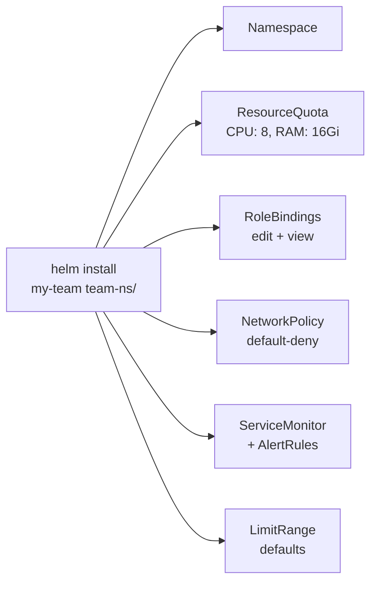

> 💡 **Quick Answer:** Create a namespace template (Helm chart or Kustomize base) that provisions a complete environment in one command: namespace + ResourceQuota + LimitRange + RBAC + NetworkPolicy + monitoring ServiceMonitor. New teams/apps get production-ready isolation in seconds, not days.

## The Problem

"Kubernetes is too complex" usually means "I have to set up everything from scratch every time." That's only true if you haven't built templates. Once you have a namespace template, spinning up a new environment is one command — and it comes with security, quotas, and monitoring built in.



## The Solution

### Helm Chart: Namespace Template

```
namespace-template/
├── Chart.yaml
├── values.yaml
└── templates/
    ├── namespace.yaml
    ├── resourcequota.yaml
    ├── limitrange.yaml
    ├── rbac.yaml
    ├── networkpolicy.yaml
    └── monitoring.yaml
```

**Chart.yaml:**
```yaml
apiVersion: v2
name: namespace-template
description: Production-ready namespace in one command
version: 1.0.0
```

**values.yaml:**
```yaml
team: ""
environment: dev
owner: ""

quota:
  cpu: "8"
  memory: 16Gi
  pods: "50"
  storage: 100Gi

limits:
  defaultCpu: 500m
  defaultMemory: 512Mi
  maxCpu: "4"
  maxMemory: 8Gi

rbac:
  editGroup: ""       # OIDC group with edit access
  viewGroup: ""       # OIDC group with read-only

networkPolicy:
  allowDNS: true
  allowIntraNamespace: true
  allowIngress: true
  egressCIDRs: []     # External CIDRs to allow
```

**templates/namespace.yaml:**
```yaml
apiVersion: v1
kind: Namespace
metadata:
  name: {{ .Values.team }}-{{ .Values.environment }}
  labels:
    team: {{ .Values.team }}
    environment: {{ .Values.environment }}
    owner: {{ .Values.owner }}
    pod-security.kubernetes.io/enforce: restricted
```

**templates/resourcequota.yaml:**
```yaml
apiVersion: v1
kind: ResourceQuota
metadata:
  name: default
  namespace: {{ .Values.team }}-{{ .Values.environment }}
spec:
  hard:
    requests.cpu: {{ .Values.quota.cpu }}
    requests.memory: {{ .Values.quota.memory }}
    pods: {{ .Values.quota.pods }}
    requests.storage: {{ .Values.quota.storage }}
```

**templates/rbac.yaml:**
```yaml
{{- if .Values.rbac.editGroup }}
apiVersion: rbac.authorization.k8s.io/v1
kind: RoleBinding
metadata:
  name: team-edit
  namespace: {{ .Values.team }}-{{ .Values.environment }}
subjects:
  - kind: Group
    name: {{ .Values.rbac.editGroup }}
    apiGroup: rbac.authorization.k8s.io
roleRef:
  kind: ClusterRole
  name: edit
  apiGroup: rbac.authorization.k8s.io
{{- end }}
```

**templates/networkpolicy.yaml:**
```yaml
apiVersion: networking.k8s.io/v1
kind: NetworkPolicy
metadata:
  name: default-deny
  namespace: {{ .Values.team }}-{{ .Values.environment }}
spec:
  podSelector: {}
  policyTypes: [Ingress, Egress]
---
apiVersion: networking.k8s.io/v1
kind: NetworkPolicy
metadata:
  name: allow-baseline
  namespace: {{ .Values.team }}-{{ .Values.environment }}
spec:
  podSelector: {}
  policyTypes: [Ingress, Egress]
  ingress:
    - from:
        - podSelector: {}
  egress:
    - to:
        - podSelector: {}
    - to:
        - namespaceSelector: {}
          podSelector:
            matchLabels:
              k8s-app: kube-dns
      ports:
        - port: 53
          protocol: UDP
```

### One Command to Create an Environment

```bash
# New team onboarding — takes 5 seconds
helm install payments namespace-template/ \
  --set team=payments \
  --set environment=dev \
  --set owner=alice@example.com \
  --set rbac.editGroup=team-payments \
  --set quota.cpu=16 \
  --set quota.memory=32Gi

# Verify everything was created
kubectl get all,quota,limitrange,netpol -n payments-dev

# Need a staging environment? Same template, different values:
helm install payments-staging namespace-template/ \
  --set team=payments \
  --set environment=staging \
  --set owner=alice@example.com \
  --set rbac.editGroup=team-payments \
  --set quota.cpu=8
```

### GitOps: ArgoCD ApplicationSet

```yaml
# Auto-create namespaces from a list in Git
apiVersion: argoproj.io/v1alpha1
kind: ApplicationSet
metadata:
  name: team-namespaces
spec:
  generators:
    - git:
        repoURL: https://github.com/org/platform-config
        revision: main
        files:
          - path: "teams/*/config.yaml"
  template:
    metadata:
      name: "ns-{{team}}-{{environment}}"
    spec:
      source:
        repoURL: https://github.com/org/namespace-template
        targetRevision: main
        helm:
          valueFiles:
            - "teams/{{team}}/config.yaml"
      destination:
        server: https://kubernetes.default.svc
      syncPolicy:
        automated:
          prune: true
```

## Common Issues

| Issue | Cause | Fix |
|-------|-------|-----|
| Team needs more quota | Default too restrictive | Override with `--set quota.cpu=32` |
| Pods can't reach external APIs | NetworkPolicy egress blocked | Add `egressCIDRs` for required endpoints |
| RBAC group not working | OIDC group name mismatch | Verify group claim matches IdP config |

## Best Practices

- **Template everything** — never create namespaces manually
- **GitOps the templates** — ArgoCD ApplicationSet for automatic provisioning
- **Start restrictive** — default-deny network + restricted PSA, open as needed
- **Version your templates** — semver the Helm chart, upgrade teams incrementally
- **Self-service portal** — Backstage or internal UI that calls `helm install` behind the scenes

## Key Takeaways

- One Helm chart = complete production-ready environment in seconds
- Namespace templates eliminate the "K8s is complex" complaint for day-to-day work
- GitOps + ApplicationSet = fully automated multi-team provisioning
- The initial template investment pays off on every subsequent environment
