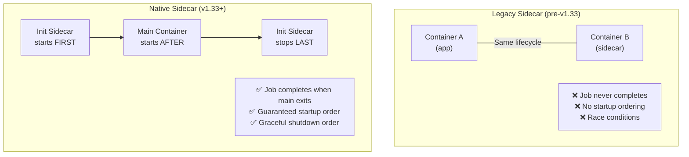

> 💡 **Quick Answer:** Native sidecar containers (stable in Kubernetes v1.33) are init containers with `restartPolicy: Always`. They start before regular containers, run alongside them for the pod's lifetime, and shut down after regular containers exit. This fixes long-standing issues with Job completion (istio-proxy blocking), log collection, and startup ordering.

## The Problem

Before v1.33, sidecars were just regular containers — Kubernetes didn't know they were "sidecars." This caused problems: Jobs never completed because the sidecar kept running, sidecar containers started simultaneously with the main app (race conditions), and there was no way to say "start the proxy first, then the app."



## The Solution

### Basic Native Sidecar

```yaml
apiVersion: v1
kind: Pod
metadata:
  name: app-with-sidecar
spec:
  initContainers:
    # This is the native sidecar — restartPolicy: Always makes it persist
    - name: log-collector
      image: fluent/fluent-bit:3.1
      restartPolicy: Always          # ← THIS makes it a native sidecar
      volumeMounts:
        - name: logs
          mountPath: /var/log/app
      resources:
        requests:
          cpu: "50m"
          memory: "64Mi"

  containers:
    # Main application — starts AFTER log-collector is running
    - name: app
      image: myorg/web-app:v2.0
      volumeMounts:
        - name: logs
          mountPath: /var/log/app

  volumes:
    - name: logs
      emptyDir: {}
```

### Service Mesh Sidecar (Istio/Envoy)

```yaml
apiVersion: v1
kind: Pod
metadata:
  name: app-with-istio
spec:
  initContainers:
    # Envoy proxy starts first — guaranteed ready before app
    - name: istio-proxy
      image: docker.io/istio/proxyv2:1.23.0
      restartPolicy: Always
      ports:
        - containerPort: 15090       # Prometheus metrics
      readinessProbe:
        httpGet:
          path: /healthz/ready
          port: 15021
        initialDelaySeconds: 1
      resources:
        requests:
          cpu: "100m"
          memory: "128Mi"
        limits:
          cpu: "2"
          memory: "1Gi"

  containers:
    - name: app
      image: myorg/api-server:v3.0
      # App starts ONLY after istio-proxy readiness probe passes
      # No more "connection refused" on startup!
      ports:
        - containerPort: 8080
```

### Job with Native Sidecar (Fixed!)

```yaml
# Before v1.33: Job never completed because sidecar kept running
# After v1.33: Sidecar auto-terminates when main container exits
apiVersion: batch/v1
kind: Job
metadata:
  name: data-migration
spec:
  template:
    spec:
      initContainers:
        - name: cloud-sql-proxy
          image: gcr.io/cloud-sql-connectors/cloud-sql-proxy:2.12.0
          restartPolicy: Always      # Sidecar: runs alongside main
          args:
            - "myproject:us-central1:mydb"
            - "--port=5432"
          readinessProbe:
            tcpSocket:
              port: 5432
          resources:
            requests:
              cpu: "100m"
              memory: "128Mi"

      containers:
        - name: migration
          image: myorg/db-migrator:v1.0
          command: ["migrate", "--source=file:///migrations", "--database=postgres://localhost:5432/mydb"]
      
      restartPolicy: Never
  # Job completes when migration exits!
  # cloud-sql-proxy stops automatically after.
```

### Multiple Sidecars with Ordering

```yaml
apiVersion: v1
kind: Pod
metadata:
  name: ordered-sidecars
spec:
  initContainers:
    # Sidecar 1: starts first
    - name: vault-agent
      image: hashicorp/vault:1.17
      restartPolicy: Always
      args: ["agent", "-config=/etc/vault/agent.hcl"]
      readinessProbe:
        httpGet:
          path: /v1/sys/health
          port: 8200

    # Regular init: runs after vault-agent is ready, before sidecars below
    - name: db-schema-check
      image: myorg/schema-checker:v1.0
      command: ["check", "--wait"]

    # Sidecar 2: starts after schema check passes
    - name: envoy
      image: envoyproxy/envoy:v1.31
      restartPolicy: Always
      readinessProbe:
        httpGet:
          path: /ready
          port: 9901

  containers:
    # Main app: starts after ALL init containers (including sidecars) are ready
    - name: app
      image: myorg/app:v3.0
```

### Lifecycle: Startup and Shutdown Order

```
STARTUP ORDER (left to right):
┌─────────────┐   ┌──────────────┐   ┌─────────────┐   ┌──────────┐
│ vault-agent  │──▶│ schema-check │──▶│   envoy     │──▶│   app    │
│ (sidecar)    │   │ (init, exits)│   │ (sidecar)   │   │ (main)   │
│ starts first │   │ runs & exits │   │ starts next │   │ last     │
└─────────────┘   └──────────────┘   └─────────────┘   └──────────┘

SHUTDOWN ORDER (right to left):
┌──────────┐   ┌─────────────┐   ┌─────────────┐
│   app    │──▶│   envoy     │──▶│ vault-agent  │
│ stops 1st│   │ stops 2nd   │   │ stops last   │
└──────────┘   └─────────────┘   └─────────────┘
```

### Migration from Legacy Sidecar

```yaml
# BEFORE (legacy sidecar — broken Job completion)
containers:
  - name: app
    image: myorg/app:v2.0
  - name: fluent-bit                    # Regular container
    image: fluent/fluent-bit:3.1

# AFTER (native sidecar — correct lifecycle)
initContainers:
  - name: fluent-bit
    image: fluent/fluent-bit:3.1
    restartPolicy: Always               # Move to initContainers + add this
containers:
  - name: app
    image: myorg/app:v2.0
```

## Common Issues

| Issue | Cause | Fix |
|-------|-------|-----|
| Sidecar not persisting | Missing `restartPolicy: Always` | Add to initContainer spec |
| App starts before sidecar ready | No readiness probe on sidecar | Add readiness probe to sidecar |
| Old K8s version | Feature requires v1.33+ | Upgrade cluster or use legacy pattern |
| Sidecar not in initContainers | Put in `containers` instead | Move to `initContainers` with `restartPolicy: Always` |
| Resource limits too low | Sidecar OOMKilled | Increase sidecar memory limits |

## Best Practices

- **Always add readiness probes to sidecars** — ensures main container waits
- **Use native sidecars for Jobs** — finally fixes the "sidecar blocks Job completion" problem
- **Order sidecars intentionally** — init container ordering controls startup sequence
- **Set resource requests on sidecars** — they compete with main container for pod resources
- **Migrate progressively** — test native sidecars in staging before fleet-wide rollout
- **Check v1.33+ requirement** — native sidecars are stable in v1.33, beta in v1.29

## Key Takeaways

- Native sidecars = init containers with `restartPolicy: Always`
- They start before main containers and stop after — guaranteed lifecycle ordering
- Fixes Job completion: sidecar exits when main container is done
- Startup ordering: vault-agent → envoy → app (no more race conditions)
- Stable in Kubernetes v1.33 (April 2025) — safe for production
- Migration is simple: move container to initContainers, add `restartPolicy: Always`
