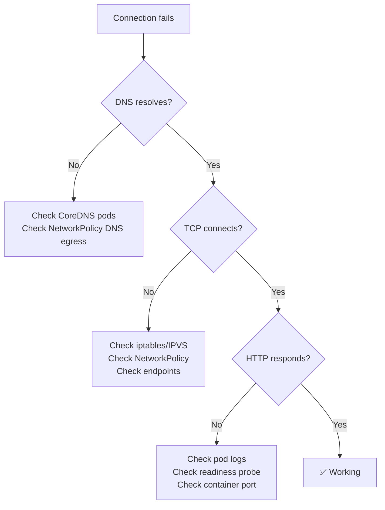

> 💡 **Quick Answer:** Deploy `nicolaka/netshoot` as an ephemeral container or debug pod. Use `tcpdump -i eth0 -w capture.pcap` for packet capture, `conntrack -L` for NAT table inspection, and `nslookup svc.namespace.svc.cluster.local` for DNS verification.

## The Problem

Service-to-service communication fails, but `kubectl get svc` shows endpoints are healthy. The problem could be anywhere: DNS resolution, iptables/IPVS rules, NetworkPolicy, CNI, or the application itself. You need a systematic debugging approach.

## The Solution

### Systematic Debugging Workflow

```bash
# Step 1: DNS resolution
kubectl run debug --rm -it --image=nicolaka/netshoot -- \
  nslookup backend-svc.production.svc.cluster.local

# Step 2: TCP connectivity
kubectl run debug --rm -it --image=nicolaka/netshoot -- \
  curl -v --connect-timeout 5 http://backend-svc.production:8080/health

# Step 3: Packet capture (ephemeral container)
kubectl debug -it failing-pod --image=nicolaka/netshoot --target=app -- \
  tcpdump -i eth0 -n host 10.96.0.10 -w /tmp/capture.pcap

# Step 4: Conntrack inspection (on node)
kubectl debug node/worker-1 -it --image=nicolaka/netshoot -- \
  conntrack -L -d 10.96.100.50

# Step 5: iptables trace (on node)
kubectl debug node/worker-1 -it --image=nicolaka/netshoot -- bash -c \
  'iptables -t raw -A PREROUTING -p tcp --dport 8080 -j TRACE && \
   iptables -t raw -A OUTPUT -p tcp --dport 8080 -j TRACE && \
   dmesg -w | grep TRACE'
```

### Common Commands

| Tool | Command | Purpose |
|------|---------|---------|
| nslookup | `nslookup svc.ns.svc.cluster.local` | DNS resolution |
| curl | `curl -v http://svc:port/path` | HTTP connectivity |
| tcpdump | `tcpdump -i eth0 -n port 8080` | Packet capture |
| ss | `ss -tlnp` | Listening ports |
| conntrack | `conntrack -L -d <ClusterIP>` | NAT table entries |
| ip | `ip route show` | Routing table |
| traceroute | `traceroute -T -p 8080 target` | Path tracing |



## Common Issues

**DNS resolves but curl times out**

iptables rules or NetworkPolicy blocking traffic. Check: `kubectl get networkpolicy -n production` and verify the policy allows ingress on the target port.

**Intermittent connection failures**

Likely conntrack table exhaustion. Check: `conntrack -C` (count) vs `sysctl net.netfilter.nf_conntrack_max`. Increase max if near limit.

## Best Practices

- **Always start with DNS** — 50% of K8s networking issues are DNS-related
- **Use `nicolaka/netshoot`** — has every networking tool pre-installed
- **Capture packets on both sides** — source and destination pods
- **Check NetworkPolicy first** — the most common cause of blocked traffic after DNS
- **`conntrack -L`** reveals NAT issues — stale entries cause intermittent failures

## Key Takeaways

- Systematic debugging: DNS → TCP → HTTP → Application
- netshoot container has all tools: tcpdump, curl, dig, ss, conntrack, iperf
- 50% of connectivity issues are DNS — always start there
- NetworkPolicy is the #2 cause — check for missing egress/ingress rules
- Conntrack exhaustion causes intermittent failures — monitor `nf_conntrack_count`
