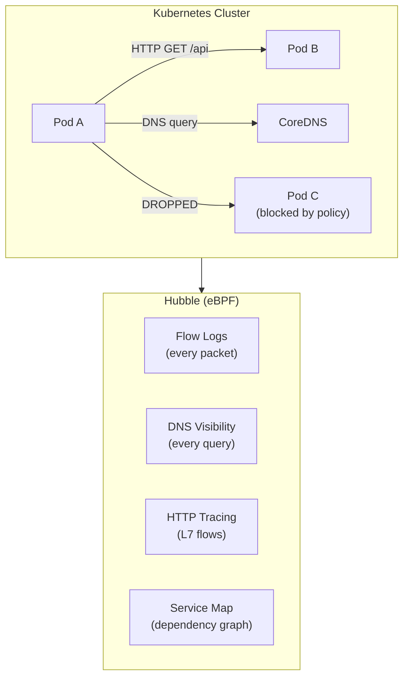

> 💡 **Quick Answer:** Hubble is the observability layer built into Cilium. Enable it with `cilium hubble enable --ui` to get real-time network flow logs, DNS query visibility, HTTP request tracing, and a service dependency map. Use `hubble observe` CLI to filter flows by namespace, pod, verdict (FORWARDED/DROPPED), and protocol.

## The Problem

Kubernetes NetworkPolicies are "fire and forget" — you apply them but can't see what's actually happening. When a pod can't connect, is it DNS? NetworkPolicy? Wrong service port? Hubble gives eBPF-level visibility into every packet, DNS query, and HTTP request flowing through the cluster — without sidecars or application changes.



## The Solution

### Enable Hubble

```bash
# If Cilium is installed via CLI
cilium hubble enable --ui

# If Cilium is installed via Helm
helm upgrade cilium cilium/cilium \
  --namespace kube-system \
  --set hubble.relay.enabled=true \
  --set hubble.ui.enabled=true \
  --set hubble.metrics.enabled="{dns,drop,tcp,flow,icmp,http}"

# Port-forward Hubble UI
cilium hubble ui
# Opens browser at http://localhost:12000
```

### Hubble CLI: Observe Flows

```bash
# Install Hubble CLI
export HUBBLE_VERSION=$(curl -s https://raw.githubusercontent.com/cilium/hubble/master/stable.txt)
curl -LO "https://github.com/cilium/hubble/releases/download/$HUBBLE_VERSION/hubble-linux-amd64.tar.gz"
tar xzf hubble-linux-amd64.tar.gz && sudo mv hubble /usr/local/bin/

# Port-forward Hubble Relay
kubectl port-forward -n kube-system deploy/hubble-relay 4245:4245 &

# Observe all traffic in a namespace
hubble observe --namespace my-app

# Filter dropped traffic (NetworkPolicy violations)
hubble observe --verdict DROPPED

# DNS queries from a specific pod
hubble observe --pod my-app/web-abc123 --protocol DNS

# HTTP flows with status codes
hubble observe --namespace my-app --protocol HTTP \
  -o json | jq '.flow.l7.http'

# Traffic between two services
hubble observe \
  --from-pod my-app/frontend \
  --to-pod my-app/backend
```

### Hubble Prometheus Metrics

```yaml
# Expose Hubble metrics to Prometheus
hubble:
  metrics:
    enabled:
      - dns:query;ignoreAAAA
      - drop
      - tcp
      - flow
      - icmp
      - http
    serviceMonitor:
      enabled: true

# Key metrics:
# hubble_dns_queries_total — DNS query count by rcode
# hubble_drop_total — dropped packets by reason
# hubble_flows_processed_total — total flows
# hubble_http_requests_total — HTTP requests by method/status
```

### Network Policy Audit with Hubble

```bash
# Find all dropped traffic (potential policy gaps)
hubble observe --verdict DROPPED --since 1h -o compact

# Example output:
# DROPPED  my-app/frontend -> my-app/cache:6379 TCP
# DROPPED  my-app/backend  -> kube-system/coredns:53 UDP
# → Missing NetworkPolicy: backend needs DNS egress

# Find all traffic from a pod (to write policies)
hubble observe --from-pod my-app/frontend --since 24h \
  -o json | jq -r '.flow | "\(.source.namespace)/\(.source.labels) -> \(.destination.namespace)/\(.destination.labels) \(.l4.TCP.destination_port // .l4.UDP.destination_port)"' | sort -u
```

## Common Issues

| Issue | Cause | Fix |
|-------|-------|-----|
| `hubble observe` no output | Hubble Relay not running | Check `kubectl get pods -n kube-system -l app.kubernetes.io/name=hubble-relay` |
| No HTTP flows | L7 visibility not enabled | Add `hubble.http` to Cilium CiliumNetworkPolicy |
| High CPU on Hubble | Too many flow events | Increase sampling rate or filter namespaces |
| UI shows no service map | Not enough traffic observed | Generate traffic or wait for organic flows |
| DNS queries not visible | DNS metrics not enabled | Add `dns` to hubble.metrics.enabled |

## Best Practices

- **Enable Hubble in all clusters** — zero performance impact for basic flow logs
- **Use DROPPED filter first** — fastest way to find NetworkPolicy issues
- **Export metrics to Prometheus** — long-term visibility beyond Hubble's buffer
- **Enable L7 selectively** — HTTP tracing adds overhead; enable per-namespace
- **Audit before enforcing** — observe flows first, then write NetworkPolicies from real traffic
- **Use service map for architecture docs** — auto-generated dependency graph

## Key Takeaways

- Hubble provides eBPF-level network observability without sidecars
- See every flow: source, destination, port, protocol, verdict (FORWARDED/DROPPED)
- DNS visibility catches resolution failures and slow queries
- HTTP tracing shows request methods, paths, and status codes
- Service map auto-generates architecture dependency graphs from live traffic
- Essential for writing and debugging Kubernetes NetworkPolicies
