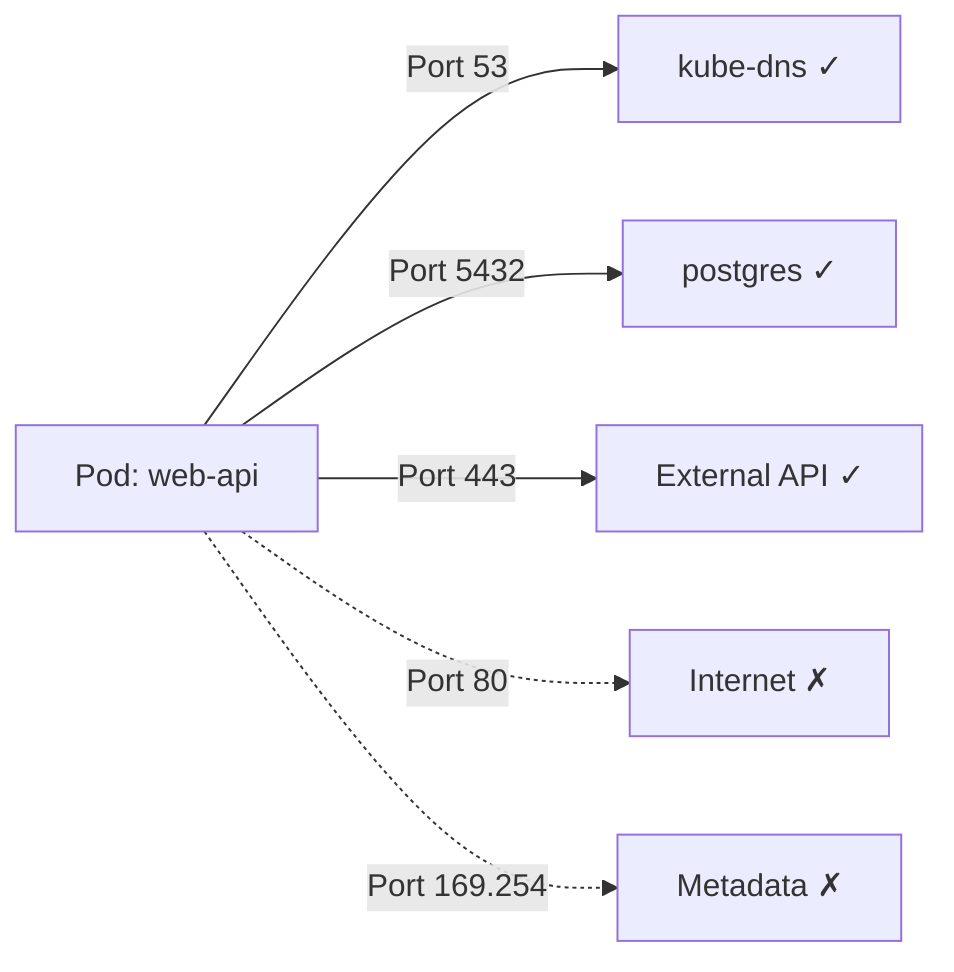

> 💡 **Quick Answer:** Egress NetworkPolicies restrict outbound traffic from pods. Always allow DNS (port 53 to kube-dns) in egress rules, then whitelist specific destinations by CIDR, namespace, or pod labels.

## The Problem

By default, pods can reach any IP — the internet, other namespaces, metadata services (169.254.169.254). In a zero-trust model, you need to explicitly allow only required outbound connections.

## The Solution

### Default Deny All Egress

```yaml
apiVersion: networking.k8s.io/v1
kind: NetworkPolicy
metadata:
  name: default-deny-egress
  namespace: production
spec:
  podSelector: {}
  policyTypes:
    - Egress
```

### Allow DNS + Specific Services

```yaml
apiVersion: networking.k8s.io/v1
kind: NetworkPolicy
metadata:
  name: app-egress
  namespace: production
spec:
  podSelector:
    matchLabels:
      app: web-api
  policyTypes:
    - Egress
  egress:
    # Allow DNS
    - to:
        - namespaceSelector: {}
          podSelector:
            matchLabels:
              k8s-app: kube-dns
      ports:
        - protocol: UDP
          port: 53
        - protocol: TCP
          port: 53
    # Allow database in same namespace
    - to:
        - podSelector:
            matchLabels:
              app: postgres
      ports:
        - protocol: TCP
          port: 5432
    # Allow external API
    - to:
        - ipBlock:
            cidr: 203.0.113.0/24
      ports:
        - protocol: TCP
          port: 443
```

### Block Cloud Metadata Service

```yaml
apiVersion: networking.k8s.io/v1
kind: NetworkPolicy
metadata:
  name: block-metadata
  namespace: production
spec:
  podSelector: {}
  policyTypes:
    - Egress
  egress:
    - to:
        - ipBlock:
            cidr: 0.0.0.0/0
            except:
              - 169.254.169.254/32
```

### Allow Traffic to Another Namespace

```yaml
egress:
  - to:
      - namespaceSelector:
          matchLabels:
            name: monitoring
        podSelector:
          matchLabels:
            app: prometheus
    ports:
      - protocol: TCP
        port: 9090
```



## Common Issues

**All DNS breaks after applying egress deny**
Always include DNS allow rule:
```yaml
- to:
    - namespaceSelector: {}
      podSelector:
        matchLabels:
          k8s-app: kube-dns
  ports:
    - protocol: UDP
      port: 53
```

**Policy not enforced**
NetworkPolicies require a CNI that supports them (Calico, Cilium, Weave). Flannel does NOT enforce policies:
```bash
kubectl get pods -n kube-system | grep -E "calico|cilium"
```

**Egress to headless service fails**
Use pod/namespace selectors instead of ipBlock for in-cluster services — pod IPs change.

## Best Practices

- Always start with default-deny-egress per namespace
- Allow DNS first in every egress policy
- Use namespace selectors for in-cluster communication
- Use CIDR blocks for external services with stable IPs
- Block metadata endpoint (169.254.169.254) in multi-tenant clusters
- Test policies with `kubectl exec` + `curl`/`nc` before enforcing
- Use Cilium's `CiliumNetworkPolicy` for L7 (HTTP path/method) egress rules

## Key Takeaways

- Egress policies control outbound traffic from selected pods
- An empty `egress: []` in policyTypes blocks all outbound traffic
- DNS (UDP/TCP 53) must be explicitly allowed when egress is restricted
- `ipBlock` works for external IPs; pod/namespace selectors for in-cluster
- Multiple egress rules are ORed — matching any rule allows the traffic
- CNI must support NetworkPolicy (Calico, Cilium) — Flannel doesn't enforce
