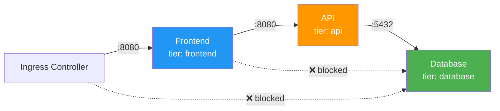

> 💡 **Quick Answer:** NetworkPolicies are Kubernetes-native firewall rules that control pod-to-pod and pod-to-external traffic. Start with a deny-all policy per namespace, then explicitly allow required traffic. Requires a CNI that supports NetworkPolicy (Calico, Cilium, Antrea) — default kubenet does NOT enforce them.

## The Problem

By default, every pod can communicate with every other pod in the cluster — no segmentation. This means:

- Compromised pod can reach databases directly
- No tenant isolation in multi-tenant clusters
- Lateral movement after initial breach is unrestricted
- Compliance requirements (PCI-DSS, HIPAA) unmet

## The Solution

### Deny All (Default Stance)

```yaml
# Deny all ingress to namespace
apiVersion: networking.k8s.io/v1
kind: NetworkPolicy
metadata:
  name: deny-all-ingress
  namespace: production
spec:
  podSelector: {}          # Applies to ALL pods in namespace
  policyTypes:
  - Ingress

---
# Deny all egress from namespace
apiVersion: networking.k8s.io/v1
kind: NetworkPolicy
metadata:
  name: deny-all-egress
  namespace: production
spec:
  podSelector: {}
  policyTypes:
  - Egress
```

### Allow Specific Ingress

```yaml
apiVersion: networking.k8s.io/v1
kind: NetworkPolicy
metadata:
  name: allow-frontend-to-api
  namespace: production
spec:
  podSelector:
    matchLabels:
      app: api-server         # Target: api-server pods
  policyTypes:
  - Ingress
  ingress:
  - from:
    # Allow from frontend pods
    - podSelector:
        matchLabels:
          app: frontend
    # Allow from monitoring namespace
    - namespaceSelector:
        matchLabels:
          purpose: monitoring
      podSelector:
        matchLabels:
          app: prometheus
    ports:
    - protocol: TCP
      port: 8080
```

### Allow DNS Egress (Essential)

```yaml
# Must allow DNS for any egress-restricted namespace
apiVersion: networking.k8s.io/v1
kind: NetworkPolicy
metadata:
  name: allow-dns
  namespace: production
spec:
  podSelector: {}
  policyTypes:
  - Egress
  egress:
  - to:
    - namespaceSelector: {}
      podSelector:
        matchLabels:
          k8s-app: kube-dns
    ports:
    - protocol: UDP
      port: 53
    - protocol: TCP
      port: 53
```

### Allow Egress to External

```yaml
apiVersion: networking.k8s.io/v1
kind: NetworkPolicy
metadata:
  name: allow-external-api
  namespace: production
spec:
  podSelector:
    matchLabels:
      app: api-server
  policyTypes:
  - Egress
  egress:
  # Allow to external API
  - to:
    - ipBlock:
        cidr: 203.0.113.0/24
    ports:
    - protocol: TCP
      port: 443
  # Allow to database
  - to:
    - podSelector:
        matchLabels:
          app: postgres
    ports:
    - protocol: TCP
      port: 5432
```

### Complete 3-Tier Application

```yaml
# Frontend: accept from ingress controller only
apiVersion: networking.k8s.io/v1
kind: NetworkPolicy
metadata:
  name: frontend-policy
  namespace: production
spec:
  podSelector:
    matchLabels:
      tier: frontend
  ingress:
  - from:
    - namespaceSelector:
        matchLabels:
          app: ingress-nginx
    ports:
    - port: 8080
  egress:
  - to:
    - podSelector:
        matchLabels:
          tier: api
    ports:
    - port: 8080
---
# API: accept from frontend only, talk to database
apiVersion: networking.k8s.io/v1
kind: NetworkPolicy
metadata:
  name: api-policy
  namespace: production
spec:
  podSelector:
    matchLabels:
      tier: api
  ingress:
  - from:
    - podSelector:
        matchLabels:
          tier: frontend
    ports:
    - port: 8080
  egress:
  - to:
    - podSelector:
        matchLabels:
          tier: database
    ports:
    - port: 5432
---
# Database: accept from API only, no egress
apiVersion: networking.k8s.io/v1
kind: NetworkPolicy
metadata:
  name: database-policy
  namespace: production
spec:
  podSelector:
    matchLabels:
      tier: database
  ingress:
  - from:
    - podSelector:
        matchLabels:
          tier: api
    ports:
    - port: 5432
  policyTypes:
  - Ingress
  - Egress    # Empty egress = deny all outbound
```



## Common Issues

**NetworkPolicy not enforced**

Your CNI doesn't support NetworkPolicy. Default kubenet and Flannel do NOT enforce them. Use Calico, Cilium, or Antrea.

**Pods can't resolve DNS after deny-all egress**

You need an explicit DNS allow rule. Egress deny-all blocks DNS (UDP/TCP 53) — add the DNS egress policy above.

**AND vs OR confusion in rules**

Multiple items in the same `from` entry are AND'd. Separate `from` entries are OR'd. This is the #1 NetworkPolicy mistake.

## Best Practices

- **Deny-all first, allow explicitly** — zero-trust networking
- **Always allow DNS when restricting egress** — everything breaks without it
- **Use namespace selectors for cross-namespace rules**
- **Test with `kubectl exec` and `curl`** — verify connectivity before and after
- **Use Calico or Cilium for enforcement** — kubenet ignores policies silently
- **Label namespaces for selector targeting** — makes policies more readable

## Key Takeaways

- NetworkPolicies are additive — if no policy selects a pod, all traffic is allowed
- Once ANY policy selects a pod, only explicitly allowed traffic gets through
- Requires a compatible CNI (Calico, Cilium, Antrea) — kubenet does NOT enforce
- Always allow DNS egress when using deny-all egress policies
- Multiple `from`/`to` entries are OR'd; multiple selectors in ONE entry are AND'd
- Start with deny-all per namespace, then build allow rules incrementally
