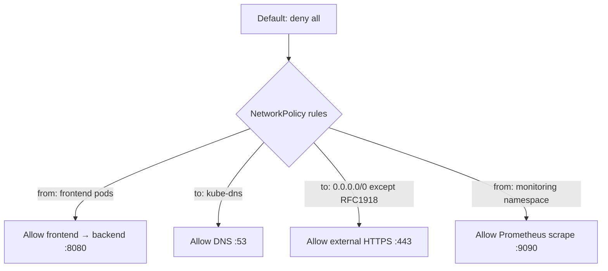

> 💡 **Quick Answer:** Create Kubernetes NetworkPolicies to control pod-to-pod traffic. Covers ingress and egress rules, CIDR blocks, namespace isolation, and default deny policies.

## The Problem

This is one of the most searched Kubernetes topics. A comprehensive, well-structured guide helps engineers of all levels quickly find actionable solutions.

## The Solution

Detailed implementation with production-ready examples below.


### Default Deny All

```yaml
# Block all ingress and egress in a namespace
apiVersion: networking.k8s.io/v1
kind: NetworkPolicy
metadata:
  name: default-deny-all
  namespace: production
spec:
  podSelector: {}       # Apply to ALL pods
  policyTypes:
    - Ingress
    - Egress
```

### Allow Specific Traffic

```yaml
# Allow frontend → backend on port 8080
apiVersion: networking.k8s.io/v1
kind: NetworkPolicy
metadata:
  name: allow-frontend-to-backend
  namespace: production
spec:
  podSelector:
    matchLabels:
      app: backend
  policyTypes:
    - Ingress
  ingress:
    - from:
        - podSelector:
            matchLabels:
              app: frontend
      ports:
        - protocol: TCP
          port: 8080
---
# Allow DNS (always needed with default-deny egress)
apiVersion: networking.k8s.io/v1
kind: NetworkPolicy
metadata:
  name: allow-dns
  namespace: production
spec:
  podSelector: {}
  policyTypes:
    - Egress
  egress:
    - to:
        - namespaceSelector: {}
          podSelector:
            matchLabels:
              k8s-app: kube-dns
      ports:
        - protocol: UDP
          port: 53
        - protocol: TCP
          port: 53
---
# Allow egress to external CIDR
apiVersion: networking.k8s.io/v1
kind: NetworkPolicy
metadata:
  name: allow-external-api
spec:
  podSelector:
    matchLabels:
      app: backend
  policyTypes:
    - Egress
  egress:
    - to:
        - ipBlock:
            cidr: 0.0.0.0/0
            except:
              - 10.0.0.0/8
              - 172.16.0.0/12
              - 192.168.0.0/16
      ports:
        - protocol: TCP
          port: 443
```

### Cross-Namespace Policy

```yaml
# Allow monitoring namespace to scrape metrics
apiVersion: networking.k8s.io/v1
kind: NetworkPolicy
metadata:
  name: allow-prometheus
  namespace: production
spec:
  podSelector: {}
  ingress:
    - from:
        - namespaceSelector:
            matchLabels:
              name: monitoring
      ports:
        - port: 9090
```



## Frequently Asked Questions

### Do I need a CNI that supports NetworkPolicies?

Yes! Default kubenet does NOT enforce NetworkPolicies. Use Calico, Cilium, or Weave Net. Without a supporting CNI, NetworkPolicy resources are created but have no effect.

### Are NetworkPolicies additive or subtractive?

Additive. If no policy selects a pod, all traffic is allowed. Once any policy selects a pod, only traffic matching that policy's rules is allowed. Multiple policies are OR'd together.

## Common Issues

Check `kubectl describe` and `kubectl get events` first — most issues have clear error messages pointing to the root cause.

## Best Practices

- **Follow least privilege** — only grant the access that's needed
- **Test in staging** before applying to production
- **Monitor and alert** on key metrics
- **Document your runbooks** for the team

## Key Takeaways

- Essential knowledge for Kubernetes operations
- Start simple and evolve your approach
- Automation reduces human error
- Share knowledge with your team
