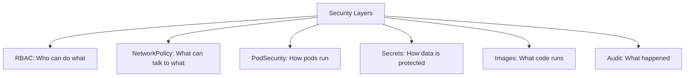

> 💡 **Quick Answer:** Production security checklist for Kubernetes clusters. Covers RBAC, network policies, pod security, secrets encryption, audit logging, and image scanning.

## The Problem

This is one of the most searched Kubernetes topics. A comprehensive, well-structured guide helps engineers of all levels quickly find actionable solutions.

## The Solution

Detailed implementation with production-ready examples below.


### Production Security Checklist

```yaml
# 1. RBAC — least privilege
apiVersion: rbac.authorization.k8s.io/v1
kind: Role
metadata:
  name: app-deployer
rules:
  - apiGroups: ["apps"]
    resources: ["deployments"]
    verbs: ["get", "list", "update"]    # No delete, no create
---
# 2. Network Policies — default deny
apiVersion: networking.k8s.io/v1
kind: NetworkPolicy
metadata:
  name: default-deny
spec:
  podSelector: {}
  policyTypes: [Ingress, Egress]
---
# 3. Pod Security Standards
apiVersion: v1
kind: Namespace
metadata:
  name: production
  labels:
    pod-security.kubernetes.io/enforce: restricted
    pod-security.kubernetes.io/warn: restricted
---
# 4. Resource Quotas
apiVersion: v1
kind: ResourceQuota
metadata:
  name: compute-quota
spec:
  hard:
    requests.cpu: "10"
    requests.memory: 20Gi
    limits.cpu: "20"
    limits.memory: 40Gi
    pods: "50"
---
# 5. Security Context
apiVersion: v1
kind: Pod
spec:
  securityContext:
    runAsNonRoot: true
    runAsUser: 1000
    fsGroup: 2000
    seccompProfile:
      type: RuntimeDefault
  containers:
    - name: app
      securityContext:
        allowPrivilegeEscalation: false
        readOnlyRootFilesystem: true
        capabilities:
          drop: [ALL]
```

### Checklist

| Category | Check | Priority |
|----------|-------|----------|
| RBAC | Least privilege roles | Critical |
| RBAC | No cluster-admin for apps | Critical |
| Network | Default deny NetworkPolicies | Critical |
| Network | TLS everywhere (mTLS with service mesh) | High |
| Pods | Non-root containers | Critical |
| Pods | Read-only root filesystem | High |
| Pods | Drop ALL capabilities | High |
| Pods | Seccomp profiles enabled | Medium |
| Images | Scan for CVEs (Trivy, Snyk) | Critical |
| Images | Use digests, not :latest | High |
| Secrets | Encryption at rest | Critical |
| Secrets | External secrets manager | High |
| Audit | API server audit logging | High |
| Audit | Runtime security (Falco) | Medium |



## Common Issues

Check `kubectl describe` and `kubectl get events` first — most issues have clear error messages pointing to the root cause.

## Best Practices

- **Follow least privilege** — only grant the access that's needed
- **Test in staging** before applying to production
- **Monitor and alert** on key metrics
- **Document your runbooks** for the team

## Key Takeaways

- Essential knowledge for Kubernetes operations
- Start simple and evolve your approach
- Automation reduces human error
- Share knowledge with your team
