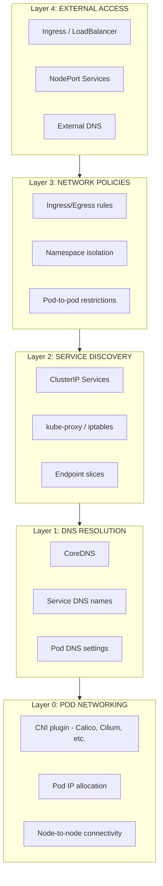

## The Problem

Pods can't communicate with services, DNS resolution fails, or network policies block expected traffic. Kubernetes networking issues can be challenging to diagnose due to multiple layers involved.

## The Solution

Follow a systematic approach to identify and resolve networking issues by testing each layer: Pod networking, Service discovery, DNS resolution, and Network Policies.

## Kubernetes Networking Layers



## Deploy a Debug Pod

```yaml
apiVersion: v1
kind: Pod
metadata:
  name: netshoot
  namespace: default
spec:
  containers:
    - name: netshoot
      image: nicolaka/netshoot:latest
      command: ["sleep", "infinity"]
      securityContext:
        capabilities:
          add:
            - NET_ADMIN
            - NET_RAW
```

```bash
kubectl apply -f netshoot.yaml
kubectl exec -it netshoot -- /bin/bash
```

## Layer 0: Pod Networking Diagnostics

### Check Pod IP Assignment

```bash
# View pod IP
kubectl get pod <pod-name> -o wide

# Check if pod has IP assigned
kubectl get pods -A -o custom-columns=\
NAME:.metadata.name,\
NAMESPACE:.metadata.namespace,\
IP:.status.podIP,\
NODE:.spec.nodeName

# Pods without IPs indicate CNI issues
kubectl get pods -A | grep -v Running
```

### Test Pod-to-Pod Connectivity

```bash
# Get IPs of two pods
POD1_IP=$(kubectl get pod pod1 -o jsonpath='{.status.podIP}')
POD2_IP=$(kubectl get pod pod2 -o jsonpath='{.status.podIP}')

# From pod1, ping pod2
kubectl exec pod1 -- ping -c 3 $POD2_IP

# Test TCP connectivity
kubectl exec pod1 -- nc -zv $POD2_IP 8080
```

### Check CNI Plugin Status

```bash
# Calico
kubectl get pods -n kube-system -l k8s-app=calico-node
kubectl logs -n kube-system -l k8s-app=calico-node --tail=50

# Cilium
kubectl get pods -n kube-system -l k8s-app=cilium
cilium status

# Flannel
kubectl get pods -n kube-system -l app=flannel
```

### Node-to-Node Connectivity

```bash
# Check if nodes can reach each other
NODE1_IP=$(kubectl get node node1 -o jsonpath='{.status.addresses[?(@.type=="InternalIP")].address}')
NODE2_IP=$(kubectl get node node2 -o jsonpath='{.status.addresses[?(@.type=="InternalIP")].address}')

# SSH to node1 and ping node2
ssh node1 "ping -c 3 $NODE2_IP"

# Check pod CIDR routes exist
ssh node1 "ip route | grep -E '10\.(244|96)'"
```

## Layer 1: DNS Troubleshooting

### Check CoreDNS Status

```bash
# CoreDNS pods
kubectl get pods -n kube-system -l k8s-app=kube-dns

# CoreDNS logs
kubectl logs -n kube-system -l k8s-app=kube-dns --tail=100

# CoreDNS configmap
kubectl get configmap coredns -n kube-system -o yaml
```

### Test DNS Resolution from Pod

```bash
# Test cluster DNS
kubectl exec netshoot -- nslookup kubernetes.default.svc.cluster.local

# Test service DNS
kubectl exec netshoot -- nslookup <service-name>.<namespace>.svc.cluster.local

# Test external DNS
kubectl exec netshoot -- nslookup google.com

# Check /etc/resolv.conf
kubectl exec netshoot -- cat /etc/resolv.conf
```

### Expected resolv.conf

```
nameserver 10.96.0.10
search default.svc.cluster.local svc.cluster.local cluster.local
options ndots:5
```

### DNS Debug Pod

```yaml
apiVersion: v1
kind: Pod
metadata:
  name: dnsutils
  namespace: default
spec:
  containers:
    - name: dnsutils
      image: registry.k8s.io/e2e-test-images/jessie-dnsutils:1.5
      command: ["sleep", "infinity"]
```

```bash
# Detailed DNS query
kubectl exec dnsutils -- dig +search kubernetes.default.svc.cluster.local

# Query specific DNS server
kubectl exec dnsutils -- dig @10.96.0.10 kubernetes.default.svc.cluster.local
```

### Fix Common DNS Issues

```bash
# Issue: DNS timeout
# Check CoreDNS is running
kubectl rollout restart deployment/coredns -n kube-system

# Issue: Wrong nameserver
# Verify kubelet DNS configuration
ssh node1 "cat /var/lib/kubelet/config.yaml | grep -A 5 clusterDNS"

# Issue: ndots causing slow resolution
# Add to pod spec:
spec:
  dnsConfig:
    options:
      - name: ndots
        value: "2"
```

## Layer 2: Service Troubleshooting

### Check Service and Endpoints

```bash
# View service details
kubectl get svc <service-name> -o wide

# Check endpoints exist
kubectl get endpoints <service-name>

# Detailed endpoint slices
kubectl get endpointslices -l kubernetes.io/service-name=<service-name>

# Describe service
kubectl describe svc <service-name>
```

### Verify Service Selector Matches Pods

```bash
# Get service selector
kubectl get svc <service-name> -o jsonpath='{.spec.selector}'

# Check if pods match selector
kubectl get pods -l <key>=<value>

# Common issue: selector mismatch
# Service: app=myapp
# Pod labels: app=my-app  # Different!
```

### Test Service Connectivity

```bash
# From within cluster
kubectl exec netshoot -- curl -v http://<service-name>.<namespace>.svc.cluster.local:<port>

# Test ClusterIP directly
SVC_IP=$(kubectl get svc <service-name> -o jsonpath='{.spec.clusterIP}')
kubectl exec netshoot -- curl -v http://$SVC_IP:<port>

# Test individual endpoint
ENDPOINT_IP=$(kubectl get endpoints <service-name> -o jsonpath='{.subsets[0].addresses[0].ip}')
kubectl exec netshoot -- curl -v http://$ENDPOINT_IP:<port>
```

### Check kube-proxy

```bash
# kube-proxy pods
kubectl get pods -n kube-system -l k8s-app=kube-proxy

# kube-proxy logs
kubectl logs -n kube-system -l k8s-app=kube-proxy --tail=50

# Check iptables rules (on node)
ssh node1 "iptables -t nat -L KUBE-SERVICES -n | head -20"

# For ipvs mode
ssh node1 "ipvsadm -Ln"
```

### Headless Service Debugging

```bash
# For headless services (ClusterIP: None)
kubectl get svc <headless-service> -o yaml

# DNS returns pod IPs directly
kubectl exec netshoot -- nslookup <headless-service>.<namespace>.svc.cluster.local

# Should return multiple A records for each pod
```

## Layer 3: Network Policy Troubleshooting

### Check Existing Network Policies

```bash
# List all network policies
kubectl get networkpolicies -A

# Describe specific policy
kubectl describe networkpolicy <policy-name> -n <namespace>

# View policy YAML
kubectl get networkpolicy <policy-name> -n <namespace> -o yaml
```

### Test if Network Policy is Blocking

```bash
# Create test pod in same namespace
kubectl run test-client --image=busybox --rm -it --restart=Never -- wget -qO- --timeout=2 http://<service>:<port>

# Create test pod in different namespace
kubectl run test-client -n other-ns --image=busybox --rm -it --restart=Never -- wget -qO- --timeout=2 http://<service>.<namespace>.svc.cluster.local:<port>
```

### Debug Network Policy with Labels

```bash
# Check pod labels
kubectl get pod <pod-name> -o jsonpath='{.metadata.labels}' | jq .

# Check namespace labels
kubectl get namespace <namespace> -o jsonpath='{.metadata.labels}' | jq .

# Verify policy selector matches
kubectl get pods -l <policy-pod-selector>
```

### Allow All Traffic (Debugging Only)

```yaml
# WARNING: Use only for debugging, remove after!
apiVersion: networking.k8s.io/v1
kind: NetworkPolicy
metadata:
  name: allow-all-debug
  namespace: <namespace>
spec:
  podSelector: {}
  policyTypes:
    - Ingress
    - Egress
  ingress:
    - {}
  egress:
    - {}
```

### Calico Network Policy Debugging

```bash
# Check Calico policies
kubectl get networkpolicies.crd.projectcalico.org -A

# Calico debug
calicoctl get workloadendpoint
calicoctl get policy -o wide
```

### Cilium Network Policy Debugging

```bash
# Check Cilium policies
kubectl get ciliumnetworkpolicies -A

# Cilium policy verdict
cilium policy get
cilium monitor --type policy-verdict

# Hubble flow visibility
hubble observe --namespace <namespace>
```

## Layer 4: External Access Troubleshooting

### NodePort Service

```bash
# Get NodePort
kubectl get svc <service-name> -o jsonpath='{.spec.ports[0].nodePort}'

# Test from outside cluster
curl http://<node-ip>:<node-port>

# Check node firewall
ssh node1 "iptables -L INPUT -n | grep <node-port>"
```

### LoadBalancer Service

```bash
# Check external IP assignment
kubectl get svc <service-name> -o wide

# If EXTERNAL-IP is <pending>
kubectl describe svc <service-name>
# Look for events about LoadBalancer provisioning

# Test external IP
curl http://<external-ip>:<port>
```

### Ingress Troubleshooting

```bash
# Check Ingress resource
kubectl get ingress <ingress-name> -o wide

# Describe for events
kubectl describe ingress <ingress-name>

# Check Ingress controller logs
kubectl logs -n ingress-nginx -l app.kubernetes.io/name=ingress-nginx

# Test with curl
curl -H "Host: <hostname>" http://<ingress-ip>/

# Check backend service
kubectl get svc <backend-service>
```

## Comprehensive Connectivity Test Script

```bash
#!/bin/bash
# network-diagnostic.sh

NAMESPACE=${1:-default}
SERVICE=${2:-kubernetes}
PORT=${3:-443}

echo "=== Network Diagnostic for $SERVICE.$NAMESPACE ==="

echo -e "\n--- DNS Resolution ---"
kubectl exec -n $NAMESPACE netshoot -- nslookup $SERVICE.$NAMESPACE.svc.cluster.local

echo -e "\n--- Service Details ---"
kubectl get svc $SERVICE -n $NAMESPACE -o wide

echo -e "\n--- Endpoints ---"
kubectl get endpoints $SERVICE -n $NAMESPACE

echo -e "\n--- Network Policies ---"
kubectl get networkpolicies -n $NAMESPACE

echo -e "\n--- Connectivity Test ---"
kubectl exec -n $NAMESPACE netshoot -- nc -zv $SERVICE.$NAMESPACE.svc.cluster.local $PORT

echo -e "\n--- CoreDNS Status ---"
kubectl get pods -n kube-system -l k8s-app=kube-dns

echo -e "\n--- CNI Pods ---"
kubectl get pods -n kube-system | grep -E "(calico|cilium|flannel|weave)"
```

## Common Issues and Solutions

| Symptom | Likely Cause | Solution |
|---------|--------------|----------|
| Pod has no IP | CNI failure | Restart CNI pods, check CNI config |
| DNS timeout | CoreDNS down/overloaded | Restart CoreDNS, check resources |
| Service no endpoints | Selector mismatch | Fix service selector or pod labels |
| Connection refused | Pod not listening | Check container port, readiness probe |
| Connection timeout | Network policy blocking | Review and update network policies |
| Intermittent failures | Endpoint not ready | Check readiness probes, pod health |

## Quick Reference Commands

```bash
# Overall cluster networking status
kubectl get pods -A -o wide | grep -v Running
kubectl get svc -A
kubectl get networkpolicies -A

# DNS quick test
kubectl run test-dns --image=busybox:1.28 --rm -it --restart=Never -- nslookup kubernetes

# Service quick test
kubectl run test-svc --image=busybox:1.28 --rm -it --restart=Never -- wget -qO- --timeout=5 http://kubernetes.default:443

# Network policy impact test
kubectl run test-np --image=nginx --rm -it --restart=Never -- curl -v --connect-timeout 5 http://<target-service>
```

## Summary

Kubernetes networking troubleshooting requires a layered approach: start from the bottom (CNI/pod networking), work through DNS and services, check network policies, and finally verify external access. Use debug pods like netshoot for comprehensive testing capabilities.

---

## 📘 Go Further with Kubernetes Recipes

**Love this recipe? There's so much more!** This is just one of **100+ hands-on recipes** in our comprehensive **[Kubernetes Recipes book](https://amzn.to/3DzC8QA)**.

Inside the book, you'll master:
- ✅ Production-ready deployment strategies
- ✅ Advanced networking and security patterns  
- ✅ Observability, monitoring, and troubleshooting
- ✅ Real-world best practices from industry experts

> *"The practical, recipe-based approach made complex Kubernetes concepts finally click for me."*

**👉 [Get Your Copy Now](https://amzn.to/3DzC8QA)** — Start building production-grade Kubernetes skills today!
