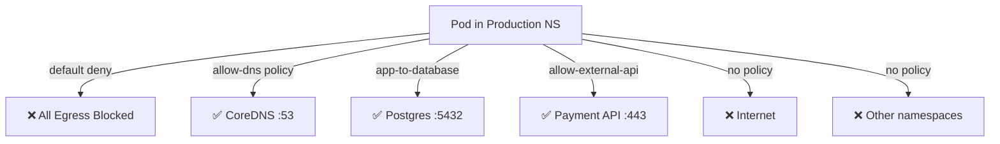

> 💡 **Quick Answer:** Apply a NetworkPolicy with `policyTypes: ["Egress"]` and empty `egress: []` to deny all outbound traffic. Then create additional policies to allow DNS (port 53), specific services, and required external endpoints. Always allow DNS first or nothing works.

## The Problem

By default, pods can reach any destination — internal or external:
- Compromised pods can exfiltrate data
- Lateral movement between namespaces is unrestricted
- No visibility into what pods are connecting to
- Compliance requires explicit egress allowlists

## The Solution

### Default Deny All Egress

```yaml
# Deny ALL outbound traffic for all pods in namespace
apiVersion: networking.k8s.io/v1
kind: NetworkPolicy
metadata:
  name: default-deny-egress
  namespace: production
spec:
  podSelector: {}  # Applies to ALL pods in namespace
  policyTypes:
    - Egress
  egress: []  # Empty = deny all
```

### Allow DNS (Always Needed First)

```yaml
# Without DNS, pods can't resolve any service names
apiVersion: networking.k8s.io/v1
kind: NetworkPolicy
metadata:
  name: allow-dns
  namespace: production
spec:
  podSelector: {}  # All pods
  policyTypes:
    - Egress
  egress:
    - to:
        - namespaceSelector:
            matchLabels:
              kubernetes.io/metadata.name: kube-system
          podSelector:
            matchLabels:
              k8s-app: kube-dns
      ports:
        - protocol: UDP
          port: 53
        - protocol: TCP
          port: 53
```

### Allow Internal Service Communication

```yaml
# Allow app pods to reach database in same namespace
apiVersion: networking.k8s.io/v1
kind: NetworkPolicy
metadata:
  name: app-to-database
  namespace: production
spec:
  podSelector:
    matchLabels:
      app: myapp
  policyTypes:
    - Egress
  egress:
    - to:
        - podSelector:
            matchLabels:
              app: postgres
      ports:
        - protocol: TCP
          port: 5432
---
# Allow app to reach Redis in another namespace
apiVersion: networking.k8s.io/v1
kind: NetworkPolicy
metadata:
  name: app-to-redis
  namespace: production
spec:
  podSelector:
    matchLabels:
      app: myapp
  policyTypes:
    - Egress
  egress:
    - to:
        - namespaceSelector:
            matchLabels:
              kubernetes.io/metadata.name: cache
          podSelector:
            matchLabels:
              app: redis
      ports:
        - protocol: TCP
          port: 6379
```

### Allow Specific External IPs

```yaml
# Allow outbound to specific external API
apiVersion: networking.k8s.io/v1
kind: NetworkPolicy
metadata:
  name: allow-external-api
  namespace: production
spec:
  podSelector:
    matchLabels:
      app: payment-service
  policyTypes:
    - Egress
  egress:
    - to:
        - ipBlock:
            cidr: 203.0.113.0/24  # External payment API range
      ports:
        - protocol: TCP
          port: 443
    # Also allow DNS for resolution
    - to:
        - namespaceSelector:
            matchLabels:
              kubernetes.io/metadata.name: kube-system
          podSelector:
            matchLabels:
              k8s-app: kube-dns
      ports:
        - protocol: UDP
          port: 53
```

### Complete Zero-Trust Namespace Setup

```yaml
# 1. Deny all ingress AND egress
apiVersion: networking.k8s.io/v1
kind: NetworkPolicy
metadata:
  name: default-deny-all
  namespace: production
spec:
  podSelector: {}
  policyTypes:
    - Ingress
    - Egress
  ingress: []
  egress: []
---
# 2. Allow DNS for all pods
apiVersion: networking.k8s.io/v1
kind: NetworkPolicy
metadata:
  name: allow-dns
  namespace: production
spec:
  podSelector: {}
  policyTypes:
    - Egress
  egress:
    - to:
        - namespaceSelector:
            matchLabels:
              kubernetes.io/metadata.name: kube-system
      ports:
        - protocol: UDP
          port: 53
        - protocol: TCP
          port: 53
---
# 3. Allow ingress from ingress controller
apiVersion: networking.k8s.io/v1
kind: NetworkPolicy
metadata:
  name: allow-ingress-controller
  namespace: production
spec:
  podSelector:
    matchLabels:
      app: myapp
  policyTypes:
    - Ingress
  ingress:
    - from:
        - namespaceSelector:
            matchLabels:
              kubernetes.io/metadata.name: ingress-nginx
      ports:
        - protocol: TCP
          port: 8080
```

### Architecture



## Common Issues

| Issue | Cause | Fix |
|-------|-------|-----|
| All DNS resolution breaks | Forgot to allow DNS egress | Add DNS allow policy first |
| Pods can still reach everything | CNI doesn't support NetworkPolicy | Use Calico, Cilium, or Antrea |
| Cross-namespace traffic blocked | Missing `namespaceSelector` | Add namespace label selector |
| External API unreachable | Need both DNS + IP block allow | Add both in same policy |
| Health checks fail | Liveness probe from kubelet blocked | kubelet isn't subject to NetworkPolicy (host network) |

## Best Practices

1. **Apply deny-all FIRST, then allow specific** — explicit allowlist approach
2. **Always allow DNS** — first policy after deny-all, or nothing resolves
3. **Label namespaces** — `kubernetes.io/metadata.name` is auto-applied since K8s 1.21
4. **Test with `kubectl exec curl`** — verify connectivity after applying policies
5. **Use Cilium/Calico for FQDN egress rules** — native NetworkPolicy only supports IPs

## Key Takeaways

- `policyTypes: ["Egress"]` with empty `egress: []` = deny all outbound
- DNS (UDP/TCP 53 to kube-system) must be explicitly allowed or nothing works
- Policies are additive — multiple policies allowing different things all take effect
- CNI must support NetworkPolicy (Calico, Cilium, Antrea) — kubenet/flannel don't
- Host-networked processes (kubelet probes) bypass NetworkPolicy — no need to allow
