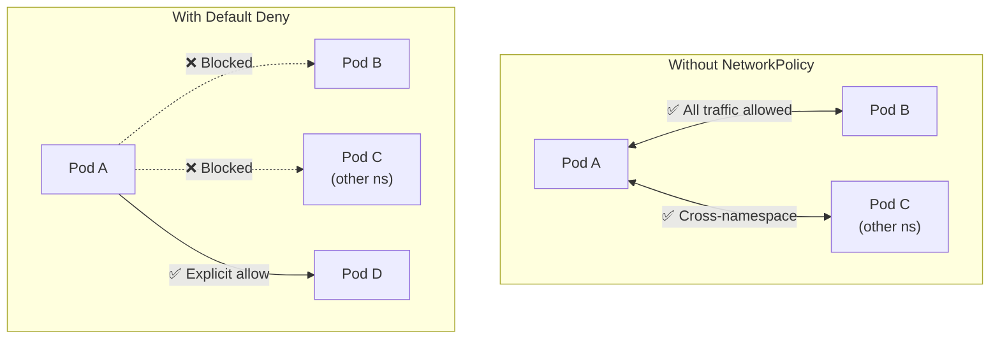

> 💡 **Quick Answer:** By default, Kubernetes allows ALL traffic between pods. Apply a default-deny NetworkPolicy to block everything, then add allow rules for specific traffic. This is the foundation of zero-trust networking in Kubernetes.

## The Problem

Without NetworkPolicy, every pod can communicate with every other pod in the cluster — across all namespaces. This means a compromised pod can reach databases, internal APIs, and control plane components. Default-deny policies flip this to a secure-by-default posture.



## The Solution

### Default Deny All Ingress

Block all incoming traffic to pods in a namespace:

```yaml
apiVersion: networking.k8s.io/v1
kind: NetworkPolicy
metadata:
  name: default-deny-ingress
  namespace: production
spec:
  podSelector: {}          # Applies to ALL pods in namespace
  policyTypes:
    - Ingress              # Block all incoming traffic
  # No ingress rules = deny all
```

### Default Deny All Egress

Block all outgoing traffic from pods in a namespace:

```yaml
apiVersion: networking.k8s.io/v1
kind: NetworkPolicy
metadata:
  name: default-deny-egress
  namespace: production
spec:
  podSelector: {}
  policyTypes:
    - Egress
  # No egress rules = deny all
```

### Default Deny Both (Recommended)

Block all ingress AND egress:

```yaml
apiVersion: networking.k8s.io/v1
kind: NetworkPolicy
metadata:
  name: default-deny-all
  namespace: production
spec:
  podSelector: {}
  policyTypes:
    - Ingress
    - Egress
```

> ⚠️ **Warning:** This blocks DNS too! Pods can't resolve service names. Add a DNS exception (see below).

### Default Deny + Allow DNS

The most common starting point — deny all but allow DNS resolution:

```yaml
---
# 1. Deny all traffic
apiVersion: networking.k8s.io/v1
kind: NetworkPolicy
metadata:
  name: default-deny-all
  namespace: production
spec:
  podSelector: {}
  policyTypes:
    - Ingress
    - Egress
---
# 2. Allow DNS for all pods
apiVersion: networking.k8s.io/v1
kind: NetworkPolicy
metadata:
  name: allow-dns
  namespace: production
spec:
  podSelector: {}
  policyTypes:
    - Egress
  egress:
    - to:
        - namespaceSelector: {}    # Any namespace (kube-system)
      ports:
        - protocol: UDP
          port: 53
        - protocol: TCP
          port: 53
```

### Allow Specific Traffic Patterns

After default-deny, add explicit allow rules:

```yaml
# Allow frontend → backend on port 8080
apiVersion: networking.k8s.io/v1
kind: NetworkPolicy
metadata:
  name: allow-frontend-to-backend
  namespace: production
spec:
  podSelector:
    matchLabels:
      app: backend
  policyTypes:
    - Ingress
  ingress:
    - from:
        - podSelector:
            matchLabels:
              app: frontend
      ports:
        - protocol: TCP
          port: 8080
---
# Allow backend → database on port 5432
apiVersion: networking.k8s.io/v1
kind: NetworkPolicy
metadata:
  name: allow-backend-to-db
  namespace: production
spec:
  podSelector:
    matchLabels:
      app: database
  policyTypes:
    - Ingress
  ingress:
    - from:
        - podSelector:
            matchLabels:
              app: backend
      ports:
        - protocol: TCP
          port: 5432
---
# Allow backend egress to database
apiVersion: networking.k8s.io/v1
kind: NetworkPolicy
metadata:
  name: backend-egress-to-db
  namespace: production
spec:
  podSelector:
    matchLabels:
      app: backend
  policyTypes:
    - Egress
  egress:
    - to:
        - podSelector:
            matchLabels:
              app: database
      ports:
        - protocol: TCP
          port: 5432
```

### Namespace Isolation

Allow traffic only within the same namespace:

```yaml
apiVersion: networking.k8s.io/v1
kind: NetworkPolicy
metadata:
  name: allow-same-namespace
  namespace: production
spec:
  podSelector: {}
  policyTypes:
    - Ingress
  ingress:
    - from:
        - podSelector: {}   # Any pod in same namespace
```

### Allow from Specific Namespace

```yaml
apiVersion: networking.k8s.io/v1
kind: NetworkPolicy
metadata:
  name: allow-from-monitoring
  namespace: production
spec:
  podSelector: {}
  policyTypes:
    - Ingress
  ingress:
    - from:
        - namespaceSelector:
            matchLabels:
              kubernetes.io/metadata.name: monitoring
      ports:
        - protocol: TCP
          port: 9090    # Prometheus scraping
```

### Verify Policies

```bash
# List policies in namespace
kubectl get networkpolicy -n production

# Describe a specific policy
kubectl describe networkpolicy default-deny-all -n production

# Test connectivity
kubectl exec -n production frontend-pod -- curl -s --connect-timeout 3 backend:8080
# Should succeed (allowed)

kubectl exec -n production frontend-pod -- curl -s --connect-timeout 3 database:5432
# Should fail (denied)

# Check if CNI supports NetworkPolicy
kubectl get pods -n kube-system | grep -E "calico|cilium|weave|antrea"
```

## Common Issues

| Issue | Cause | Fix |
|-------|-------|-----|
| DNS resolution broken | Default deny blocks UDP 53 | Add DNS allow policy |
| All pods can't communicate | Default deny applied without allow rules | Add specific allow policies |
| Policy has no effect | CNI doesn't support NetworkPolicy | Use Calico, Cilium, or Antrea |
| Cross-namespace traffic blocked | Missing \`namespaceSelector\` | Add \`namespaceSelector\` in \`from\`/\`to\` |
| Monitoring broken | Prometheus can't scrape metrics | Allow from monitoring namespace on metrics port |
| Pod-to-external blocked | Egress deny blocks internet access | Add egress rule for external CIDR |

## Best Practices

- **Start with default-deny + DNS** — then add allow rules incrementally
- **Apply per namespace** — NetworkPolicy is namespace-scoped
- **Use labels consistently** — policies match on labels, not pod names
- **Allow monitoring explicitly** — Prometheus, log collectors need ingress access
- **Test before production** — verify with \`curl\`/\`wget\` from test pods
- **Use a CNI that supports policies** — Calico, Cilium, Antrea (not Flannel)

## Key Takeaways

- Kubernetes allows all pod-to-pod traffic by default — no built-in isolation
- \`podSelector: {}\` with no rules = deny all (for specified \`policyTypes\`)
- Always add DNS exception (UDP/TCP 53) when using egress deny
- Policies are additive — multiple policies combine with OR logic
- Requires a CNI that supports NetworkPolicy (Calico, Cilium, Antrea)
- Default-deny is the foundation of zero-trust networking in Kubernetes
