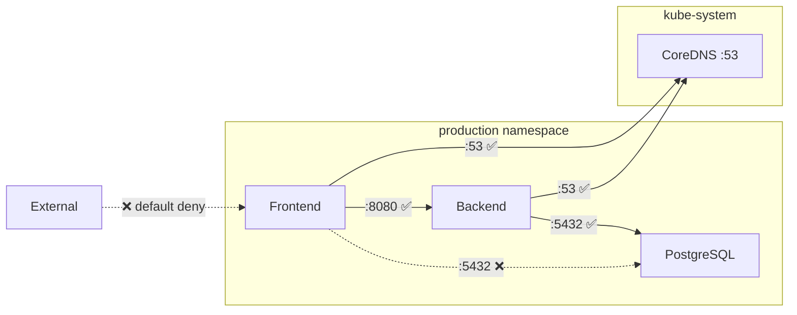

> 💡 **Quick Answer:** Apply a default-deny NetworkPolicy in every namespace, then explicitly allow only required ingress/egress. Always allow DNS egress (port 53) to `kube-system` or your DNS namespace first — without it, all name resolution breaks.

## The Problem

By default, Kubernetes allows all pod-to-pod traffic across all namespaces. This means a compromised pod can reach any service in the cluster. Zero-trust networking requires explicit allow rules for every connection.

## The Solution

### Step 1: Default Deny All

```yaml
apiVersion: networking.k8s.io/v1
kind: NetworkPolicy
metadata:
  name: default-deny-all
  namespace: production
spec:
  podSelector: {}
  policyTypes:
    - Ingress
    - Egress
```

### Step 2: Allow DNS

```yaml
apiVersion: networking.k8s.io/v1
kind: NetworkPolicy
metadata:
  name: allow-dns
  namespace: production
spec:
  podSelector: {}
  policyTypes:
    - Egress
  egress:
    - to:
        - namespaceSelector:
            matchLabels:
              kubernetes.io/metadata.name: kube-system
      ports:
        - protocol: UDP
          port: 53
        - protocol: TCP
          port: 53
```

### Step 3: Application-Specific Rules

```yaml
# Frontend → Backend
apiVersion: networking.k8s.io/v1
kind: NetworkPolicy
metadata:
  name: backend-ingress
  namespace: production
spec:
  podSelector:
    matchLabels:
      app: backend
  policyTypes:
    - Ingress
  ingress:
    - from:
        - podSelector:
            matchLabels:
              app: frontend
      ports:
        - port: 8080
---
# Backend → Database
apiVersion: networking.k8s.io/v1
kind: NetworkPolicy
metadata:
  name: database-ingress
  namespace: production
spec:
  podSelector:
    matchLabels:
      app: postgres
  policyTypes:
    - Ingress
  ingress:
    - from:
        - podSelector:
            matchLabels:
              app: backend
      ports:
        - port: 5432
```



## Common Issues

**All pods lose DNS after applying default-deny**

You must explicitly allow DNS egress before applying default-deny. Apply the `allow-dns` policy first.

**NetworkPolicy has no effect**

Your CNI must support NetworkPolicy. Flannel does NOT. Use Calico, Cilium, or Antrea.

**Can't reach services in other namespaces**

Use `namespaceSelector` to allow cross-namespace traffic:
```yaml
ingress:
  - from:
      - namespaceSelector:
          matchLabels:
            kubernetes.io/metadata.name: monitoring
```

## Best Practices

- **Default-deny first, then allow** — the only secure approach
- **Always allow DNS first** — it's the #1 cause of "everything broke after adding NetworkPolicy"
- **Use namespace labels** (`kubernetes.io/metadata.name`) for cross-namespace rules
- **Test with `kubectl exec -- wget`** before and after applying policies
- **Use Cilium for L7 policies** — HTTP path/method filtering, DNS FQDN egress rules

## Key Takeaways

- Default Kubernetes networking is allow-all — not secure
- `podSelector: {}` + both policyTypes = deny all in/out for the namespace
- DNS egress to kube-system must be explicitly allowed
- NetworkPolicies are additive — multiple policies union their rules
- CNI must support NetworkPolicy (Calico, Cilium, Antrea — not Flannel)
