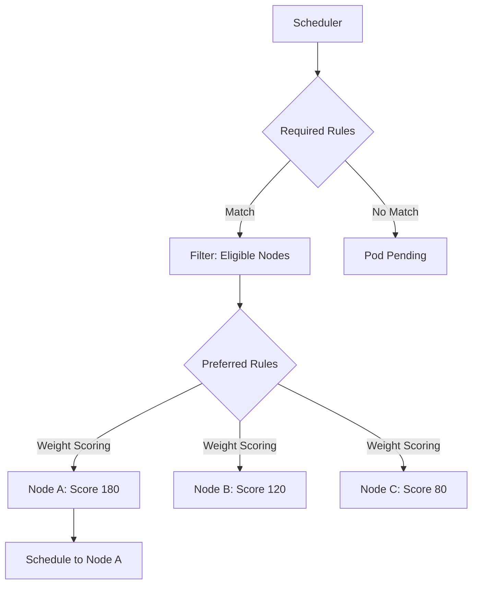

> 💡 **Quick Answer:** `requiredDuringSchedulingIgnoredDuringExecution` is a hard constraint (pod stays Pending if no node matches). `preferredDuringSchedulingIgnoredDuringExecution` is a soft preference (scheduler tries but doesn't block).

## The Problem

Simple `nodeSelector` only supports exact label matches. You need:
- OR logic (schedule on GPU nodes OR high-memory nodes)
- Weighted preferences (prefer zone-a but allow zone-b)
- Exclusion rules (NOT on spot instances)
- Multiple conditions with different priorities

## The Solution

### Required (Hard) Node Affinity

```yaml
apiVersion: v1
kind: Pod
metadata:
  name: gpu-workload
spec:
  affinity:
    nodeAffinity:
      requiredDuringSchedulingIgnoredDuringExecution:
        nodeSelectorTerms:
          - matchExpressions:
              - key: nvidia.com/gpu.product
                operator: In
                values:
                  - A100-SXM4-80GB
                  - H100-SXM5-80GB
              - key: node-role.kubernetes.io/worker
                operator: Exists
  containers:
    - name: training
      image: training-job:1.0
      resources:
        limits:
          nvidia.com/gpu: 8
```

### Preferred (Soft) Node Affinity

```yaml
affinity:
  nodeAffinity:
    preferredDuringSchedulingIgnoredDuringExecution:
      - weight: 80
        preference:
          matchExpressions:
            - key: topology.kubernetes.io/zone
              operator: In
              values: ["us-east-1a"]
      - weight: 20
        preference:
          matchExpressions:
            - key: topology.kubernetes.io/zone
              operator: In
              values: ["us-east-1b"]
```

### Combined Required + Preferred

```yaml
affinity:
  nodeAffinity:
    requiredDuringSchedulingIgnoredDuringExecution:
      nodeSelectorTerms:
        - matchExpressions:
            - key: kubernetes.io/arch
              operator: In
              values: ["amd64"]
            - key: node.kubernetes.io/instance-type
              operator: NotIn
              values: ["t3.micro", "t3.small"]
    preferredDuringSchedulingIgnoredDuringExecution:
      - weight: 100
        preference:
          matchExpressions:
            - key: disktype
              operator: In
              values: ["ssd"]
```

### Available Operators

```yaml
# In: value must be one of the listed values
- key: zone
  operator: In
  values: ["us-east-1a", "us-east-1b"]

# NotIn: value must NOT be any of the listed values
- key: instance-type
  operator: NotIn
  values: ["spot"]

# Exists: label key must exist (any value)
- key: gpu
  operator: Exists

# DoesNotExist: label key must NOT exist
- key: maintenance
  operator: DoesNotExist

# Gt / Lt: numeric comparison
- key: capacity
  operator: Gt
  values: ["100"]
```



## Common Issues

**Multiple nodeSelectorTerms are ORed, expressions within are ANDed**
```yaml
nodeSelectorTerms:
  - matchExpressions:  # Term 1 (OR)
      - key: gpu       # AND
        operator: Exists
      - key: zone      # AND
        operator: In
        values: ["a"]
  - matchExpressions:  # Term 2 (OR with Term 1)
      - key: high-memory
        operator: Exists
```

**IgnoredDuringExecution means what?**
If node labels change after scheduling, the pod stays. It's not re-evaluated or evicted.

**Preferred weights not working as expected**
Weights (1-100) are additive across all preferences. A node matching two weight-50 preferences scores higher than one matching a single weight-80.

## Best Practices

- Use `required` for hard constraints (architecture, GPU type, compliance zones)
- Use `preferred` for optimization (locality, cost, performance tier)
- Combine with taints/tolerations for node dedication
- Set higher weights for more important preferences
- Use `NotIn` to exclude problematic or special-purpose nodes
- Keep affinity rules in Deployment spec (not pod spec) for consistency

## Key Takeaways

- `required` = hard constraint, pod stays Pending if unsatisfied
- `preferred` = soft preference, scheduler scores but doesn't block
- Within `nodeSelectorTerms`: terms are ORed, expressions within a term are ANDed
- Weights range 1-100 and affect scheduler scoring
- `IgnoredDuringExecution` = no eviction if labels change post-scheduling
- Operators: In, NotIn, Exists, DoesNotExist, Gt, Lt
