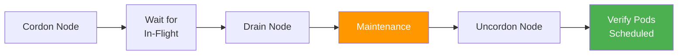

> 💡 **Quick Answer:** `kubectl cordon <node>` marks a node unschedulable (no new pods), `kubectl drain <node>` evicts all pods and cordons in one step. Always drain with `--ignore-daemonsets --delete-emptydir-data` for clean maintenance. Uncordon with `kubectl uncordon <node>` when maintenance is complete.

## The Problem

Node maintenance — OS upgrades, kernel patches, hardware replacement — requires moving workloads off nodes without downtime. Incorrectly draining nodes causes:

- Application outages from simultaneous pod eviction
- Stuck drains from PDB conflicts
- Data loss from pods with emptyDir volumes
- Orphaned DaemonSet pods blocking the drain

## The Solution

### Cordon (Mark Unschedulable)

```bash
# Prevent new pods from scheduling on the node
kubectl cordon worker-3

# Verify
kubectl get nodes
# NAME       STATUS                     ROLES    AGE
# worker-3   Ready,SchedulingDisabled   worker   90d

# Uncordon when done
kubectl uncordon worker-3
```

### Drain (Evict + Cordon)

```bash
# Standard drain for maintenance
kubectl drain worker-3 \
  --ignore-daemonsets \
  --delete-emptydir-data \
  --grace-period=60 \
  --timeout=300s

# Dry run first
kubectl drain worker-3 --dry-run=client \
  --ignore-daemonsets \
  --delete-emptydir-data
```

### Drain Flags

| Flag | Purpose |
|------|---------|
| `--ignore-daemonsets` | Skip DaemonSet pods (they can't be rescheduled) |
| `--delete-emptydir-data` | Allow evicting pods with emptyDir volumes |
| `--grace-period=N` | Override pod termination grace period (seconds) |
| `--timeout=N` | Abort drain if it takes longer than N seconds |
| `--force` | Delete pods not managed by a controller (bare pods) |
| `--pod-selector=label` | Only evict pods matching the selector |
| `--disable-eviction` | Use delete instead of eviction API (bypasses PDB) |

### Maintenance Window Script

```bash
#!/bin/bash
NODE=$1
echo "=== Starting maintenance on $NODE ==="

# Step 1: Cordon
kubectl cordon "$NODE"

# Step 2: Wait for in-flight requests to complete
sleep 30

# Step 3: Drain
kubectl drain "$NODE" \
  --ignore-daemonsets \
  --delete-emptydir-data \
  --grace-period=120 \
  --timeout=600s

if [ $? -ne 0 ]; then
  echo "ERROR: Drain failed. Check PDB conflicts."
  exit 1
fi

echo "=== Node $NODE drained. Perform maintenance. ==="
echo "=== Run: kubectl uncordon $NODE when complete ==="
```



## Common Issues

**"Cannot evict pod" — PDB violation**

A PodDisruptionBudget is blocking eviction. Wait for other pods to become ready, or use `--disable-eviction` as a last resort (bypasses PDB, may cause downtime).

**"pod not managed by a controller"**

Bare pods (not from a Deployment/StatefulSet) won't be rescheduled. Use `--force` to delete them, but understand they're gone permanently.

**Drain takes forever**

A pod has a long `terminationGracePeriodSeconds` or a PreStop hook. Use `--grace-period=30` to override, or investigate the stuck pod.

## Best Practices

- **Always drain before maintenance** — don't just power off nodes
- **Dry run first** — `--dry-run=client` shows what would be evicted
- **Set PDBs on all production workloads** — prevents mass eviction
- **Drain one node at a time** — maintain cluster capacity
- **Use `--timeout`** — prevent infinite waits from stuck pods
- **Automate with scripts** — cordon → drain → maintain → uncordon

## Key Takeaways

- `cordon` prevents new scheduling; `drain` evicts existing pods AND cordons
- `--ignore-daemonsets --delete-emptydir-data` are needed for most real-world drains
- PDBs can block drains — by design, to protect availability
- Always `uncordon` after maintenance to restore scheduling
- Drain one node at a time during rolling maintenance windows
