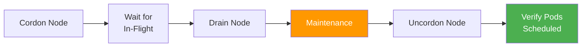

> 💡 **Quick Answer:** `kubectl cordon <node>` marks a node unschedulable (no new pods), `kubectl drain <node>` evicts all pods and cordons in one step. Always drain with `--ignore-daemonsets --delete-emptydir-data` for clean maintenance. Uncordon with `kubectl uncordon <node>` when maintenance is complete.
>
> **Gotcha:** Drain uses the Eviction API, so PodDisruptionBudgets can hold it indefinitely — always pass `--timeout`. On OpenShift, `oc adm cordon/drain/uncordon` take the same flags (add `--timeout=30m`+ for MachineConfig-triggered reboots); see [OpenShift node management](/recipes/configuration/rhcos-openshift-node-management/) for MCP-specific gotchas.

## The Problem

Node maintenance — OS upgrades, kernel patches, hardware replacement — requires moving workloads off nodes without downtime. Incorrectly draining nodes causes:

- Application outages from simultaneous pod eviction
- Stuck drains from PDB conflicts
- Data loss from pods with emptyDir volumes
- Orphaned DaemonSet pods blocking the drain

## The Solution

### Cordon (Mark Unschedulable)

```bash
# Prevent new pods from scheduling on the node
kubectl cordon worker-3

# Verify
kubectl get nodes
# NAME       STATUS                     ROLES    AGE
# worker-3   Ready,SchedulingDisabled   worker   90d

# Uncordon when done
kubectl uncordon worker-3
```

### Drain (Evict + Cordon)

```bash
# Standard drain for maintenance
kubectl drain worker-3 \
  --ignore-daemonsets \
  --delete-emptydir-data \
  --grace-period=60 \
  --timeout=300s

# Dry run first (server-side: also checks what the API would do)
kubectl drain worker-3 --dry-run=server \
  --ignore-daemonsets \
  --delete-emptydir-data
```

### Safe Maintenance Procedure

```bash
# 1. What runs on the node?
kubectl get pods -A --field-selector spec.nodeName=worker-3 -o wide

# 2. Will any PDB block the drain? (ALLOWED DISRUPTIONS must be > 0)
kubectl get pdb -A

# 3. Drain, do the maintenance, uncordon
kubectl drain worker-3 --ignore-daemonsets --delete-emptydir-data --timeout=600s
kubectl uncordon worker-3

# 4. Confirm the node is schedulable again
kubectl get node worker-3        # STATUS: Ready (no SchedulingDisabled)
```

Uncordoning doesn't move evicted pods back — the node fills up again only as new pods are created (rollouts, scaling). Use the descheduler if you need active rebalancing.

### Drain Flags

| Flag | Purpose |
|------|---------|
| `--ignore-daemonsets` | Skip DaemonSet pods (they can't be rescheduled) |
| `--delete-emptydir-data` | Allow evicting pods with emptyDir volumes |
| `--grace-period=N` | Override pod termination grace period (seconds) |
| `--timeout=N` | Abort drain if it takes longer than N seconds |
| `--force` | Delete pods not managed by a controller (bare pods) |
| `--pod-selector=label` | Only evict pods matching the selector |
| `--disable-eviction` | Use delete instead of eviction API (bypasses PDB) |
| `--dry-run=server` | Preview evictions without changing anything |

`--force` does **not** bypass PDBs; only `--disable-eviction` does.

### Maintenance Window Script

```bash
#!/bin/bash
NODE=$1
echo "=== Starting maintenance on $NODE ==="

# Step 1: Cordon
kubectl cordon "$NODE"

# Step 2: Wait for in-flight requests to complete
sleep 30

# Step 3: Drain
kubectl drain "$NODE" \
  --ignore-daemonsets \
  --delete-emptydir-data \
  --grace-period=120 \
  --timeout=600s

if [ $? -ne 0 ]; then
  echo "ERROR: Drain failed. Check PDB conflicts."
  exit 1
fi

echo "=== Node $NODE drained. Perform maintenance. ==="
echo "=== Run: kubectl uncordon $NODE when complete ==="
```


```mermaid
graph LR
    A[Cordon Node] --> B[Wait for<br/>In-Flight]
    B --> C[Drain Node]
    C --> D[Maintenance]
    D --> E[Uncordon Node]
    E --> F[Verify Pods<br/>Scheduled]
    
    style D fill:#FF9800,color:white
    style F fill:#4CAF50,color:white
```

## Common Issues

**"Cannot evict pod" — PDB violation**

A PodDisruptionBudget is blocking eviction. Wait for other pods to become ready, or use `--disable-eviction` as a last resort (bypasses PDB, may cause downtime).

**"pod not managed by a controller"**

Bare pods (not from a Deployment/StatefulSet) won't be rescheduled. Use `--force` to delete them, but understand they're gone permanently.

**"cannot delete Pods with local storage"**

The pod uses `emptyDir`. Add `--delete-emptydir-data` (the data is lost; it's scratch space by definition).

**Drain takes forever**

A pod has a long `terminationGracePeriodSeconds` or a PreStop hook. Use `--grace-period=30` to override, or investigate the stuck pod.

## Best Practices

- **Always drain before maintenance** — don't just power off nodes
- **Dry run first** — `--dry-run=server` shows what would be evicted
- **Set PDBs on all production workloads** — prevents mass eviction
- **Drain one node at a time** — maintain cluster capacity
- **Use `--timeout`** — prevent infinite waits from stuck pods
- **Automate with scripts** — cordon → drain → maintain → uncordon

## Key Takeaways

- `cordon` prevents new scheduling; `drain` evicts existing pods AND cordons
- `--ignore-daemonsets --delete-emptydir-data` are needed for most real-world drains
- PDBs can block drains — by design, to protect availability
- Always `uncordon` after maintenance to restore scheduling
- Drain one node at a time during rolling maintenance windows

## Frequently Asked Questions

### What is the difference between cordon and drain?

`kubectl cordon` only marks the node unschedulable (`spec.unschedulable: true`); running pods stay. `kubectl drain` cordons the node and then evicts its pods (except DaemonSet pods and mirror pods) so controllers recreate them elsewhere.

### What does uncordon do?

`kubectl uncordon <node>` clears `spec.unschedulable`, so the scheduler can place new pods on the node again. It doesn't bring back pods that were evicted.

### Why is kubectl drain hanging?

Usually a PodDisruptionBudget allows 0 disruptions (single replica, `minAvailable` equal to replicas, or unready pods), or a pod has a long termination grace period. Check `kubectl get pdb -A`, scale the workload up, or fix unhealthy pods. See [PDB allowed disruptions 0](/recipes/troubleshooting/pdb-allowed-disruptions-zero/).

### Does drain evict DaemonSet pods?

No. DaemonSet pods would be recreated on the same node immediately, so drain refuses to proceed unless you pass `--ignore-daemonsets`, which leaves them running.

