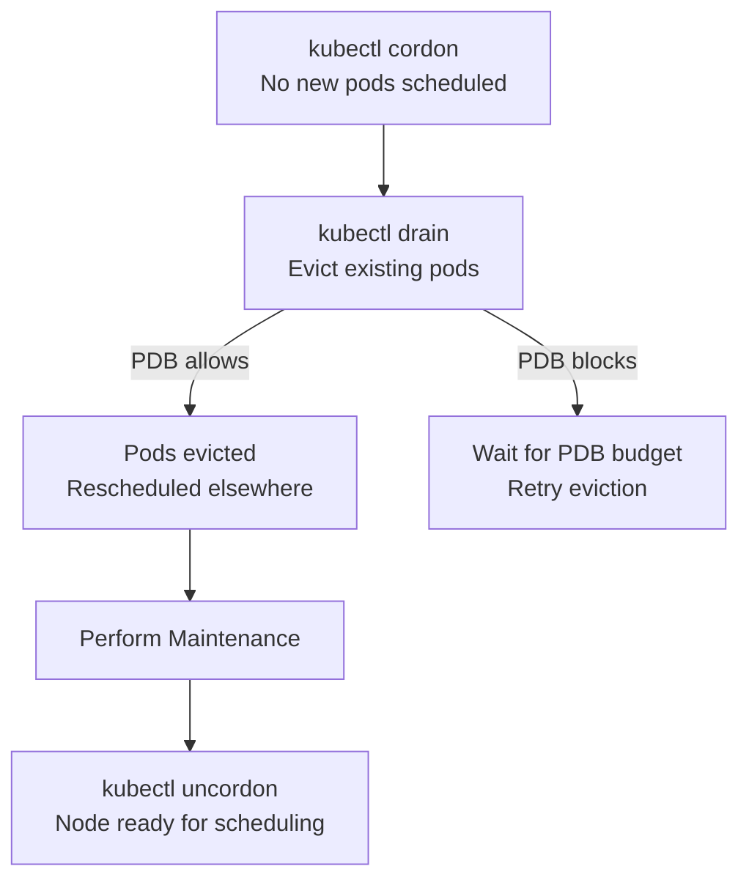

> 💡 **Quick Answer:** Use `kubectl cordon <node>` to prevent new scheduling, `kubectl drain <node> --ignore-daemonsets --delete-emptydir-data` to evict pods, perform maintenance, then `kubectl uncordon <node>` to re-enable scheduling.

## The Problem

Nodes need maintenance: kernel updates, hardware repairs, Kubernetes version upgrades. Draining pods without proper handling causes downtime — PDB violations, stuck DaemonSet pods, and pods with local storage that refuse to evict.

## The Solution

### Standard Drain Workflow

```bash
# Step 1: Cordon — prevent new pods from scheduling
kubectl cordon worker-3

# Step 2: Drain — evict existing pods
kubectl drain worker-3 \
  --ignore-daemonsets \
  --delete-emptydir-data \
  --grace-period=120 \
  --timeout=300s

# Step 3: Perform maintenance
# (kernel update, hardware repair, etc.)

# Step 4: Uncordon — re-enable scheduling
kubectl uncordon worker-3
```

### Drain Options

| Flag | Purpose |
|------|---------|
| `--ignore-daemonsets` | Skip DaemonSet pods (they'll restart on the node) |
| `--delete-emptydir-data` | Allow eviction of pods with emptyDir volumes |
| `--grace-period=120` | Give pods 120s to terminate gracefully |
| `--timeout=300s` | Fail if drain doesn't complete in 5 minutes |
| `--force` | Delete pods not managed by a controller (standalone pods) |
| `--pod-selector=app=web` | Only drain specific pods |

### Graceful Drain Script

```bash
#!/bin/bash
NODE=$1
echo "Draining $NODE..."

# Check PDB status first
kubectl get pdb -A -o wide

# Cordon
kubectl cordon "$NODE"

# Drain with retry
for attempt in 1 2 3; do
  if kubectl drain "$NODE" --ignore-daemonsets --delete-emptydir-data --grace-period=120 --timeout=300s; then
    echo "Drain successful"
    break
  fi
  echo "Attempt $attempt failed, retrying in 30s..."
  sleep 30
done

echo "Node $NODE drained. Perform maintenance, then run:"
echo "  kubectl uncordon $NODE"
```



## Common Issues

**Drain stuck on PDB — "Cannot evict pod"**

A PodDisruptionBudget prevents eviction. Check: `kubectl get pdb -A`. Either wait for replicas to scale up, or temporarily adjust the PDB.

**"pod has local storage" error**

Use `--delete-emptydir-data` to allow eviction of pods with emptyDir. For pods with hostPath or local PVs, you may need `--force`.

## Best Practices

- **Always cordon before drain** — prevents race conditions with new scheduling
- **`--ignore-daemonsets` is almost always needed** — DaemonSets manage their own lifecycle
- **Set `--grace-period` to match your longest shutdown** — give pods time to drain connections
- **Check PDBs before draining** — ensure replicas exist elsewhere to satisfy PDB
- **Drain one node at a time** — prevents simultaneous disruption across the cluster

## Key Takeaways

- Cordon marks node unschedulable; drain evicts pods; uncordon re-enables scheduling
- `--ignore-daemonsets` and `--delete-emptydir-data` are needed for most drain operations
- PDBs can block drain — ensure sufficient replicas exist on other nodes
- Grace period should match your application's graceful shutdown time
- Always drain one node at a time for safe cluster maintenance
