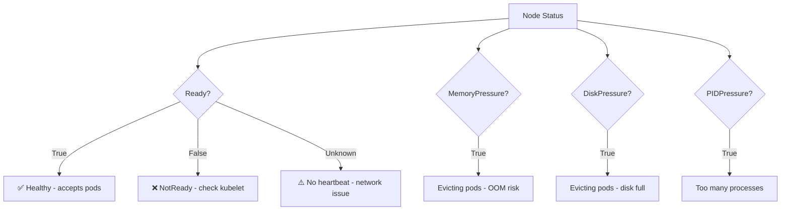

> 💡 **Quick Answer:** `kubectl get nodes` shows node status. `kubectl describe node <name>` shows detailed conditions (Ready, MemoryPressure, DiskPressure, PIDPressure). A healthy node shows `Ready=True` for all conditions.

## The Problem

You need to quickly determine:
- Are all nodes healthy and schedulable?
- Why is a node showing `NotReady`?
- Is the node running out of resources (memory, disk, PIDs)?
- Which pods are running on a specific node?

## The Solution

### Quick Status Check

```bash
# All nodes status
kubectl get nodes
# NAME       STATUS   ROLES           AGE   VERSION
# master-1   Ready    control-plane   90d   v1.30.2
# worker-1   Ready    <none>          90d   v1.30.2
# worker-2   NotReady <none>          90d   v1.30.2

# With additional info
kubectl get nodes -o wide
# Shows: INTERNAL-IP, EXTERNAL-IP, OS-IMAGE, KERNEL-VERSION, CONTAINER-RUNTIME

# Node resource usage
kubectl top nodes
# NAME       CPU(cores)  CPU%   MEMORY(bytes)  MEMORY%
# worker-1   2450m       61%    12680Mi        79%
# worker-2   180m        4%     4200Mi         26%
```

### Detailed Node Conditions

```bash
# Full node details
kubectl describe node worker-2

# Key sections to check:
# Conditions:
#   Type                 Status  Reason
#   ----                 ------  ------
#   MemoryPressure       False   KubeletHasSufficientMemory
#   DiskPressure         False   KubeletHasNoDiskPressure
#   PIDPressure          False   KubeletHasSufficientPID
#   Ready                True    KubeletReady

# Extract just conditions
kubectl get node worker-2 -o jsonpath='{range .status.conditions[*]}{.type}{"\t"}{.status}{"\t"}{.reason}{"\n"}{end}'
```

### Node Conditions Explained



| Condition | Healthy State | Meaning When True |
|-----------|--------------|-------------------|
| Ready | True | Node can accept pods |
| MemoryPressure | False | Memory below eviction threshold |
| DiskPressure | False | Disk below eviction threshold |
| PIDPressure | False | PIDs below limit |
| NetworkUnavailable | False | Network configured correctly |

### Troubleshoot NotReady Node

```bash
# 1. Check kubelet status on the node
ssh worker-2 "systemctl status kubelet"
ssh worker-2 "journalctl -u kubelet --since '10 min ago' | tail -30"

# 2. Check node events
kubectl get events --field-selector involvedObject.name=worker-2 --sort-by='.lastTimestamp'

# 3. Check if node is cordoned (manually unschedulable)
kubectl get node worker-2 -o jsonpath='{.spec.unschedulable}'
# true = cordoned

# 4. Uncordon the node
kubectl uncordon worker-2

# 5. Check container runtime
ssh worker-2 "crictl info"
ssh worker-2 "systemctl status containerd"
```

### Monitor Allocatable Resources

```bash
# See allocatable vs capacity
kubectl describe node worker-1 | grep -A 6 "Allocatable:"
# Allocatable:
#   cpu:                8
#   memory:             32565Mi
#   ephemeral-storage:  95Gi
#   pods:               110

# See allocated resources (requests vs limits)
kubectl describe node worker-1 | grep -A 10 "Allocated resources:"
# Allocated resources:
#   Resource           Requests    Limits
#   cpu                3100m (38%) 8000m (100%)
#   memory             8Gi (25%)   16Gi (50%)

# All pods on a node
kubectl get pods --all-namespaces --field-selector spec.nodeName=worker-1
```

### Custom Columns for Fleet View

```bash
# Quick fleet health check
kubectl get nodes -o custom-columns=\
'NAME:.metadata.name,\
STATUS:.status.conditions[?(@.type=="Ready")].status,\
VERSION:.status.nodeInfo.kubeletVersion,\
OS:.status.nodeInfo.osImage,\
RUNTIME:.status.nodeInfo.containerRuntimeVersion'

# Nodes with taints
kubectl get nodes -o custom-columns=\
'NAME:.metadata.name,\
TAINTS:.spec.taints[*].key'
```

### JSON/YAML Queries

```bash
# Get all NotReady nodes
kubectl get nodes -o json | jq '.items[] | select(.status.conditions[] | select(.type=="Ready" and .status!="True")) | .metadata.name'

# Check node ages
kubectl get nodes -o custom-columns='NAME:.metadata.name,AGE:.metadata.creationTimestamp' --sort-by='.metadata.creationTimestamp'

# Find nodes with GPU
kubectl get nodes -o json | jq '.items[] | select(.status.capacity."nvidia.com/gpu" != null) | {name: .metadata.name, gpus: .status.capacity."nvidia.com/gpu"}'
```

## Common Issues

| Issue | Cause | Fix |
|-------|-------|-----|
| NotReady | Kubelet crashed or network issue | Restart kubelet, check network |
| Unknown status | Node heartbeat missing >5min | Check node connectivity |
| MemoryPressure | Memory >90% used | Delete pods, add memory, increase eviction threshold |
| DiskPressure | Disk >85% used | Clean images: `crictl rmi --prune` |
| SchedulingDisabled | Node cordoned | `kubectl uncordon <node>` |
| Pods evicted | Resource pressure | Scale cluster or reduce workload |

## Best Practices

1. **Monitor node conditions** — alert on `Ready!=True` lasting >5 minutes
2. **Set resource requests on all pods** — prevents overcommit and OOM
3. **Use `kubectl top nodes`** — quick real-time resource usage check
4. **Cordon before maintenance** — `kubectl cordon` then `kubectl drain`
5. **Track kubelet version** — ensure all nodes match cluster version

## Key Takeaways

- `kubectl get nodes` for quick status; `kubectl describe node` for full conditions
- Healthy = `Ready=True`, all pressure conditions `False`
- `NotReady` usually means kubelet is down or network partitioned
- `kubectl top nodes` shows real-time CPU/memory usage (requires metrics-server)
- Cordon → Drain → Maintenance → Uncordon is the safe maintenance workflow
