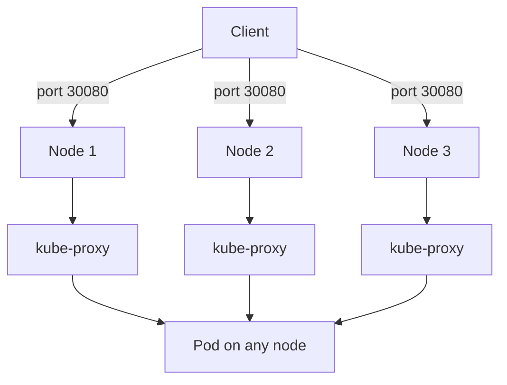

> 💡 **Quick Answer:** networking

## The Problem

This is one of the most searched Kubernetes topics with thousands of monthly searches. A comprehensive, production-ready guide prevents hours of trial and error.

## The Solution

### Create a NodePort Service

```yaml
apiVersion: v1
kind: Service
metadata:
  name: web-nodeport
spec:
  type: NodePort
  selector:
    app: web
  ports:
    - port: 80            # Service port (internal)
      targetPort: 8080    # Container port
      nodePort: 30080     # External port (30000-32767)
      # If nodePort omitted, K8s assigns random from range
```

```bash
# Access from outside the cluster
curl http://<any-node-ip>:30080

# Find node IPs
kubectl get nodes -o wide
```

### How NodePort Works

```
External Client → Node IP:30080 → kube-proxy → Pod IP:8080

1. Client sends request to ANY node on port 30080
2. kube-proxy on that node routes to a matching pod
3. Pod may be on a DIFFERENT node (extra hop)
```

### Avoid Extra Hops

```yaml
spec:
  type: NodePort
  externalTrafficPolicy: Local   # Only route to pods on this node
  # Pros: No extra hop, preserves client IP
  # Cons: Uneven load if pods not on all nodes
```

### When to Use What

| Service Type | Use When |
|-------------|----------|
| **ClusterIP** | Internal only (default) |
| **NodePort** | Dev/testing, on-prem without LB |
| **LoadBalancer** | Production cloud (AWS ALB, GCP LB) |
| **Ingress** | HTTP routing, TLS, multiple services |



## Frequently Asked Questions

### Why ports 30000-32767 only?

This is the default `--service-node-port-range` for kube-apiserver. It avoids conflicts with well-known ports. You can change the range but it's not recommended.

### NodePort vs port-forward for development?

`kubectl port-forward` is simpler for single-user dev. NodePort is better when multiple people need access or you're testing load balancer behavior.

## Best Practices

- Start with the simplest configuration that solves your problem
- Test in staging before production
- Use `kubectl describe` and events for troubleshooting
- Document team conventions for consistency

## Key Takeaways

- This is fundamental Kubernetes operational knowledge
- Follow established conventions and recommended labels
- Monitor and iterate based on real production behavior
- Automate repetitive tasks to reduce human error
