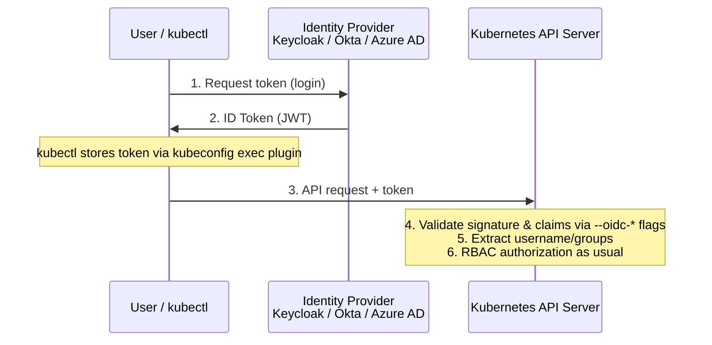

> 💡 **Quick Answer:** Configure OpenID Connect authentication for Kubernetes API server. Keycloak, Dex, Google OIDC, kubelogin plugin, and RBAC integration for SSO.

## The Problem

Managing individual client certificates for every cluster user doesn't scale, can't enforce your org's password/MFA policy, and gives you no way to instantly revoke access when someone leaves. You need the API server to trust your existing identity provider instead.

## The Solution

### The OIDC Login Flow



### Configure the API Server

```yaml
# /etc/kubernetes/manifests/kube-apiserver.yaml
spec:
  containers:
    - name: kube-apiserver
      command:
        - kube-apiserver
        - --oidc-issuer-url=https://keycloak.example.com/realms/kubernetes
        - --oidc-client-id=kubernetes
        - --oidc-username-claim=preferred_username
        - --oidc-username-prefix=oidc:
        - --oidc-groups-claim=groups
        - --oidc-groups-prefix=oidc:
        - --oidc-ca-file=/etc/kubernetes/pki/oidc-ca.crt
        - --oidc-required-claim=aud=kubernetes
```

For managed clusters, this is set via the provider's API instead of raw flags:

```bash
# EKS
aws eks update-cluster-config --name my-cluster --identity-provider-config '{
  "oidc": {"identityProviderConfigName": "keycloak",
    "issuerUrl": "https://keycloak.example.com/realms/kubernetes",
    "clientId": "kubernetes", "usernameClaim": "preferred_username",
    "usernamePrefix": "oidc:", "groupsClaim": "groups", "groupsPrefix": "oidc:"}
}'
```

### Bind OIDC Groups to RBAC

Use group-based bindings, not per-user — groups are managed in the IdP, so access changes there without touching cluster config:

```yaml
apiVersion: rbac.authorization.k8s.io/v1
kind: ClusterRoleBinding
metadata:
  name: oidc-cluster-admins
subjects:
  - kind: Group
    name: oidc:cluster-admins   # matches the prefix set by --oidc-groups-prefix
    apiGroup: rbac.authorization.k8s.io
roleRef: {kind: ClusterRole, name: cluster-admin, apiGroup: rbac.authorization.k8s.io}
---
apiVersion: rbac.authorization.k8s.io/v1
kind: RoleBinding
metadata: {name: oidc-developers, namespace: production}
subjects:
  - {kind: Group, name: "oidc:developers", apiGroup: rbac.authorization.k8s.io}
roleRef: {kind: ClusterRole, name: edit, apiGroup: rbac.authorization.k8s.io}
```

### Configure kubectl with kubelogin

Kubernetes doesn't refresh OIDC tokens itself — `kubelogin` (the `oidc-login` kubectl plugin) handles the browser login and token cache:

```bash
brew install int128/kubelogin/kubelogin   # macOS
```

```yaml
# ~/.kube/config
users:
  - name: oidc-user
    user:
      exec:
        apiVersion: client.authentication.k8s.io/v1beta1
        command: kubectl
        args:
          - oidc-login
          - get-token
          - --oidc-issuer-url=https://keycloak.example.com/realms/kubernetes
          - --oidc-client-id=kubernetes
          - --oidc-client-secret=kubernetes-client-secret
          - --oidc-extra-scope=groups
```

### Provider-Specific Notes: Azure AD and Okta

```yaml
# Azure AD API server flags
- --oidc-issuer-url=https://login.microsoftonline.com/<tenant-id>/v2.0
- --oidc-client-id=<application-id>
- --oidc-username-claim=email
- --oidc-groups-claim=groups
```

```yaml
# Okta API server flags
- --oidc-issuer-url=https://your-org.okta.com
- --oidc-client-id=<okta-client-id>
- --oidc-username-claim=email
- --oidc-username-prefix=okta:
```

Azure AD in particular needs the `kubelogin` `get-token` exec plugin (not `oidc-login`) with `--environment`/`--server-id`/`--tenant-id` — see the [OIDC claims-mapping troubleshooting guide](/recipes/troubleshooting/openshift-oidc-claims-mapping-troubleshooting/) if your IdP's actual claim names don't match what you configured.

### Verification

```bash
kubectl oidc-login setup --oidc-issuer-url=... --oidc-client-id=kubernetes --oidc-client-secret=...
kubectl auth whoami
kubectl auth can-i --list

# Impersonate to test a binding without that user's actual token
kubectl auth can-i create pods --as=oidc:jane@example.com -n production
kubectl auth can-i delete deployments --as-group=oidc:developers -n production
```

## Common Issues

| Issue | Cause | Fix |
|-------|-------|-----|
| Token validation fails | Issuer URL doesn't exactly match, or clock skew between API server and IdP | Copy the issuer URL verbatim from the IdP's discovery document; sync node clocks (NTP) |
| Groups claim missing from token | Group mapper not configured in IdP, or groups only added to the access token, not the ID token | Kubernetes reads the **ID token** — confirm the IdP includes `groups` there, not just the access token |
| `kubectl` auth errors after IdP password change | Stale cached token | `rm -rf ~/.kube/cache/oidc-login` and log in again |
| RBAC binding has no effect | Group name in the binding doesn't include the `--oidc-groups-prefix` | `ClusterRoleBinding` subject must be `oidc:developers`, not `developers`, if the prefix is `oidc:` |

## Best Practices

- **Bind RBAC to groups, not individual users** — access changes happen in the IdP, not in cluster YAML
- **Use username/group prefixes** (`oidc:`, `okta:`) to avoid collisions with local/service-account identities of the same name
- **Set token lifetimes to 1-8 hours** — short enough to limit blast radius from a leaked token, long enough to not annoy users
- **Enable PKCE** for the OIDC client — mandatory for public clients doing the CLI login flow
- **Audit OIDC authentication events** at `Metadata` level minimum, `Request` level for privileged groups
- **Test the full login → RBAC flow in staging** before rolling out to a production cluster's only auth path

## Key Takeaways

- OIDC lets users authenticate with existing corporate credentials instead of per-user client certificates
- The API server validates tokens via `--oidc-*` flags — it never talks to the IdP directly at request time, only at flag-configured issuer/CA validation
- Kubernetes doesn't handle token refresh — `kubelogin`/`oidc-login` kubectl plugins manage that via kubeconfig `exec`
- Bind RBAC to OIDC groups (with the configured prefix), not individual users, for maintainable access control
- If claim names don't match between your IdP and your `--oidc-*` flags, see the dedicated [claims-mapping troubleshooting guide](/recipes/troubleshooting/openshift-oidc-claims-mapping-troubleshooting/)
