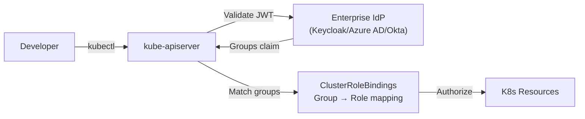

> 💡 **Quick Answer:** Configure the kube-apiserver with `--oidc-issuer-url`, `--oidc-client-id`, and `--oidc-groups-claim` flags to authenticate users via your enterprise IdP (Keycloak, Azure AD, Okta). Map IdP groups to Kubernetes ClusterRoleBindings for automated RBAC.

## The Problem

Enterprise organizations need centralized identity management. Local Kubernetes service accounts and client certificates don't integrate with corporate SSO, lack MFA, and create audit gaps. You need API server authentication that flows through your existing identity provider with group-based access control.



## The Solution

### Configure kube-apiserver for OIDC

Add OIDC flags to the API server manifest:

```yaml
# /etc/kubernetes/manifests/kube-apiserver.yaml (kubeadm)
apiVersion: v1
kind: Pod
metadata:
  name: kube-apiserver
  namespace: kube-system
spec:
  containers:
    - name: kube-apiserver
      command:
        - kube-apiserver
        # ... existing flags ...
        - --oidc-issuer-url=https://keycloak.example.com/realms/kubernetes
        - --oidc-client-id=kubernetes
        - --oidc-username-claim=preferred_username
        - --oidc-username-prefix="oidc:"
        - --oidc-groups-claim=groups
        - --oidc-groups-prefix="oidc:"
        - --oidc-ca-file=/etc/kubernetes/pki/oidc-ca.pem
```

### Keycloak Configuration

```bash
# Create Kubernetes realm client in Keycloak
# 1. Create a new client: kubernetes
# 2. Set Access Type: confidential
# 3. Add mappers:
#    - groups: Type=Group Membership, Token Claim Name=groups
#    - audience: Type=Audience, Included Client Audience=kubernetes

# Example Keycloak groups:
# - k8s-admins      → cluster-admin
# - k8s-developers  → namespace edit
# - k8s-viewers     → namespace view
```

### Azure AD Configuration

```bash
# Register application in Azure AD
az ad app create --display-name "Kubernetes OIDC" \
  --sign-in-audience AzureADMyOrg

# API server flags for Azure AD
--oidc-issuer-url=https://login.microsoftonline.com/<TENANT-ID>/v2.0
--oidc-client-id=<APPLICATION-ID>
--oidc-username-claim=email
--oidc-groups-claim=groups
```

### Group-Based RBAC Bindings

```yaml
# Map IdP group to cluster-admin
apiVersion: rbac.authorization.k8s.io/v1
kind: ClusterRoleBinding
metadata:
  name: oidc-cluster-admins
subjects:
  - kind: Group
    name: "oidc:k8s-admins"
    apiGroup: rbac.authorization.k8s.io
roleRef:
  kind: ClusterRole
  name: cluster-admin
  apiGroup: rbac.authorization.k8s.io
---
# Map IdP group to namespace developer
apiVersion: rbac.authorization.k8s.io/v1
kind: RoleBinding
metadata:
  name: oidc-developers
  namespace: app-team-a
subjects:
  - kind: Group
    name: "oidc:k8s-developers"
    apiGroup: rbac.authorization.k8s.io
roleRef:
  kind: ClusterRole
  name: edit
  apiGroup: rbac.authorization.k8s.io
---
# Read-only for viewers
apiVersion: rbac.authorization.k8s.io/v1
kind: ClusterRoleBinding
metadata:
  name: oidc-viewers
subjects:
  - kind: Group
    name: "oidc:k8s-viewers"
    apiGroup: rbac.authorization.k8s.io
roleRef:
  kind: ClusterRole
  name: view
  apiGroup: rbac.authorization.k8s.io
```

### Configure kubectl for OIDC

```bash
# Install kubelogin (OIDC helper)
kubectl krew install oidc-login

# Configure kubeconfig
kubectl config set-credentials oidc-user \
  --exec-api-version=client.authentication.k8s.io/v1beta1 \
  --exec-command=kubectl \
  --exec-arg=oidc-login \
  --exec-arg=get-token \
  --exec-arg=--oidc-issuer-url=https://keycloak.example.com/realms/kubernetes \
  --exec-arg=--oidc-client-id=kubernetes \
  --exec-arg=--oidc-client-secret=<CLIENT-SECRET>

# Test authentication
kubectl --user=oidc-user get pods
# Browser opens → SSO login → kubectl authorized
```

### Audit Logging for Compliance

```yaml
apiVersion: audit.k8s.io/v1
kind: Policy
rules:
  # Log all authentication events
  - level: RequestResponse
    users: ["system:anonymous"]
    resources:
      - group: ""
        resources: ["*"]
  # Log OIDC user actions at metadata level
  - level: Metadata
    userGroups: ["oidc:*"]
  # Log privilege escalation attempts
  - level: RequestResponse
    resources:
      - group: "rbac.authorization.k8s.io"
        resources: ["clusterroles", "clusterrolebindings"]
```

## Common Issues

| Issue | Cause | Fix |
|-------|-------|-----|
| `Unauthorized` after login | OIDC issuer URL mismatch | Verify `--oidc-issuer-url` matches IdP exactly (trailing slash matters) |
| Groups not mapped | Missing groups claim mapper | Add Group Membership mapper in Keycloak with `groups` token claim |
| Token expired during session | Short token lifetime | Configure IdP refresh tokens, use `kubelogin` for auto-refresh |
| `oidc: verify failed` | CA cert mismatch | Add IdP CA to `--oidc-ca-file` on API server |
| Azure AD groups show as GUIDs | Default Azure behavior | Map GUIDs to friendly names in RoleBindings or use `--oidc-groups-claim=roles` |

## Best Practices

- **Use group-based RBAC** — never bind individual users; always map IdP groups to K8s roles
- **Prefix OIDC identities** — `--oidc-username-prefix` and `--oidc-groups-prefix` prevent collisions with local accounts
- **Require MFA at the IdP level** — Kubernetes doesn't handle MFA; enforce it in Keycloak/Azure AD/Okta
- **Rotate client secrets** — schedule secret rotation in your IdP at least every 90 days
- **Audit everything** — enable API server audit logging for all OIDC user actions
- **Break-glass accounts** — maintain emergency client certificate or service account access in case IdP is down

## Key Takeaways

- OIDC integrates Kubernetes with enterprise SSO (Keycloak, Azure AD, Okta) for centralized identity
- Map IdP groups to K8s ClusterRoleBindings/RoleBindings for automated group-based RBAC
- Use `kubelogin` for seamless browser-based SSO with kubectl
- Always prefix OIDC identities to distinguish from local service accounts
