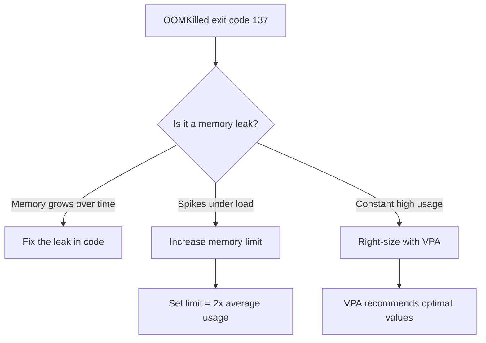

> 💡 **Quick Answer:** Debug and fix OOMKilled errors in Kubernetes. Find memory leaks, set correct limits, use VPA for right-sizing, and prevent container OOM kills.

## The Problem

This is one of the most searched Kubernetes topics. A comprehensive, well-structured guide helps engineers of all levels quickly find actionable solutions.

## The Solution

Detailed implementation with production-ready examples below.


### Diagnose OOMKilled

```bash
# Check pod status
kubectl get pod <name> -o jsonpath='{.status.containerStatuses[0].lastState.terminated}'
# {"exitCode":137,"reason":"OOMKilled",...}

# Check events
kubectl describe pod <name> | grep -i oom

# Check current memory usage vs limits
kubectl top pod <name>
kubectl get pod <name> -o jsonpath='{.spec.containers[0].resources.limits.memory}'

# Check node-level OOM events
kubectl get events --field-selector reason=OOMKilling -A
```

### Fix: Increase Memory Limits

```yaml
# Before (too low)
resources:
  limits:
    memory: 128Mi

# After (right-sized)
resources:
  requests:
    memory: 256Mi    # Based on actual usage
  limits:
    memory: 512Mi    # 2x request for burst headroom
```

### Fix: Find Memory Leaks

```bash
# Monitor memory over time
kubectl top pod <name> --containers
# Run every 30s and watch if memory grows continuously

# Profile inside the container
kubectl exec -it <name> -- /bin/sh
# Java: jmap -heap <pid>
# Python: tracemalloc
# Node.js: --inspect flag + Chrome DevTools
# Go: pprof endpoint
```

### Fix: Use VPA for Right-Sizing

```yaml
apiVersion: autoscaling.k8s.io/v1
kind: VerticalPodAutoscaler
metadata:
  name: my-app-vpa
spec:
  targetRef:
    apiVersion: apps/v1
    kind: Deployment
    name: my-app
  updatePolicy:
    updateMode: "Off"   # Just get recommendations first
```

```bash
kubectl describe vpa my-app-vpa
# Target: memory 340Mi ← set your request to this
```



## Frequently Asked Questions

### Why exit code 137?

137 = 128 + 9 (SIGKILL). The Linux OOM killer sends SIGKILL (signal 9) when a process exceeds its cgroup memory limit.

### OOMKilled vs node-level OOM?

Container OOMKilled = container exceeded its own memory limit. Node OOM = node ran out of memory entirely and the kernel OOM killer chose a victim. Set memory requests to guarantee capacity.

## Common Issues

Check `kubectl describe` and `kubectl get events` first — most issues have clear error messages pointing to the root cause.

## Best Practices

- **Follow least privilege** — only grant the access that's needed
- **Test in staging** before applying to production
- **Monitor and alert** on key metrics
- **Document your runbooks** for the team

## Key Takeaways

- Essential knowledge for Kubernetes operations
- Start simple and evolve your approach
- Automation reduces human error
- Share knowledge with your team
