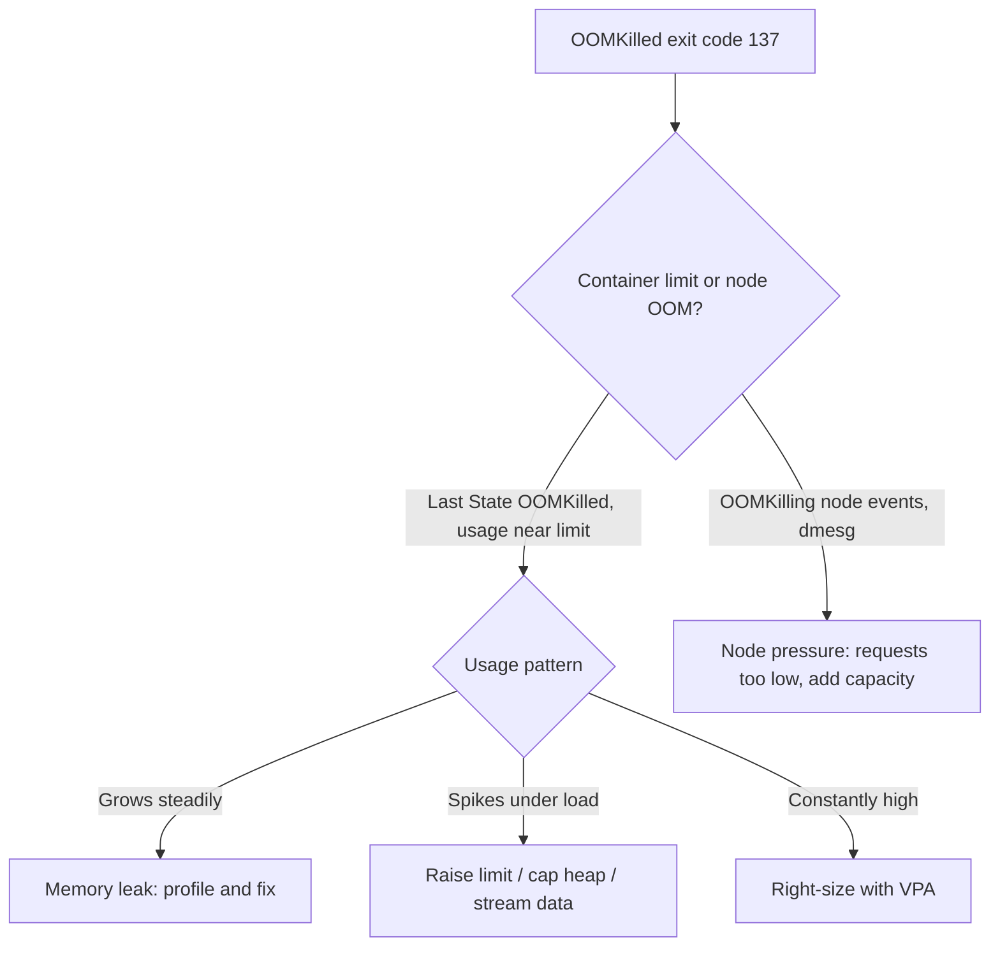

> 💡 **Quick Answer:** `OOMKilled` with exit code 137 means the kernel killed the container for exceeding `resources.limits.memory` (or the node ran out of memory). Confirm with `kubectl describe pod <pod>` (Last State: OOMKilled), compare `kubectl top pod --containers` with the limit, then either raise the limit, cap the runtime heap below it (`-XX:MaxRAMPercentage=75`, `--max-old-space-size`), or fix the leak. Use VPA in `Off` mode for sizing recommendations.

## The Problem

OOMKilled (exit code 137) means the Linux kernel's Out-of-Memory killer terminated your container because it exceeded `resources.limits.memory` — or the node itself ran out of memory. Left undiagnosed, it looks like a random crash loop instead of the memory problem it actually is.

## The Solution

### Identify OOMKilled Pods

```bash
# Find every OOMKilled pod cluster-wide
kubectl get pods --all-namespaces -o json | jq -r '
  .items[] |
  select(.status.containerStatuses[]?.lastState.terminated.reason == "OOMKilled") |
  [.metadata.namespace, .metadata.name] | @tsv'

# Which container, and when?
kubectl get pod myapp-pod -o jsonpath='{range .status.containerStatuses[*]}{.name}{"\t"}{.lastState.terminated.reason}{"\t"}{.lastState.terminated.exitCode}{"\n"}{end}'

# Confirm on a specific pod
kubectl describe pod myapp-pod
#   Last State:     Terminated
#     Reason:       OOMKilled
#     Exit Code:    137
```

### Check Current Memory Usage

```bash
kubectl top pod myapp-pod --containers
kubectl top nodes
kubectl describe node <node-name> | grep -A5 "Allocated resources"

# Or attach a debug container (Kubernetes 1.25+) and read cgroups directly
kubectl debug myapp-pod -it --image=busybox --target=myapp
cat /sys/fs/cgroup/memory.current   # cgroups v2
cat /sys/fs/cgroup/memory.max
```

### Set Requests and Limits with Headroom

```yaml
resources:
  requests:
    memory: "256Mi"   # scheduling guarantee — set to expected average usage
  limits:
    memory: "512Mi"   # hard limit — OOMKilled if exceeded; 1.5-2x requests is a reasonable start
```

### Fix Runtime-Specific Memory Behavior

Most OOMKills in managed runtimes come from heap sizing that ignores the rest of the process footprint. Modern JVMs (JDK 10+, 8u191+) detect the cgroup limit, but default the max heap to only 25% of it; older runtimes and Node.js size from host memory or fixed defaults:

```yaml
# Java: let the JVM respect the container limit instead of the host's
env:
  - name: JAVA_OPTS
    value: >-
      -XX:MaxRAMPercentage=75.0
      -XX:+HeapDumpOnOutOfMemoryError
      -XX:HeapDumpPath=/tmp/heapdump.hprof
```

`-Xmx` equal to the limit guarantees an OOMKill: the JVM needs memory beyond the heap. Budget for a 1Gi limit:

| Component | Typical size |
|-----------|-------------|
| Heap (`-Xmx` / `MaxRAMPercentage=75`) | ~768Mi |
| Metaspace (cap with `-XX:MaxMetaspaceSize`) | 100-200Mi |
| Thread stacks | ~1Mi per thread |
| Code cache, GC structures, direct/NIO buffers | 100-200Mi |

`-XX:+UseContainerSupport` is on by default since JDK 10 / 8u191 — adding it is harmless but not a fix.

```yaml
# Node.js: cap the V8 heap below the container's memory limit
env:
  - name: NODE_OPTIONS
    value: "--max-old-space-size=384"   # for a 512Mi limit
```

```yaml
# Python: enable tracemalloc to find leaks, reduce allocator fragmentation
env:
  - name: PYTHONTRACEMALLOC
    value: "1"
  - name: MALLOC_TRIM_THRESHOLD_
    value: "65536"
```

### Find the Leak

```bash
kubectl top pod myapp-pod --containers    # repeat over time, or graph container_memory_working_set_bytes
# Go:     kubectl port-forward pod/myapp-pod 6060 && go tool pprof http://localhost:6060/debug/pprof/heap
# Java:   kubectl exec myapp-pod -- jcmd 1 GC.heap_dump /tmp/heap.hprof && kubectl cp myapp-pod:/tmp/heap.hprof ./heap.hprof
# Python: tracemalloc snapshots, or py-spy / memray in an ephemeral debug container
# Node:   --heapsnapshot-signal=SIGUSR2, then kubectl exec ... kill -USR2 1
```

### Alert Before the Kill, Not After

```yaml
apiVersion: monitoring.coreos.com/v1
kind: PrometheusRule
metadata:
  name: memory-alerts
spec:
  groups:
    - name: memory
      rules:
        - alert: ContainerMemoryHigh
          expr: (container_memory_working_set_bytes / container_spec_memory_limit_bytes) > 0.9
          for: 5m
          labels: {severity: warning}
        - alert: ContainerOOMKilled
          expr: kube_pod_container_status_last_terminated_reason{reason="OOMKilled"} == 1
          labels: {severity: critical}
```

### Right-Size with VPA

```yaml
apiVersion: autoscaling.k8s.io/v1
kind: VerticalPodAutoscaler
metadata:
  name: myapp-vpa
spec:
  targetRef:
    apiVersion: apps/v1
    kind: Deployment
    name: myapp
  updatePolicy:
    updateMode: "Off"   # recommend only, don't auto-apply
  resourcePolicy:
    containerPolicies:
      - containerName: myapp
        minAllowed: {memory: "128Mi"}
        maxAllowed: {memory: "4Gi"}
```

```bash
kubectl describe vpa myapp-vpa   # read the recommendation
```

### Node-Level OOM

```bash
kubectl get events --field-selector reason=OOMKilling -A
journalctl -u kubelet | grep -i oom
dmesg | grep -i "out of memory"
kubectl describe node <node> | grep -A5 Conditions
```



## Common Issues

| Cause | Fix |
|-------|-----|
| Memory leak | Profile the app (pprof/VisualVM/heapdump), fix the leak |
| Limit set too low | Increase based on `kubectl top` / VPA recommendations |
| JVM heap misconfigured | Use `-XX:MaxRAMPercentage`, not a fixed `-Xmx` guess |
| Large file processing | Stream instead of loading the whole file into memory |
| Unbounded cache | Add a size limit and LRU eviction |
| Node memory exhaustion | Add nodes, or set namespace ResourceQuotas |

**OOMKilled but `kubectl top` shows low usage** — the spike happened between metrics-server scrapes (~15-60s). Use `container_memory_working_set_bytes` in Prometheus, or `max_over_time(...[1h])`.

**OOMKilled immediately on startup** — the limit is below the app's startup footprint (JVM init, model loading, large caches warmed at boot). Raise the limit or lazy-load.

**Pod `Evicted`, not OOMKilled** — that's kubelet node-pressure eviction (`memory.available` below the eviction threshold), not the OOM killer. Check `kubectl describe node` Conditions (`MemoryPressure`) and fix requests so the node isn't overcommitted.

**VPA fights HPA** — don't let both act on the same resource. Scale on CPU/custom metrics with HPA and restrict VPA to memory with `controlledResources: ["memory"]`.

## Frequently Asked Questions

### Why is OOMKilled exit code 137?
137 = 128 + 9: the process was terminated by signal 9 (SIGKILL), which is what the kernel OOM killer sends. You'll also see `command terminated with exit code 137` from `kubectl exec` when the process is killed.

### What is the difference between container OOMKilled and node OOM?
A container OOMKill means it hit its own cgroup memory limit. A node-level OOM means the whole node ran out of memory; the kubelet evicts pods (status `Evicted`) or the kernel kills a process based on QoS (BestEffort first, Guaranteed last). Set memory requests realistically so the scheduler doesn't overcommit nodes.

### How do I debug OOMKilled errors in Kubernetes?
Find the container with `kubectl describe pod`, compare its working set (`kubectl top pod --containers` or `container_memory_working_set_bytes`) against the limit over time, check runtime heap flags, and take a heap dump or profile (pprof, jmap, tracemalloc) if usage grows without bound.

### Why does memory get OOMKilled but CPU doesn't?
CPU is compressible: exceeding a CPU limit throttles the container. Memory isn't: the only way to enforce a memory limit is to kill a process.

### How much above -Xmx should the container limit be?
Roughly heap + metaspace + ~1Mi per thread + 100-200Mi native. In practice, set `-XX:MaxRAMPercentage=75` and let the JVM compute the heap from the limit.

### Should memory limits equal requests?
For latency-critical or stateful workloads, yes — `requests == limits` gives the Guaranteed QoS class and prevents node overcommit. For bursty stateless apps, a limit 1.5-2x the request is a common compromise.

## Best Practices

- Set `requests.memory` to typical usage and `limits.memory` to 1.5-2x that for burst headroom — not so high it risks node-level pressure
- Let each runtime respect the container's cgroup limit explicitly (`MaxRAMPercentage`, `--max-old-space-size`) rather than guessing
- Alert at 90% of the memory limit — an alert before the kill is actionable, an alert after is a postmortem
- Use VPA in `"Off"` mode first to get sized recommendations before enabling auto-update
- Check node-level OOM (`dmesg`, kubelet logs) when the killed process isn't your container — noisy neighbors can starve the whole node

## Key Takeaways

- OOMKilled = exit code 137 = the container exceeded `resources.limits.memory`, or the node ran out of memory
- Diagnose with `kubectl describe pod` (Last State: OOMKilled) and `kubectl top pod --containers`
- Runtime memory settings (JVM, Node.js, Python) must leave headroom below the container limit — defaults are either too small (JVM 25%) or unaware of the limit
- Alert at 90% utilization to catch it before the kill, not just after
- VPA in recommendation-only mode is the fastest way to find the right limit without guessing
