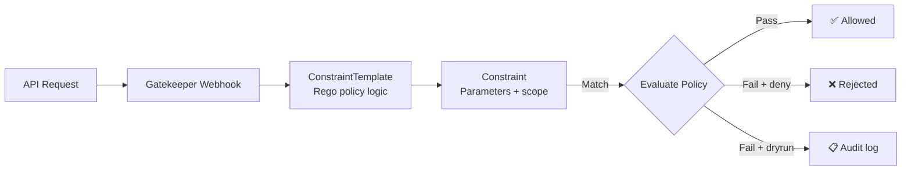

> 💡 **Quick Answer:** Install Gatekeeper, create `ConstraintTemplate` CRDs with Rego policies, then apply `Constraint` resources to enforce them. Start in `dryrun` mode to audit violations before blocking.

## The Problem

Kubernetes doesn't enforce organizational policies natively: which registries are allowed, mandatory labels, resource limit requirements, or privilege restrictions. OPA Gatekeeper provides a policy-as-code framework with audit capabilities.

## The Solution

### Install Gatekeeper

```bash
helm install gatekeeper gatekeeper/gatekeeper \
  --namespace gatekeeper-system \
  --create-namespace
```

### Allowed Registries Policy

```yaml
apiVersion: templates.gatekeeper.sh/v1
kind: ConstraintTemplate
metadata:
  name: k8sallowedregistries
spec:
  crd:
    spec:
      names:
        kind: K8sAllowedRegistries
      validation:
        openAPIV3Schema:
          type: object
          properties:
            registries:
              type: array
              items:
                type: string
  targets:
    - target: admission.k8s.gatekeeper.sh
      rego: |
        package k8sallowedregistries
        violation[{"msg": msg}] {
          container := input.review.object.spec.containers[_]
          not startswith(container.image, input.parameters.registries[_])
          msg := sprintf("Container %v uses image %v from unauthorized registry", [container.name, container.image])
        }
        violation[{"msg": msg}] {
          container := input.review.object.spec.initContainers[_]
          not startswith(container.image, input.parameters.registries[_])
          msg := sprintf("Init container %v uses image %v from unauthorized registry", [container.name, container.image])
        }
---
apiVersion: constraints.gatekeeper.sh/v1beta1
kind: K8sAllowedRegistries
metadata:
  name: allowed-registries
spec:
  enforcementAction: dryrun
  match:
    kinds:
      - apiGroups: [""]
        kinds: ["Pod"]
    excludedNamespaces:
      - kube-system
      - gatekeeper-system
  parameters:
    registries:
      - "registry.example.com/"
      - "gcr.io/"
```

### Required Labels Policy

```yaml
apiVersion: templates.gatekeeper.sh/v1
kind: ConstraintTemplate
metadata:
  name: k8srequiredlabels
spec:
  crd:
    spec:
      names:
        kind: K8sRequiredLabels
      validation:
        openAPIV3Schema:
          type: object
          properties:
            labels:
              type: array
              items:
                type: string
  targets:
    - target: admission.k8s.gatekeeper.sh
      rego: |
        package k8srequiredlabels
        violation[{"msg": msg}] {
          required := input.parameters.labels[_]
          not input.review.object.metadata.labels[required]
          msg := sprintf("Missing required label: %v", [required])
        }
---
apiVersion: constraints.gatekeeper.sh/v1beta1
kind: K8sRequiredLabels
metadata:
  name: require-team-label
spec:
  enforcementAction: deny
  match:
    kinds:
      - apiGroups: ["apps"]
        kinds: ["Deployment"]
  parameters:
    labels:
      - "team"
      - "environment"
```

### Enforcement Actions

| Action | Behavior |
|--------|----------|
| `deny` | Block non-compliant resources |
| `dryrun` | Log violations but allow creation |
| `warn` | Allow creation but return warning to user |

### Audit Violations

```bash
# Check audit results
kubectl get k8sallowedregistries allowed-registries -o yaml | \
  yq '.status.violations'

# Count violations by constraint
kubectl get constraints -o json | \
  jq '.items[] | {name: .metadata.name, violations: (.status.totalViolations // 0)}'
```



## Common Issues

**Gatekeeper blocks system pods**

Always exclude `kube-system` and `gatekeeper-system` from constraints. Add all operator namespaces too.

**Constraint shows 0 violations but pods are non-compliant**

Check that `match.kinds` targets the right resource. Pods created by Deployments: target `Pod`, not `Deployment` (unless checking deployment-level metadata).

## Best Practices

- **Start with `dryrun`** — audit existing violations before enforcing
- **Exclude system namespaces** — preventing system pod creation breaks the cluster
- **Library of reusable ConstraintTemplates** — the Gatekeeper library has 30+ ready-made policies
- **Consider `ValidatingAdmissionPolicy`** (K8s 1.30+) for simple checks — no Rego needed

## Key Takeaways

- ConstraintTemplate defines the policy logic (Rego); Constraint applies it with parameters
- Start in `dryrun` mode, audit, then switch to `deny`
- Always exclude system namespaces from policy enforcement
- Gatekeeper provides audit for existing non-compliant resources, not just new ones
- K8s 1.30+ `ValidatingAdmissionPolicy` with CEL is simpler for basic checks
