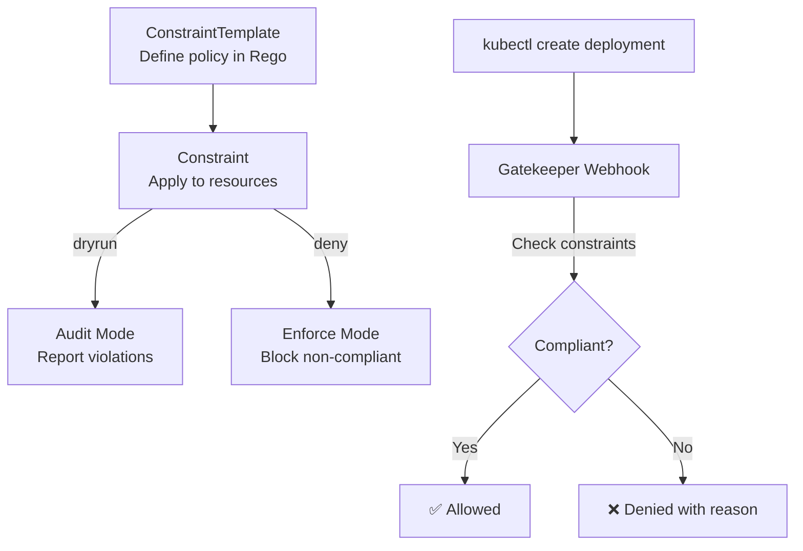

> 💡 **Quick Answer:** Install OPA Gatekeeper and create `ConstraintTemplates` with Rego policies. Apply `Constraints` to enforce rules like requiring resource limits, blocking privileged containers, and mandating labels. Use `enforcementAction: dryrun` to audit before enforcing.

## The Problem

RBAC and Pod Security Standards provide basic guardrails, but organizations need custom policies: 'all images must come from our approved registry,' 'every Deployment must have a team label,' 'no containers can run as root.' OPA Gatekeeper lets you define and enforce any policy declaratively.

## The Solution

### Install Gatekeeper

```bash
helm repo add gatekeeper https://open-policy-agent.github.io/gatekeeper/charts
helm install gatekeeper gatekeeper/gatekeeper --namespace gatekeeper-system --create-namespace
```

### ConstraintTemplate: Require Labels

```yaml
apiVersion: templates.gatekeeper.sh/v1
kind: ConstraintTemplate
metadata:
  name: k8srequiredlabels
spec:
  crd:
    spec:
      names:
        kind: K8sRequiredLabels
      validation:
        openAPIV3Schema:
          type: object
          properties:
            labels:
              type: array
              items:
                type: string
  targets:
    - target: admission.k8s.gatekeeper.sh
      rego: |
        package k8srequiredlabels
        violation[{"msg": msg}] {
          provided := {l | input.review.object.metadata.labels[l]}
          required := {l | l := input.parameters.labels[_]}
          missing := required - provided
          count(missing) > 0
          msg := sprintf("Missing required labels: %v", [missing])
        }
---
apiVersion: constraints.gatekeeper.sh/v1beta1
kind: K8sRequiredLabels
metadata:
  name: require-team-label
spec:
  enforcementAction: dryrun
  match:
    kinds:
      - apiGroups: ["apps"]
        kinds: ["Deployment"]
  parameters:
    labels: ["team", "env"]
```

### Block Privileged Containers

```yaml
apiVersion: templates.gatekeeper.sh/v1
kind: ConstraintTemplate
metadata:
  name: k8sblockprivileged
spec:
  crd:
    spec:
      names:
        kind: K8sBlockPrivileged
  targets:
    - target: admission.k8s.gatekeeper.sh
      rego: |
        package k8sblockprivileged
        violation[{"msg": msg}] {
          c := input.review.object.spec.containers[_]
          c.securityContext.privileged == true
          msg := sprintf("Privileged container not allowed: %v", [c.name])
        }
```

### Audit Violations

```bash
# Check violations without enforcing
kubectl get k8srequiredlabels require-team-label -o yaml
# status.violations shows all non-compliant resources

# Switch from dryrun to enforce
kubectl patch k8srequiredlabels require-team-label \
  --type=json -p='[{"op":"replace","path":"/spec/enforcementAction","value":"deny"}]'
```



## Common Issues

**Gatekeeper blocking system resources**: Add `match.excludedNamespaces: [kube-system, gatekeeper-system]` to constraints.

**ConstraintTemplate not syncing**: Check Rego syntax: `kubectl describe constrainttemplate k8srequiredlabels`. Rego syntax errors prevent the template from compiling.

## Best Practices

- **Start with dryrun** — audit before enforcing
- **Exclude system namespaces** — never block kube-system
- **Version ConstraintTemplates** in Git — they're policy as code
- **Audit dashboard** — Gatekeeper exposes Prometheus metrics
- **Common policies**: required labels, image allowlist, no privileged, resource limits

## Key Takeaways

- OPA Gatekeeper enforces custom policies on Kubernetes resources
- ConstraintTemplates define policies in Rego; Constraints apply them
- dryrun mode audits violations without blocking — always start here
- Policies as code: version control ConstraintTemplates alongside manifests
- Common use cases: required labels, image allowlists, no privileged containers
