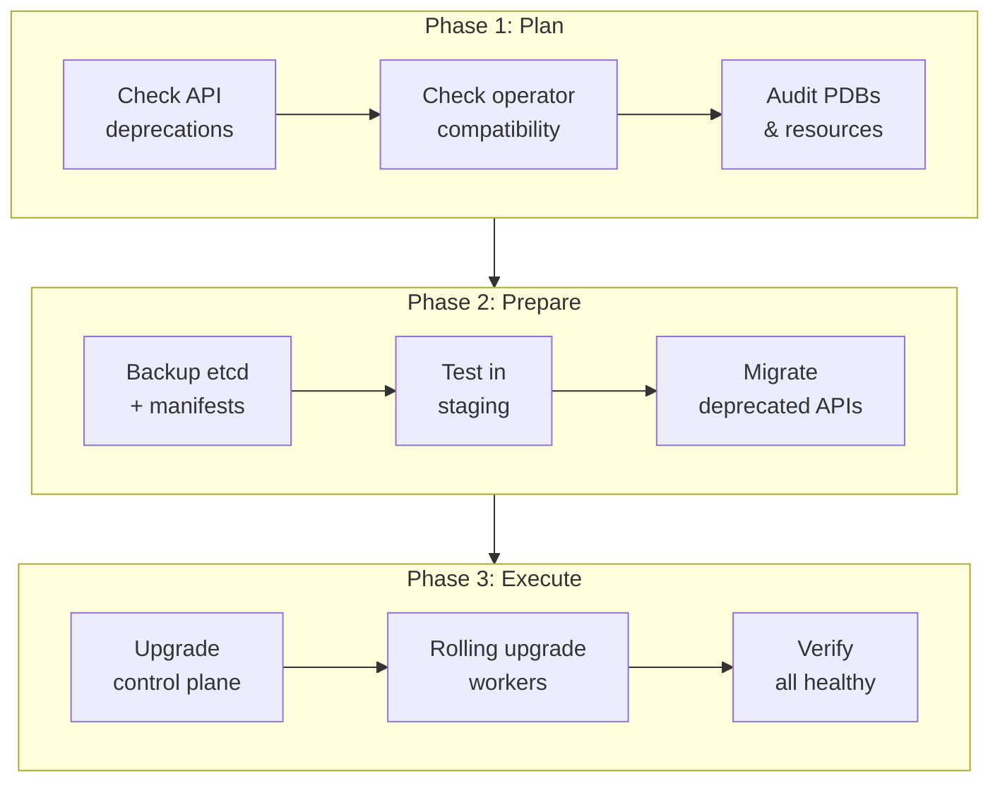
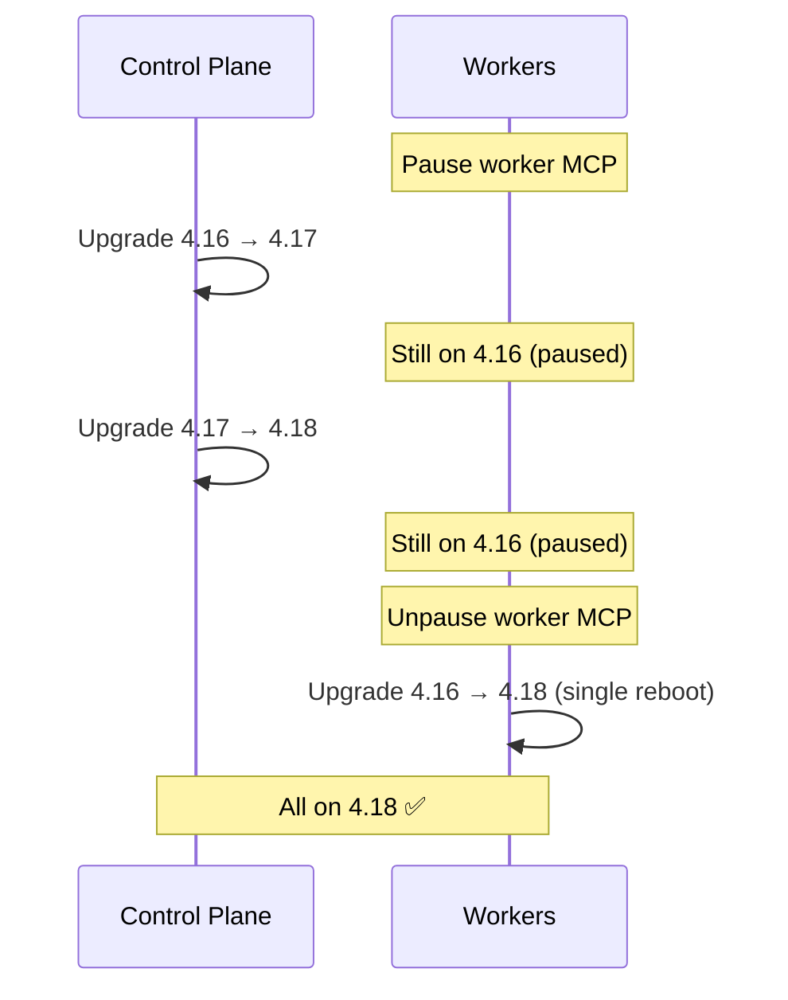

> 💡 **Quick Answer:** Minor/major upgrades change APIs and features. **Kubernetes:** upgrade sequentially (1.31→1.32→1.33, never skip). Use `kubeadm upgrade plan`, fix deprecated APIs first, backup etcd, then upgrade control plane → workers. **OpenShift:** `oc adm upgrade --to=4.17.x` (sequential) or EUS-to-EUS (4.16→4.18). Always run API deprecation checks and test in staging before production.

## The Problem

Minor upgrades remove deprecated APIs, change default behaviors, and introduce new features. Unlike patches, they can break applications that use removed APIs. Kubernetes removes APIs 2-3 minor versions after deprecation. OpenShift adds operator compatibility constraints — operators must support the target version. Skipping versions is not supported.



## Kubernetes Minor Upgrade (e.g., 1.31 → 1.32)

### Phase 1: Pre-Upgrade Checks

```bash
# 1. Check deprecated APIs in your cluster
# Install kubent (kube-no-trouble)
curl -sSL https://git.io/install-kubent | sh

kubent
# 4:17 PM >>> Deprecated APIs:
#   Ingress found in networking.k8s.io/v1beta1 — removed in 1.22
#   CronJob found in batch/v1beta1 — removed in 1.25
# If kubent finds removals in your target version → fix before upgrading!

# 2. Check API requests for deprecated versions
kubectl get --raw /metrics | grep apiserver_requested_deprecated_apis
# Shows which APIs are actively being called

# 3. Verify all nodes are healthy
kubectl get nodes
# All must be Ready

# 4. Check etcd health
kubectl -n kube-system exec -it etcd-master-0 -- \
  etcdctl endpoint health --cluster --write-out=table

# 5. Verify sufficient resources for drain
kubectl top nodes
# Need ~20% headroom to absorb drained workloads

# 6. Check PDBs that might block drain
kubectl get pdb -A -o custom-columns='NAMESPACE:.metadata.namespace,NAME:.metadata.name,MIN-AVAILABLE:.spec.minAvailable,MAX-UNAVAILABLE:.spec.maxUnavailable,CURRENT:.status.currentHealthy,DESIRED:.status.desiredHealthy'

# 7. Review release notes for breaking changes
echo "https://github.com/kubernetes/kubernetes/blob/master/CHANGELOG/CHANGELOG-1.32.md"
```

### Phase 2: Migrate Deprecated APIs

```bash
# Find and update deprecated API versions in manifests

# Example: batch/v1beta1 CronJob → batch/v1
# Before:
# apiVersion: batch/v1beta1
# kind: CronJob

# After:
# apiVersion: batch/v1
# kind: CronJob

# Use kubectl convert (if available):
kubectl convert -f old-cronjob.yaml --output-version batch/v1

# Or use kube-convert plugin:
kubectl kube-convert -f manifests/ --output-version batch/v1

# For Helm charts, update templates:
grep -r "apiVersion: batch/v1beta1" charts/ --include="*.yaml" -l
# Update each file

# For kustomize:
grep -r "apiVersion: batch/v1beta1" kustomize/ --include="*.yaml" -l

# Apply updated manifests BEFORE upgrading
kubectl apply -f updated-manifests/
```

### Phase 3: Backup

```bash
# CRITICAL: Backup etcd
ETCDCTL_API=3 etcdctl snapshot save /backup/etcd-pre-1.32-upgrade.db \
  --endpoints=https://127.0.0.1:2379 \
  --cacert=/etc/kubernetes/pki/etcd/ca.crt \
  --cert=/etc/kubernetes/pki/etcd/server.crt \
  --key=/etc/kubernetes/pki/etcd/server.key

# Verify backup
ETCDCTL_API=3 etcdctl snapshot status /backup/etcd-pre-1.32-upgrade.db --write-out=table

# Backup all manifests
kubectl get all -A -o yaml > /backup/all-resources-pre-upgrade.yaml

# Backup kubeadm config
kubectl -n kube-system get cm kubeadm-config -o yaml > /backup/kubeadm-config.yaml
```

### Phase 4: Upgrade Control Plane

```bash
# Update kubeadm to target version
sudo apt-get update
sudo apt-get install -y kubeadm=1.32.0-1.1

# Check upgrade plan
sudo kubeadm upgrade plan
# Components that will be upgraded:
# COMPONENT   CURRENT   TARGET
# kube-apiserver   v1.31.3   v1.32.0
# kube-controller-manager   v1.31.3   v1.32.0
# kube-scheduler   v1.31.3   v1.32.0
# kube-proxy   v1.31.3   v1.32.0
# CoreDNS   v1.11.1   v1.11.3
# etcd   3.5.12   3.5.15

# Apply upgrade on FIRST control plane node
sudo kubeadm upgrade apply v1.32.0 --yes

# Update kubelet and kubectl
sudo apt-get install -y kubelet=1.32.0-1.1 kubectl=1.32.0-1.1
sudo systemctl daemon-reload
sudo systemctl restart kubelet

# On ADDITIONAL control plane nodes:
sudo apt-get install -y kubeadm=1.32.0-1.1
sudo kubeadm upgrade node
sudo apt-get install -y kubelet=1.32.0-1.1 kubectl=1.32.0-1.1
sudo systemctl daemon-reload
sudo systemctl restart kubelet

# Verify control plane
kubectl get nodes
kubectl version
```

### Phase 5: Upgrade Workers (Rolling)

```bash
# Same as patch upgrade but with more caution
for node in $(kubectl get nodes -l '!node-role.kubernetes.io/control-plane' -o name); do
  NODE_NAME=${node#node/}
  echo "=== Upgrading $NODE_NAME ==="
  
  kubectl cordon "$NODE_NAME"
  kubectl drain "$NODE_NAME" --ignore-daemonsets --delete-emptydir-data --timeout=600s
  
  ssh "$NODE_NAME" << 'EOF'
    sudo apt-get update -qq
    sudo apt-get install -y -qq kubeadm=1.32.0-1.1 kubelet=1.32.0-1.1 kubectl=1.32.0-1.1
    sudo kubeadm upgrade node
    sudo systemctl daemon-reload
    sudo systemctl restart kubelet
EOF
  
  kubectl uncordon "$NODE_NAME"
  kubectl wait --for=condition=Ready "node/$NODE_NAME" --timeout=180s
  
  # Post-upgrade verification
  NODE_VER=$(kubectl get node "$NODE_NAME" -o jsonpath='{.status.nodeInfo.kubeletVersion}')
  echo "✅ $NODE_NAME now running $NODE_VER"
  
  # Pause between nodes — monitor for issues
  echo "Waiting 60s before next node..."
  sleep 60
done
```

## OpenShift Minor Upgrade (e.g., 4.16 → 4.17)

### Sequential Upgrade

```bash
# 1. Set the target channel
oc adm upgrade channel stable-4.17

# 2. Check available upgrade path
oc adm upgrade
# Recommended updates:
#   VERSION   IMAGE
#   4.17.6    quay.io/openshift-release-dev/ocp-release@sha256:...

# 3. Pre-flight: check operator compatibility
oc get co | grep -v "True.*False.*False"
# All operators must be Available=True, Degraded=False

# 4. Check for deprecated APIs
oc get apirequestcounts | grep -v "0$" | sort -k3 -rn | head -20
# Shows API usage counts — focus on deprecated versions

# 5. Backup etcd
oc debug node/master-0 -- chroot /host /usr/local/bin/cluster-backup.sh /home/core/backup

# 6. Start upgrade
oc adm upgrade --to=4.17.6

# 7. Monitor
watch -n 10 'oc get clusterversion; echo "---"; oc get co | grep -v "True.*False.*False"; echo "---"; oc get mcp'
```

### EUS-to-EUS Upgrade (4.16 → 4.18)

```bash
# EUS (Extended Update Support) is for even-numbered releases
# EUS-to-EUS skips the odd release (4.17) but does a controlled upgrade path

# 1. Pause worker MCP (prevent premature node reboots)
oc patch mcp worker --type merge -p '{"spec":{"paused":true}}'

# 2. Set intermediate channel
oc adm upgrade channel eus-4.18

# 3. Upgrade control plane to 4.17 (intermediate)
oc adm upgrade --to-latest
# Control plane upgrades to 4.17.x
# Workers stay on 4.16 (paused MCP)

# 4. Wait for control plane to complete
oc wait --for=condition=Progressing=False clusterversion version --timeout=60m

# 5. Upgrade control plane to 4.18
oc adm upgrade --to-latest
# Control plane upgrades to 4.18.x
# Workers still on 4.16

# 6. Wait for control plane 4.18 to complete
oc wait --for=condition=Progressing=False clusterversion version --timeout=60m

# 7. NOW unpause workers — they jump directly from 4.16 to 4.18
oc patch mcp worker --type merge -p '{"spec":{"paused":false}}'

# 8. Monitor worker rollout
oc get mcp worker -w
# Workers reboot once (not twice), going 4.16 → 4.18

# Benefits of EUS-to-EUS:
# - Workers only reboot ONCE (not twice)
# - Skip 4.17 worker drain/reboot cycle
# - Reduced total downtime for workloads
# - Stays on supported EUS versions throughout
```



### Post-Upgrade Verification

```bash
# 1. All nodes at target version
kubectl get nodes -o custom-columns='NAME:.metadata.name,VERSION:.status.nodeInfo.kubeletVersion,READY:.status.conditions[?(@.type=="Ready")].status'

# 2. All operators healthy (OCP)
oc get co | column -t
# All: AVAILABLE=True, PROGRESSING=False, DEGRADED=False

# 3. All pods running
kubectl get pods -A --field-selector=status.phase!=Running,status.phase!=Succeeded | grep -v Completed

# 4. Run smoke tests
kubectl run smoke-test --image=busybox --rm -it -- wget -qO- http://kubernetes.default.svc/healthz
# Should return "ok"

# 5. Verify workload health
kubectl get deployments -A -o custom-columns='NS:.metadata.namespace,NAME:.metadata.name,READY:.status.readyReplicas,DESIRED:.spec.replicas' | grep -v "^NS" | awk '$3 != $4'
# Shows deployments not at desired replica count

# 6. Check for new deprecation warnings
kubectl get --raw /metrics | grep apiserver_requested_deprecated_apis
```

## Rollback Procedures

### Kubernetes Rollback

```bash
# Kubernetes does NOT support downgrading the control plane
# If upgrade fails, restore from etcd backup:

# 1. Stop kubelet and etcd on all control planes
sudo systemctl stop kubelet
sudo systemctl stop etcd  # or: sudo crictl stopp $(sudo crictl pods -q --name etcd)

# 2. Restore etcd snapshot
ETCDCTL_API=3 etcdctl snapshot restore /backup/etcd-pre-1.32-upgrade.db \
  --data-dir=/var/lib/etcd-restore

# 3. Replace etcd data
sudo mv /var/lib/etcd /var/lib/etcd.broken
sudo mv /var/lib/etcd-restore /var/lib/etcd

# 4. Reinstall old version
sudo apt-get install -y kubeadm=1.31.3-1.1 kubelet=1.31.3-1.1 kubectl=1.31.3-1.1
sudo systemctl restart kubelet
```

### OpenShift Rollback

```bash
# OpenShift supports reverting to previous minor in some cases
oc adm upgrade --to=4.16.14  # Revert to previous version

# If that fails, restore from etcd backup:
# https://docs.openshift.com/container-platform/latest/backup_and_restore/control_plane_backup_and_restore/disaster_recovery/scenario-2-restoring-cluster-state.html
```

## Common Issues

| Issue | Cause | Fix |
|-------|-------|-----|
| `resource X not found` after upgrade | API removed in new version | Migrate to new API version before upgrading |
| Helm chart broken after upgrade | Chart uses deprecated APIs | `helm upgrade` with updated templates |
| Webhook timeout | Admission webhook incompatible | Update webhook, or delete and re-deploy |
| OCP operator Degraded | Operator not compatible with new version | Check operator subscription, update CSV |
| Node drain timeout | PDB too restrictive | Temporarily relax PDB `minAvailable` |
| kubelet won't start | Config format changed | Run `kubeadm upgrade node` before restarting kubelet |
| EUS-to-EUS: worker upgrade fails | Worker MCP unpaused too early | Re-pause, wait for CP to finish 4.18, then unpause |

## Best Practices

- **Never skip minor versions** — upgrade sequentially
- **Fix deprecated APIs BEFORE upgrading** — not after
- **Test in staging with production-like workloads** — not just empty clusters
- **Backup etcd** — your only true rollback path for Kubernetes
- **EUS-to-EUS for OpenShift production** — workers reboot once instead of twice
- **Pause worker MCP during business hours** — upgrade masters, then workers after hours
- **Run kubent before every minor upgrade** — catches deprecated APIs early
- **Read the CHANGELOG** — every minor version has known issues and breaking changes
- **Upgrade add-ons after cluster** — cert-manager, ingress controllers, CNI plugins may need updates too

## Key Takeaways

- Minor upgrades can break apps — deprecated APIs get removed
- Always upgrade sequentially: 1.31→1.32→1.33, or 4.16→4.17→4.18
- OpenShift EUS-to-EUS (4.16→4.18) is the smoothest production path
- Pre-flight: kubent for API deprecations, etcd backup, PDB audit
- Control plane first, then workers rolling one-by-one
- Read release notes — every single time
- The #1 cause of upgrade failures: deprecated APIs not migrated beforehand
