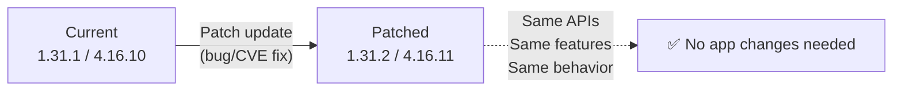

> 💡 **Quick Answer:** Patch updates (1.31.1→1.31.2 or 4.16.10→4.16.11) fix bugs and CVEs without adding features or changing APIs. **Kubernetes:** update kubeadm → upgrade control plane → upgrade kubelet/kubectl on each node. **OpenShift:** `oc adm upgrade --to-latest` — the Cluster Version Operator handles everything. Patch updates are low-risk and should be applied regularly.

## The Problem

Patch versions fix security vulnerabilities (CVEs) and critical bugs. Delaying patches exposes your cluster to known exploits. Unlike minor upgrades, patches don't change APIs, don't deprecate features, and don't require application changes. The risk of NOT patching is higher than patching.



## Kubernetes Patch Update (kubeadm)

### Step 1: Check Available Patches

```bash
# Check current version
kubectl version --short
# Client Version: v1.31.1
# Server Version: v1.31.1

# Check available versions
sudo apt-cache madison kubeadm | grep 1.31    # Debian/Ubuntu
sudo yum list --showduplicates kubeadm | grep 1.31  # RHEL/CentOS

# Or check releases
curl -s https://dl.k8s.io/release/stable-1.31.txt
# v1.31.3
```

### Step 2: Upgrade Control Plane (One Master at a Time)

```bash
# On first control plane node:

# 1. Update kubeadm
sudo apt-get update && sudo apt-get install -y kubeadm=1.31.3-1.1  # Debian
# or
sudo yum install -y kubeadm-1.31.3                                  # RHEL

# 2. Verify kubeadm version
kubeadm version
# kubeadm version: v1.31.3

# 3. Check upgrade plan (dry run)
sudo kubeadm upgrade plan
# Shows: You can upgrade to v1.31.3

# 4. Apply upgrade (first control plane)
sudo kubeadm upgrade apply v1.31.3
# [upgrade/successful] SUCCESS! Your cluster was upgraded to "v1.31.3"

# 5. Update kubelet and kubectl
sudo apt-get install -y kubelet=1.31.3-1.1 kubectl=1.31.3-1.1
sudo systemctl daemon-reload
sudo systemctl restart kubelet

# On additional control plane nodes:
sudo kubeadm upgrade node    # Not 'apply', just 'node'
sudo apt-get install -y kubelet=1.31.3-1.1 kubectl=1.31.3-1.1
sudo systemctl daemon-reload
sudo systemctl restart kubelet
```

### Step 3: Upgrade Worker Nodes (Rolling)

```bash
# For each worker node:

# 1. Cordon the node (no new pods)
kubectl cordon worker-1

# 2. Drain the node (evict existing pods)
kubectl drain worker-1 \
  --ignore-daemonsets \
  --delete-emptydir-data \
  --force \
  --timeout=300s

# 3. SSH to the worker and upgrade
ssh worker-1
sudo apt-get update
sudo apt-get install -y kubeadm=1.31.3-1.1 kubelet=1.31.3-1.1 kubectl=1.31.3-1.1
sudo kubeadm upgrade node
sudo systemctl daemon-reload
sudo systemctl restart kubelet
exit

# 4. Uncordon the node
kubectl uncordon worker-1

# 5. Verify
kubectl get node worker-1
# worker-1   Ready   <none>   v1.31.3

# Repeat for each worker node
```

### Automated Worker Upgrade Script

```bash
#!/bin/bash
# patch-workers.sh — rolling patch upgrade for all workers
TARGET_VERSION="1.31.3-1.1"

for node in $(kubectl get nodes -l '!node-role.kubernetes.io/control-plane' -o name); do
  NODE_NAME=${node#node/}
  echo "========== Upgrading $NODE_NAME =========="
  
  # Cordon
  kubectl cordon "$NODE_NAME"
  
  # Drain (respect PDBs)
  kubectl drain "$NODE_NAME" \
    --ignore-daemonsets \
    --delete-emptydir-data \
    --timeout=300s || {
    echo "❌ Drain failed for $NODE_NAME — skipping"
    kubectl uncordon "$NODE_NAME"
    continue
  }
  
  # Upgrade via SSH
  ssh -o StrictHostKeyChecking=no "$NODE_NAME" << EOF
    sudo apt-get update -qq
    sudo apt-get install -y -qq kubeadm=${TARGET_VERSION} kubelet=${TARGET_VERSION} kubectl=${TARGET_VERSION}
    sudo kubeadm upgrade node
    sudo systemctl daemon-reload
    sudo systemctl restart kubelet
EOF
  
  # Uncordon
  kubectl uncordon "$NODE_NAME"
  
  # Wait for Ready
  kubectl wait --for=condition=Ready "node/$NODE_NAME" --timeout=120s
  
  echo "✅ $NODE_NAME upgraded to $TARGET_VERSION"
  echo ""
  sleep 30  # Brief pause between nodes
done

echo "=== All workers upgraded ==="
kubectl get nodes
```

## OpenShift Patch Update

OpenShift makes patching simpler — the Cluster Version Operator (CVO) handles everything:

### Check and Apply

```bash
# Check current version
oc get clusterversion
# NAME      VERSION   AVAILABLE   PROGRESSING   SINCE   STATUS
# version   4.16.10   True        False         2d      Cluster version is 4.16.10

# Check available updates
oc adm upgrade
# Cluster version is 4.16.10
# Upstream is unset, so the cluster will use an appropriate default.
# Channel: stable-4.16
# Recommended updates:
#   VERSION   IMAGE
#   4.16.14   quay.io/openshift-release-dev/ocp-release@sha256:...
#   4.16.13   quay.io/openshift-release-dev/ocp-release@sha256:...
#   4.16.12   quay.io/openshift-release-dev/ocp-release@sha256:...
#   4.16.11   quay.io/openshift-release-dev/ocp-release@sha256:...

# Apply latest patch
oc adm upgrade --to-latest
# Updating to latest version 4.16.14

# Or specific version
oc adm upgrade --to=4.16.12
```

### Monitor Progress

```bash
# Watch upgrade progress
oc get clusterversion -w
# NAME      VERSION   AVAILABLE   PROGRESSING   SINCE   STATUS
# version   4.16.10   True        True          1m      Working towards 4.16.14

# Check operator status
oc get co
# NAME                           AVAILABLE   PROGRESSING   DEGRADED   VERSION
# authentication                 True        False         False      4.16.14
# cloud-controller-manager       True        False         False      4.16.14
# etcd                           True        True          False      4.16.10  ← still updating
# kube-apiserver                 True        True          False      4.16.10
# machine-config                 True        True          False      4.16.10

# Check MCP rollout (node updates)
oc get mcp
# NAME     CONFIG                  UPDATED   UPDATING   DEGRADED   MACHINECOUNT
# master   rendered-master-xxx     False     True       False      3
# worker   rendered-worker-xxx     True      False      False      5

# Detailed progress
oc describe clusterversion | grep -A20 "Desired\|History\|Condition"

# Check individual node progress
oc get nodes -o custom-columns='NAME:.metadata.name,VERSION:.status.nodeInfo.kubeletVersion,READY:.status.conditions[?(@.type=="Ready")].status'
```

### Control Rollout Speed

```bash
# Pause worker MCP during business hours — resume after hours
oc patch mcp worker --type merge -p '{"spec":{"paused":true}}'
# Masters upgrade first, workers wait

# Resume worker rollout
oc patch mcp worker --type merge -p '{"spec":{"paused":false}}'

# Upgrade 2 workers at a time (faster for large clusters)
oc patch mcp worker --type merge -p '{"spec":{"maxUnavailable":2}}'

# Or percentage-based
oc patch mcp worker --type merge -p '{"spec":{"maxUnavailable":"10%"}}'
```

### Canary Approach (OpenShift)

```bash
# Create a canary MCP with 1 worker
oc label node worker-canary-0 node-role.kubernetes.io/canary=""

cat << 'EOF' | oc apply -f -
apiVersion: machineconfiguration.openshift.io/v1
kind: MachineConfigPool
metadata:
  name: canary
spec:
  machineConfigSelector:
    matchExpressions:
      - key: machineconfiguration.openshift.io/role
        operator: In
        values: [worker]
  nodeSelector:
    matchLabels:
      node-role.kubernetes.io/canary: ""
  paused: false
  maxUnavailable: 1
EOF

# The canary node upgrades with masters
# Monitor it, then unpause the worker MCP
# when confident the patch is stable
```

## Patch Schedule Recommendations

| Environment | Frequency | Timing |
|-------------|-----------|--------|
| **Dev/Test** | Within 1 week of release | Any time |
| **Staging** | Within 2 weeks | Business hours |
| **Production** | Within 4 weeks | Maintenance window |
| **Critical CVE** | Within 48 hours | Emergency change |

## Common Issues

| Issue | Cause | Fix |
|-------|-------|-----|
| Drain stuck | PDB with maxUnavailable=0 | Adjust PDB or use `--disable-eviction` (last resort) |
| Node NotReady after kubelet restart | Kubelet version mismatch | Verify kubeadm + kubelet same version |
| OCP: operator Degraded after update | Operator-specific issue | `oc describe co <name>`, check operator logs |
| OCP: MCP stuck Updating | Node can't drain or reboot fails | `oc describe mcp worker`, check node events |
| Rollback needed | Patch introduced regression | K8s: reinstall old version. OCP: `oc adm upgrade --to=<previous>` |
| etcd timeout during upgrade | etcd member behind | Check etcd health before starting |

## Best Practices

- **Patch regularly** — weekly for dev, monthly for prod, immediately for critical CVEs
- **Always backup etcd before patching** — even for patches
- **Drain one node at a time** — respect PDBs for zero downtime
- **Monitor after each node** — don't batch-upgrade all workers blindly
- **Use canary nodes** — upgrade one worker first, verify, then proceed
- **Pause MCP for control** — upgrade masters first, then workers on your schedule
- **Read release notes** — even patches can have known issues
- **Test in staging first** — reproduce your production workload

## Key Takeaways

- Patch updates are low-risk — same APIs, same features, just fixes
- **Kubernetes:** kubeadm upgrade apply → kubelet/kubectl on each node
- **OpenShift:** `oc adm upgrade --to-latest` — CVO handles the rest
- Always drain nodes before upgrading kubelet
- Pause worker MCP on OpenShift to control rollout timing
- Apply patches within 4 weeks (or 48h for critical CVEs)
- The risk of not patching > the risk of patching
