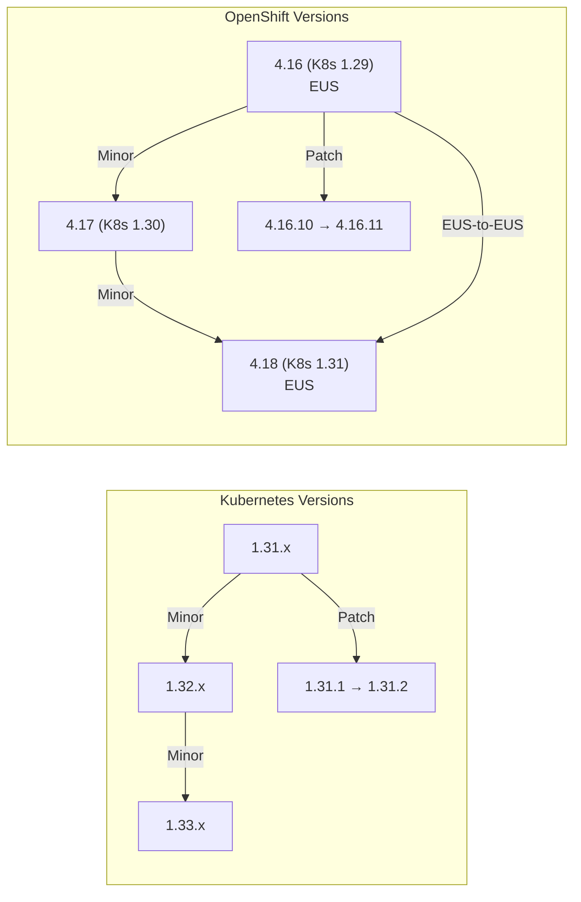

> 💡 **Quick Answer:** Kubernetes uses semantic versioning (1.x.y): **patch** (1.31.1→1.31.2) for bug/security fixes, **minor** (1.31→1.32) for new features, and **major** (theoretical 1.x→2.x). OpenShift follows Kubernetes releases (OCP 4.16 ≈ K8s 1.29). Always upgrade sequentially — never skip minor versions. Pre-flight: check API deprecations, drain nodes, backup etcd, verify PodDisruptionBudgets.

## The Problem

Clusters fall behind on versions due to upgrade fear — but running unsupported versions is worse. Kubernetes drops support for old versions after ~14 months. OpenShift EUS (Extended Update Support) extends to 18 months but only for even-numbered releases. You need a clear strategy for when and how to upgrade.



## Version Numbering

### Kubernetes

| Component | Example | Frequency | Risk Level |
|-----------|---------|-----------|------------|
| **Patch** (x.y.**Z**) | 1.31.1 → 1.31.2 | Every 1-2 weeks | 🟢 Low — bug/security fixes only |
| **Minor** (x.**Y**.0) | 1.31 → 1.32 | Every 4 months | 🟡 Medium — new features, API deprecations |
| **Major** (**X**.0.0) | 1.x → 2.x | Never happened yet | 🔴 High — breaking changes |

### OpenShift

| Component | Example | Frequency | Risk Level |
|-----------|---------|-----------|------------|
| **Patch** (4.x.**Z**) | 4.16.10 → 4.16.11 | Every 2-3 weeks | 🟢 Low — errata/bug fixes |
| **Minor** (4.**X**.0) | 4.16 → 4.17 | Every ~4 months | 🟡 Medium — new K8s version, operator updates |
| **EUS-to-EUS** | 4.16 → 4.18 | Skips odd releases | 🟡 Medium — controlled skip |

## Upgrade Paths

### Kubernetes: Sequential Minor Only

```bash
# ✅ Valid upgrade paths:
# 1.30.x → 1.31.0 → 1.31.x → 1.32.0 → 1.32.x
# (always upgrade to latest patch of current, then next minor)

# ❌ Invalid — cannot skip minor versions:
# 1.30.x → 1.32.x (SKIP 1.31 — NOT ALLOWED)

# ✅ Patch upgrades within same minor:
# 1.31.0 → 1.31.5 (can skip patches)
```

### OpenShift: Channel-Based

```bash
# OpenShift uses update channels:
# stable-4.16   — production-ready patches for 4.16
# fast-4.17     — early access to 4.17.x
# stable-4.17   — production-ready patches for 4.17
# eus-4.16      — Extended Update Support for 4.16
# eus-4.18      — Extended Update Support for 4.18

# Check current channel
oc get clusterversion -o jsonpath='{.items[0].spec.channel}'

# Set channel for upgrade
oc adm upgrade channel stable-4.17
```

## Pre-Flight Checks (Both Platforms)

```bash
#!/bin/bash
# pre-flight-check.sh — run before ANY upgrade

echo "=== 1. Current Version ==="
kubectl version --short 2>/dev/null || oc version

echo -e "\n=== 2. Node Status ==="
kubectl get nodes
# All nodes must be Ready

echo -e "\n=== 3. Component Health ==="
kubectl get cs 2>/dev/null                    # K8s component status
oc get co 2>/dev/null | grep -v "True.*False.*False"  # OCP: unhealthy operators

echo -e "\n=== 4. API Deprecations ==="
# Check for deprecated APIs in use
kubectl get --raw /metrics | grep apiserver_requested_deprecated_apis
# Or use kubent (kube-no-trouble):
# kubent

echo -e "\n=== 5. PodDisruptionBudgets ==="
kubectl get pdb -A
# PDBs with maxUnavailable=0 will block node drains!

echo -e "\n=== 6. etcd Health ==="
# K8s:
kubectl -n kube-system exec -it etcd-master-0 -- \
  etcdctl endpoint health --cluster
# OCP:
oc get etcd -o jsonpath='{.items[0].status.conditions[?(@.type=="EtcdMembersAvailable")].status}'

echo -e "\n=== 7. Backup etcd ==="
# CRITICAL: Always backup before upgrade
# K8s:
ETCDCTL_API=3 etcdctl snapshot save /backup/etcd-pre-upgrade.db
# OCP:
oc debug node/master-0 -- chroot /host /usr/local/bin/cluster-backup.sh /home/core/backup

echo -e "\n=== 8. Storage Health ==="
kubectl get pv | grep -v Bound
# All PVs should be Bound

echo -e "\n=== 9. Pending Pods ==="
kubectl get pods -A --field-selector=status.phase!=Running,status.phase!=Succeeded | head -20

echo -e "\n=== 10. Resource Headroom ==="
kubectl top nodes
# Need headroom for drained workloads during rolling upgrade
```

## Key Takeaways

- **Patch upgrades are low-risk** — apply them regularly (weekly/biweekly)
- **Minor upgrades require planning** — check API deprecations, test in staging
- **Never skip minor versions** — always upgrade sequentially
- **OpenShift EUS-to-EUS** is the safest path for production — 4.16 → 4.18
- **Always backup etcd before any upgrade** — your recovery lifeline
- **PDBs with maxUnavailable=0 block upgrades** — audit before starting
- **Drain nodes gracefully** — respect PDBs and pod termination grace periods
