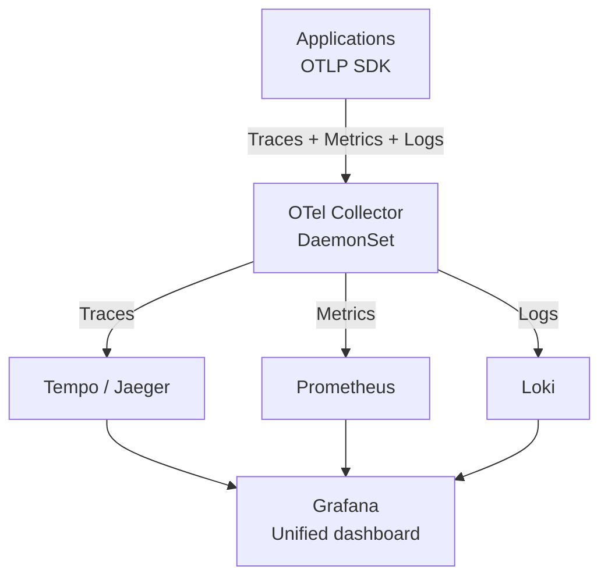

> 💡 **Quick Answer:** Deploy the OpenTelemetry Collector as a DaemonSet for node-level collection and a Deployment for cluster-level processing. Configure receivers (OTLP, Prometheus, Jaeger), processors (batch, memory_limiter), and exporters (Prometheus, Loki, Jaeger/Tempo) in a single pipeline.

## The Problem

Observability data is fragmented: Prometheus for metrics, Jaeger for traces, Loki for logs — each with its own collection agent, protocol, and configuration. OpenTelemetry Collector provides a single unified pipeline for all three signals, with vendor-neutral instrumentation.

## The Solution

### OTel Collector as DaemonSet

```yaml
apiVersion: opentelemetry.io/v1beta1
kind: OpenTelemetryCollector
metadata:
  name: otel-collector
  namespace: monitoring
spec:
  mode: daemonset
  config:
    receivers:
      otlp:
        protocols:
          grpc:
            endpoint: 0.0.0.0:4317
          http:
            endpoint: 0.0.0.0:4318
      prometheus:
        config:
          scrape_configs:
            - job_name: kubernetes-pods
              kubernetes_sd_configs:
                - role: pod
    processors:
      batch:
        timeout: 5s
        send_batch_size: 1000
      memory_limiter:
        check_interval: 1s
        limit_mib: 512
    exporters:
      prometheusremotewrite:
        endpoint: http://prometheus:9090/api/v1/write
      otlp/tempo:
        endpoint: tempo.monitoring:4317
        tls:
          insecure: true
      loki:
        endpoint: http://loki.monitoring:3100/loki/api/v1/push
    service:
      pipelines:
        traces:
          receivers: [otlp]
          processors: [memory_limiter, batch]
          exporters: [otlp/tempo]
        metrics:
          receivers: [otlp, prometheus]
          processors: [memory_limiter, batch]
          exporters: [prometheusremotewrite]
        logs:
          receivers: [otlp]
          processors: [memory_limiter, batch]
          exporters: [loki]
```

### Auto-Instrumentation

```yaml
apiVersion: opentelemetry.io/v1alpha1
kind: Instrumentation
metadata:
  name: auto-instrumentation
spec:
  exporter:
    endpoint: http://otel-collector:4317
  propagators:
    - tracecontext
    - baggage
  java:
    image: ghcr.io/open-telemetry/opentelemetry-operator/autoinstrumentation-java:2.9.0
  python:
    image: ghcr.io/open-telemetry/opentelemetry-operator/autoinstrumentation-python:0.48b0
---
# Annotate deployment for auto-instrumentation
apiVersion: apps/v1
kind: Deployment
metadata:
  name: api-server
  annotations:
    instrumentation.opentelemetry.io/inject-java: "true"
```



## Common Issues

**Collector OOMKilled**: Set `memory_limiter` processor with `limit_mib` lower than the container's memory limit. The limiter drops data before OOM.

**Traces not appearing**: Ensure the application sends to the correct endpoint (`otel-collector:4317` for gRPC, `:4318` for HTTP).

## Best Practices

- **DaemonSet for collection** — one collector per node, close to applications
- **Deployment for processing** — aggregation, sampling, and export
- **memory_limiter is mandatory** — prevents OOM on traffic spikes
- **batch processor** for efficiency — reduces export API calls
- **Auto-instrumentation** for zero-code-change observability

## Key Takeaways

- OpenTelemetry Collector provides a unified pipeline for traces, metrics, and logs
- Vendor-neutral: switch backends without changing application instrumentation
- Auto-instrumentation injects tracing with a single annotation — no code changes
- DaemonSet mode for node-level collection; Deployment mode for cluster-level processing
- memory_limiter prevents OOM; batch processor optimizes export efficiency
