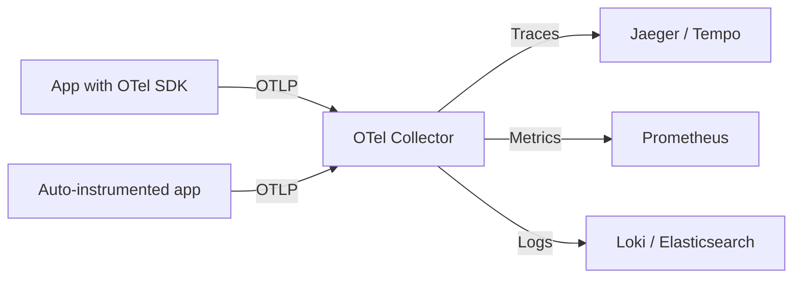

> 💡 **Quick Answer:** Deploy OpenTelemetry Collector on Kubernetes for unified observability. Collect traces, metrics, and logs with auto-instrumentation and export to any backend.

## The Problem

Engineers frequently search for this topic but find scattered, incomplete guides. This recipe provides a comprehensive, production-ready reference.

## The Solution

### Deploy OpenTelemetry Collector

```bash
helm repo add open-telemetry https://open-telemetry.github.io/opentelemetry-helm-charts
helm install otel-collector open-telemetry/opentelemetry-collector \
  --namespace observability --create-namespace \
  --set mode=daemonset \
  --set config.exporters.otlp.endpoint="jaeger.observability:4317"
```

```yaml
# Collector configuration
apiVersion: v1
kind: ConfigMap
metadata:
  name: otel-collector-config
data:
  config.yaml: |
    receivers:
      otlp:
        protocols:
          grpc:
            endpoint: 0.0.0.0:4317
          http:
            endpoint: 0.0.0.0:4318
      prometheus:
        config:
          scrape_configs:
            - job_name: 'kubernetes-pods'
              kubernetes_sd_configs:
                - role: pod
    processors:
      batch:
        timeout: 5s
        send_batch_size: 1024
      memory_limiter:
        limit_mib: 512
        spike_limit_mib: 128
    exporters:
      otlp:
        endpoint: "jaeger:4317"
        tls:
          insecure: true
      prometheus:
        endpoint: "0.0.0.0:8889"
    service:
      pipelines:
        traces:
          receivers: [otlp]
          processors: [memory_limiter, batch]
          exporters: [otlp]
        metrics:
          receivers: [otlp, prometheus]
          processors: [memory_limiter, batch]
          exporters: [prometheus]
```

### Auto-Instrumentation

```yaml
# Auto-instrument Java/Python/Node.js apps — no code changes!
apiVersion: opentelemetry.io/v1alpha1
kind: Instrumentation
metadata:
  name: auto-instrumentation
spec:
  exporter:
    endpoint: http://otel-collector:4317
  propagators:
    - tracecontext
    - baggage
  sampler:
    type: parentbased_traceidratio
    argument: "0.25"      # Sample 25% of traces
  java:
    image: ghcr.io/open-telemetry/opentelemetry-operator/autoinstrumentation-java:latest
  python:
    image: ghcr.io/open-telemetry/opentelemetry-operator/autoinstrumentation-python:latest
---
# Annotate deployment to enable
apiVersion: apps/v1
kind: Deployment
metadata:
  name: my-app
  annotations:
    instrumentation.opentelemetry.io/inject-java: "true"
```



## Frequently Asked Questions

### OpenTelemetry vs Prometheus?

They're complementary. **Prometheus** is pull-based metrics collection. **OpenTelemetry** is push-based and covers traces + metrics + logs. Use OTel Collector to scrape Prometheus metrics and forward them.


## Best Practices

- Start with the simplest approach that solves your problem
- Test thoroughly in staging before production
- Monitor and iterate based on real metrics
- Document decisions for your team

## Key Takeaways

- This is essential Kubernetes operational knowledge
- Production-readiness requires proper configuration and monitoring
- Use `kubectl describe` and logs for troubleshooting
- Automate where possible to reduce human error
