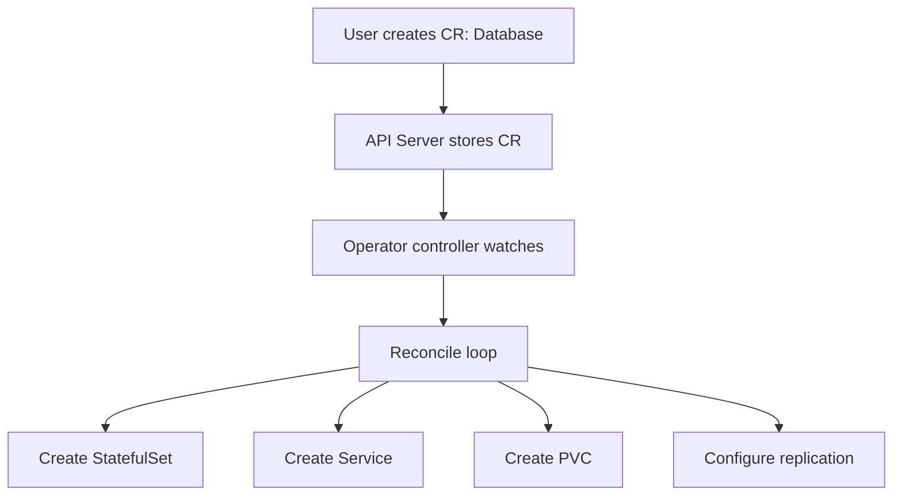

> 💡 **Quick Answer:** Build and use Kubernetes Operators for automated application management. Covers the operator pattern, CRDs, controller-runtime, and Operator SDK.

## The Problem

This is one of the most searched Kubernetes topics. A comprehensive, well-structured guide helps engineers of all levels quickly find actionable solutions.

## The Solution

Detailed implementation with production-ready examples below.


### What Is an Operator?

An Operator extends Kubernetes with a Custom Resource Definition (CRD) and a controller that watches for changes and reconciles state.

```yaml
# Custom Resource Definition
apiVersion: apiextensions.k8s.io/v1
kind: CustomResourceDefinition
metadata:
  name: databases.example.com
spec:
  group: example.com
  versions:
    - name: v1
      served: true
      storage: true
      schema:
        openAPIV3Schema:
          type: object
          properties:
            spec:
              type: object
              properties:
                engine:
                  type: string
                  enum: [postgres, mysql]
                version:
                  type: string
                replicas:
                  type: integer
                  minimum: 1
                storage:
                  type: string
  scope: Namespaced
  names:
    plural: databases
    singular: database
    kind: Database
    shortNames: [db]
---
# Custom Resource (user creates this)
apiVersion: example.com/v1
kind: Database
metadata:
  name: my-postgres
spec:
  engine: postgres
  version: "16"
  replicas: 3
  storage: 50Gi
```

### Build with Operator SDK

```bash
# Initialize
operator-sdk init --domain example.com --repo github.com/example/db-operator

# Create API + controller
operator-sdk create api --group cache --version v1 --kind Database --resource --controller

# Implement reconcile logic in controllers/database_controller.go
# Build and deploy
make docker-build docker-push IMG=registry/db-operator:v1
make deploy IMG=registry/db-operator:v1
```

### Popular Operators

| Operator | Manages | Install |
|----------|---------|---------|
| Prometheus Operator | Monitoring stack | Helm: kube-prometheus-stack |
| cert-manager | TLS certificates | Helm: cert-manager |
| Strimzi | Kafka clusters | Helm: strimzi-kafka-operator |
| CloudNativePG | PostgreSQL | Helm: cloudnative-pg |
| Rook | Ceph storage | Helm: rook-ceph |



## Frequently Asked Questions

### Operator vs Helm chart?

**Helm** deploys and templates resources but doesn't manage ongoing operations. **Operators** continuously reconcile — handling upgrades, backups, failover, and scaling automatically. Use Helm to deploy the Operator, then the Operator manages the application.

## Common Issues

Check `kubectl describe` and `kubectl get events` first — most issues have clear error messages pointing to the root cause.

## Best Practices

- **Follow least privilege** — only grant the access that's needed
- **Test in staging** before applying to production
- **Monitor and alert** on key metrics
- **Document your runbooks** for the team

## Key Takeaways

- Essential knowledge for Kubernetes operations
- Start simple and evolve your approach
- Automation reduces human error
- Share knowledge with your team
