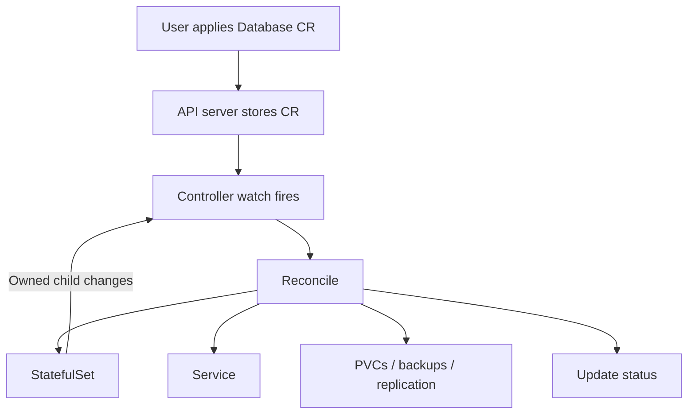

> 💡 **Quick Answer:** An operator = a **CustomResourceDefinition** (your API, e.g. `kind: Database`) + a **controller** that watches those resources and continuously reconciles actual state toward `spec`, writing progress to `status`. It encodes day-2 knowledge (upgrades, backups, failover) that Deployments and Helm can't. Build with **Kubebuilder** (Go, controller-runtime) or **Operator SDK** (Go, Helm or Ansible); key mechanics are owner references, finalizers, and the status subresource.

## The Problem

Complex applications need operational logic:

- Database: create replicas, configure replication, manage backups, handle failover
- Certificates: issue, renew, distribute, revoke
- Platform components: upgrade in order, migrate schemas, heal drift

Deployments and StatefulSets can't encode this application-specific logic.

## The Solution

### 1. The Custom Resource Definition

```yaml
apiVersion: apiextensions.k8s.io/v1
kind: CustomResourceDefinition
metadata:
  name: databases.example.com
spec:
  group: example.com
  scope: Namespaced
  names:
    plural: databases
    singular: database
    kind: Database
    shortNames: [db]
  versions:
    - name: v1
      served: true
      storage: true
      subresources:
        status: {}          # status updates don't bump metadata.generation
      schema:
        openAPIV3Schema:
          type: object
          properties:
            spec:
              type: object
              properties:
                engine:
                  type: string
                  enum: [postgres, mysql]
                version:
                  type: string
                replicas:
                  type: integer
                  minimum: 1
                storage:
                  type: string
            status:
              type: object
              properties:
                phase:
                  type: string
                readyReplicas:
                  type: integer
---
apiVersion: example.com/v1
kind: Database
metadata:
  name: my-postgres
spec:
  engine: postgres
  version: "16"
  replicas: 3
  storage: 50Gi
```

### 2. The Reconcile Loop

```
Reconcile(request):
  1. Read desired state (CR spec)
  2. Read actual state (StatefulSets, Services, PVCs it owns)
  3. Converge: create/update/delete children
  4. Write CR status
  5. Requeue on error (with backoff) or after a period if polling is needed
```


```mermaid
graph TD
    A[User applies Database CR] --> B[API server stores CR]
    B --> C[Controller watch fires]
    C --> D[Reconcile]
    D --> E[StatefulSet]
    D --> F[Service]
    D --> G[PVCs / backups / replication]
    D --> H[Update status]
    E -->|Owned child changes| C
```

### 3. Controller Code (controller-runtime / Go)

```go
const finalizerName = "databases.example.com/cleanup"

func (r *DatabaseReconciler) Reconcile(ctx context.Context, req ctrl.Request) (ctrl.Result, error) {
    var db examplev1.Database
    if err := r.Get(ctx, req.NamespacedName, &db); err != nil {
        return ctrl.Result{}, client.IgnoreNotFound(err)
    }

    // Deletion: run cleanup, then drop the finalizer
    if !db.DeletionTimestamp.IsZero() {
        return r.handleDeletion(ctx, &db)
    }
    // Ensure our finalizer is present
    if controllerutil.AddFinalizer(&db, finalizerName) {
        if err := r.Update(ctx, &db); err != nil {
            return ctrl.Result{}, err
        }
    }

    // Converge the StatefulSet (idempotent create-or-update)
    sts := &appsv1.StatefulSet{ObjectMeta: metav1.ObjectMeta{Name: db.Name, Namespace: db.Namespace}}
    if _, err := controllerutil.CreateOrUpdate(ctx, r.Client, sts, func() error {
        r.mutateStatefulSet(&db, sts) // sets replicas, image postgres:<version>, volumes
        return controllerutil.SetControllerReference(&db, sts, r.Scheme)
    }); err != nil {
        return ctrl.Result{}, err
    }

    // Report status via the status subresource
    db.Status.ReadyReplicas = sts.Status.ReadyReplicas
    db.Status.Phase = "Provisioning"
    if sts.Status.ReadyReplicas == db.Spec.Replicas {
        db.Status.Phase = "Ready"
    }
    if err := r.Status().Update(ctx, &db); err != nil {
        return ctrl.Result{}, err
    }
    return ctrl.Result{}, nil
}

func (r *DatabaseReconciler) SetupWithManager(mgr ctrl.Manager) error {
    return ctrl.NewControllerManagedBy(mgr).
        For(&examplev1.Database{}, builder.WithPredicates(predicate.GenerationChangedPredicate{})).
        Owns(&appsv1.StatefulSet{}). // child changes re-trigger reconcile
        Complete(r)
}
```

### 4. Owner References

```yaml
# Set by SetControllerReference on every child
metadata:
  ownerReferences:
  - apiVersion: example.com/v1
    kind: Database
    name: my-postgres
    uid: abc-123-def
    controller: true
    blockOwnerDeletion: true
# Deleting the Database garbage-collects the StatefulSet — no orphans
```

Owner references only work within a namespace (or cluster-scoped owner). For external resources (cloud DBs, DNS records, S3 buckets) use a finalizer.

### 5. Finalizers

```go
func (r *DatabaseReconciler) handleDeletion(ctx context.Context, db *examplev1.Database) (ctrl.Result, error) {
    if controllerutil.ContainsFinalizer(db, finalizerName) {
        if err := r.deleteExternalBackups(ctx, db); err != nil {
            return ctrl.Result{}, err // retried with backoff; CR stays Terminating
        }
        controllerutil.RemoveFinalizer(db, finalizerName)
        if err := r.Update(ctx, db); err != nil {
            return ctrl.Result{}, err
        }
    }
    return ctrl.Result{}, nil
}
```

If the operator is uninstalled while CRs still carry its finalizer, they hang in `Terminating` — see [stuck resources and finalizers](/recipes/troubleshooting/stuck-resources-finalizers/).

### 6. Scaffold with Kubebuilder

```bash
kubebuilder init --domain example.com --repo github.com/example/database-operator
kubebuilder create api --group database --version v1 --kind Database --resource --controller

# api/v1/database_types.go              -> spec/status fields + kubebuilder markers
# internal/controller/database_controller.go -> Reconcile()

make manifests      # generate CRD + RBAC from markers
make install        # install CRDs into current cluster
make run            # run controller locally against the cluster

make docker-build docker-push IMG=registry.example.com/db-operator:v1
make deploy IMG=registry.example.com/db-operator:v1
```

### 7. Operator SDK (Go, Helm, Ansible)

Operator SDK wraps Kubebuilder for Go and adds Helm/Ansible operators plus OLM bundle tooling for OpenShift OperatorHub:

```bash
# Go (same layout as Kubebuilder)
operator-sdk init --domain example.com --repo github.com/example/db-operator
operator-sdk create api --group database --version v1 --kind Database --resource --controller

# Helm-based operator (no Go code)
operator-sdk init --plugins helm --domain example.com
operator-sdk create api --group database --version v1 --kind Database \
  --helm-chart=oci://registry-1.docker.io/bitnamicharts/postgresql

# Ansible-based operator
operator-sdk init --plugins ansible --domain example.com
operator-sdk create api --group database --version v1 --kind Database --generate-role

# OLM bundle for OperatorHub
make bundle IMG=registry.example.com/db-operator:v1
```

### Framework Comparison

| Framework | Language | Best For |
|-----------|----------|----------|
| Kubebuilder | Go | Production operators, upstream standard |
| Operator SDK | Go / Helm / Ansible | OpenShift/OLM distribution, Ansible shops |
| kopf | Python | Python teams, quick controllers |
| Metacontroller | Webhooks (any language) | Simple composite controllers |
| shell-operator | Bash/Python | Scripts reacting to events |

### Popular Operators

| Operator | Manages |
|----------|---------|
| Prometheus Operator | Prometheus, Alertmanager, ServiceMonitors |
| cert-manager | TLS certificates |
| Strimzi | Kafka clusters |
| CloudNativePG | PostgreSQL |
| Rook | Ceph storage |
| NVIDIA GPU Operator | GPU drivers, device plugin, DCGM |

## Common Issues

**Controller not reconciling.** RBAC is missing — the controller can't list/watch its CRs or create children. Check `kubectl logs <operator-pod>` for `forbidden` and regenerate RBAC from `+kubebuilder:rbac` markers.

**Infinite reconcile loop.** Every status write re-triggers the watch. Enable the status subresource, update status via `r.Status().Update`, and filter with `GenerationChangedPredicate` so only spec changes trigger reconciles.

**Orphaned resources after CR deletion.** Children were created without `SetControllerReference`. External resources need a finalizer instead.

**`the object has been modified` conflicts.** You updated a stale copy. Re-fetch and retry (return the error to requeue), or use `CreateOrUpdate`/server-side apply.

## Frequently Asked Questions

### What is the Kubernetes operator pattern?
It's the pattern, described in the official Kubernetes docs, of extending the API with custom resources and running a controller that manages an application through them — automating what a human operator would do: deploy, configure, upgrade, back up, recover.

### What is the difference between an operator and a controller?
Every operator is a controller, but not every controller is an operator. Built-in controllers (Deployment, ReplicaSet) reconcile core resources; an operator is a controller for a custom resource that encodes application-specific operational knowledge.

### Operator vs Helm chart?
Helm templates and installs resources once per `helm upgrade`; it doesn't watch or react afterwards. Operators reconcile continuously — handling failover, upgrades and backups. Commonly you install the operator with Helm or OLM, then the operator manages the application.

### Should I use Kubebuilder or Operator SDK?
For a Go operator the scaffolding is the same (Operator SDK uses Kubebuilder plugins). Choose Operator SDK if you need Helm/Ansible operators or OLM bundles for OpenShift OperatorHub; otherwise Kubebuilder alone is simpler.

## Best Practices

- **Idempotent, level-triggered reconciliation** — react to current state, not to the event that fired
- **Owner references on every child**, finalizers only for external cleanup
- **Status subresource with conditions** — tell users what's happening
- **Leader election** — run 2+ replicas for HA
- **Expose metrics and health endpoints** — controller-runtime provides both

## Key Takeaways

- Operator = CRD + controller that reconciles spec → actual and reports status
- Owner references give automatic garbage collection; finalizers guard external cleanup
- Use the status subresource and generation predicates to avoid reconcile storms
- Kubebuilder and Operator SDK are the main Go frameworks; Operator SDK adds Helm/Ansible and OLM
