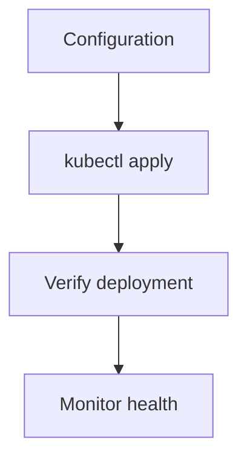

> 💡 **Quick Answer:** Build Kubernetes operators with Operator SDK. Controller reconciliation, custom resources, status subresource, leader election, and testing patterns.

## The Problem

Teams need production-ready guidance for operator sdk development guide on Kubernetes. This recipe provides step-by-step configuration with YAML examples, common pitfalls, and best practices from real-world deployments.

## The Solution

### Configuration

```yaml
# Example Operator SDK Development Guide configuration
apiVersion: v1
kind: ConfigMap
metadata:
  name: kubernetes-operator-sdk-guide-config
  namespace: production
data:
  config.yaml: |
    # Production configuration for Operator SDK Development Guide
    enabled: true
    namespace: production
```

### Deployment

```bash
# Verify configuration
kubectl apply --dry-run=server -f config.yaml

# Apply to cluster
kubectl apply -f config.yaml

# Verify
kubectl get all -n production
```



## Common Issues

**Configuration not taking effect**

Check namespace and resource names match. Use `kubectl describe` to see events and status conditions.

**Pods not starting after changes**

Review events: `kubectl get events --sort-by=.metadata.creationTimestamp -n production`. Check for resource constraints or missing dependencies.

## Best Practices

- **Test in staging first** — validate all configuration changes before production
- **Version control everything** — all YAML in Git with proper review
- **Monitor after changes** — watch metrics and logs for 30 minutes post-deploy
- **Document decisions** — record why specific settings were chosen
- **Automate with GitOps** — ArgoCD or Flux for consistent deployments

## Key Takeaways

- Operator SDK Development Guide is essential for production Kubernetes clusters
- Start with defaults, tune based on monitoring data
- Always test changes in non-production first
- Combine with other security and observability tools for defense in depth
- Keep configurations in version control for audit and rollback
