## The Problem

You need to automate the deployment, scaling, and management of complex stateful applications or custom workloads in Kubernetes beyond what Deployments and StatefulSets provide.

## The Solution

Build a Kubernetes Operator that encapsulates operational knowledge into code, using Custom Resources and Controllers to manage your application lifecycle automatically.

## What is an Operator?

```mermaid
flowchart TB
    subgraph cluster["☸️ KUBERNETES CLUSTER"]
        subgraph crd_section["📋 Custom Resource Definition"]
            CRD["📜 Custom Resource<br/>Definition (CRD)"]
            CR["📄 Custom Resource<br/>Instance (CR)<br/><br/>spec:<br/>  replicas: 3<br/>  version: 1.0"]
            CRD --> CR
        end
        
        subgraph operator["🤖 Operator Controller"]
            subgraph loop["🔄 Reconciliation Loop"]
                step1["1. Watch Custom Resource"]
                step2["2. Compare desired vs<br/>actual state"]
                step3["3. Take corrective<br/>action"]
                step1 --> step2 --> step3
            end
            
            creates["Creates/Updates:<br/>📦 Deployments<br/>🌐 Services<br/>⚙️ ConfigMaps<br/>🔐 Secrets"]
        end
        
        CR <--> operator
    end
```



## Step 1: Define Your Custom Resource

Start by defining what your operator will manage:

```yaml
# crd-database.yaml
apiVersion: apiextensions.k8s.io/v1
kind: CustomResourceDefinition
metadata:
  name: databases.example.com
spec:
  group: example.com
  versions:
    - name: v1
      served: true
      storage: true
      schema:
        openAPIV3Schema:
          type: object
          properties:
            spec:
              type: object
              required:
                - engine
                - version
              properties:
                engine:
                  type: string
                  enum: ["postgres", "mysql", "mongodb"]
                version:
                  type: string
                replicas:
                  type: integer
                  minimum: 1
                  maximum: 5
                  default: 1
                storage:
                  type: object
                  properties:
                    size:
                      type: string
                      default: "10Gi"
                    storageClass:
                      type: string
                backup:
                  type: object
                  properties:
                    enabled:
                      type: boolean
                      default: false
                    schedule:
                      type: string
                      default: "0 2 * * *"
            status:
              type: object
              properties:
                phase:
                  type: string
                ready:
                  type: boolean
                endpoint:
                  type: string
                conditions:
                  type: array
                  items:
                    type: object
                    properties:
                      type:
                        type: string
                      status:
                        type: string
                      lastTransitionTime:
                        type: string
                      reason:
                        type: string
                      message:
                        type: string
      subresources:
        status: {}
      additionalPrinterColumns:
        - name: Engine
          type: string
          jsonPath: .spec.engine
        - name: Version
          type: string
          jsonPath: .spec.version
        - name: Replicas
          type: integer
          jsonPath: .spec.replicas
        - name: Phase
          type: string
          jsonPath: .status.phase
        - name: Age
          type: date
          jsonPath: .metadata.creationTimestamp
  scope: Namespaced
  names:
    plural: databases
    singular: database
    kind: Database
    shortNames:
      - db
```

Apply the CRD:

```bash
kubectl apply -f crd-database.yaml
```

## Step 2: Create a Custom Resource Instance

```yaml
# my-database.yaml
apiVersion: example.com/v1
kind: Database
metadata:
  name: production-db
  namespace: default
spec:
  engine: postgres
  version: "15"
  replicas: 3
  storage:
    size: 50Gi
    storageClass: fast-ssd
  backup:
    enabled: true
    schedule: "0 3 * * *"
```

## Step 3: Set Up Kubebuilder Project

Initialize a new operator project:

```bash
# Install kubebuilder
curl -L -o kubebuilder "https://go.kubebuilder.io/dl/latest/$(go env GOOS)/$(go env GOARCH)"
chmod +x kubebuilder && sudo mv kubebuilder /usr/local/bin/

# Create project
mkdir database-operator && cd database-operator
kubebuilder init --domain example.com --repo github.com/example/database-operator

# Create API
kubebuilder create api --group apps --version v1 --kind Database
```

## Step 4: Implement the Controller Logic

```go
// controllers/database_controller.go
package controllers

import (
	"context"
	"fmt"
	"time"

	appsv1 "k8s.io/api/apps/v1"
	corev1 "k8s.io/api/core/v1"
	"k8s.io/apimachinery/pkg/api/errors"
	"k8s.io/apimachinery/pkg/api/resource"
	metav1 "k8s.io/apimachinery/pkg/apis/meta/v1"
	"k8s.io/apimachinery/pkg/runtime"
	"k8s.io/apimachinery/pkg/types"
	ctrl "sigs.k8s.io/controller-runtime"
	"sigs.k8s.io/controller-runtime/pkg/client"
	"sigs.k8s.io/controller-runtime/pkg/log"

	examplev1 "github.com/example/database-operator/api/v1"
)

type DatabaseReconciler struct {
	client.Client
	Scheme *runtime.Scheme
}

// +kubebuilder:rbac:groups=apps.example.com,resources=databases,verbs=get;list;watch;create;update;patch;delete
// +kubebuilder:rbac:groups=apps.example.com,resources=databases/status,verbs=get;update;patch
// +kubebuilder:rbac:groups=apps,resources=statefulsets,verbs=get;list;watch;create;update;patch;delete
// +kubebuilder:rbac:groups="",resources=services;configmaps;secrets;persistentvolumeclaims,verbs=get;list;watch;create;update;patch;delete

func (r *DatabaseReconciler) Reconcile(ctx context.Context, req ctrl.Request) (ctrl.Result, error) {
	logger := log.FromContext(ctx)

	// Fetch the Database instance
	database := &examplev1.Database{}
	err := r.Get(ctx, req.NamespacedName, database)
	if err != nil {
		if errors.IsNotFound(err) {
			logger.Info("Database resource not found. Ignoring since object must be deleted")
			return ctrl.Result{}, nil
		}
		logger.Error(err, "Failed to get Database")
		return ctrl.Result{}, err
	}

	// Check if StatefulSet exists, if not create it
	found := &appsv1.StatefulSet{}
	err = r.Get(ctx, types.NamespacedName{Name: database.Name, Namespace: database.Namespace}, found)
	if err != nil && errors.IsNotFound(err) {
		// Create StatefulSet
		sts := r.statefulSetForDatabase(database)
		logger.Info("Creating a new StatefulSet", "StatefulSet.Namespace", sts.Namespace, "StatefulSet.Name", sts.Name)
		err = r.Create(ctx, sts)
		if err != nil {
			logger.Error(err, "Failed to create new StatefulSet")
			return ctrl.Result{}, err
		}
		// Update status
		database.Status.Phase = "Creating"
		r.Status().Update(ctx, database)
		return ctrl.Result{Requeue: true}, nil
	} else if err != nil {
		logger.Error(err, "Failed to get StatefulSet")
		return ctrl.Result{}, err
	}

	// Ensure replicas match
	replicas := int32(database.Spec.Replicas)
	if *found.Spec.Replicas != replicas {
		found.Spec.Replicas = &replicas
		err = r.Update(ctx, found)
		if err != nil {
			logger.Error(err, "Failed to update StatefulSet")
			return ctrl.Result{}, err
		}
		return ctrl.Result{Requeue: true}, nil
	}

	// Update status based on StatefulSet status
	if found.Status.ReadyReplicas == replicas {
		database.Status.Phase = "Running"
		database.Status.Ready = true
		database.Status.Endpoint = fmt.Sprintf("%s.%s.svc.cluster.local", database.Name, database.Namespace)
	} else {
		database.Status.Phase = "Pending"
		database.Status.Ready = false
	}
	r.Status().Update(ctx, database)

	return ctrl.Result{RequeueAfter: 30 * time.Second}, nil
}

func (r *DatabaseReconciler) statefulSetForDatabase(db *examplev1.Database) *appsv1.StatefulSet {
	labels := map[string]string{
		"app":        db.Name,
		"managed-by": "database-operator",
	}
	replicas := int32(db.Spec.Replicas)

	image := r.getImageForEngine(db.Spec.Engine, db.Spec.Version)

	sts := &appsv1.StatefulSet{
		ObjectMeta: metav1.ObjectMeta{
			Name:      db.Name,
			Namespace: db.Namespace,
		},
		Spec: appsv1.StatefulSetSpec{
			Replicas: &replicas,
			Selector: &metav1.LabelSelector{
				MatchLabels: labels,
			},
			ServiceName: db.Name,
			Template: corev1.PodTemplateSpec{
				ObjectMeta: metav1.ObjectMeta{
					Labels: labels,
				},
				Spec: corev1.PodSpec{
					Containers: []corev1.Container{{
						Name:  db.Spec.Engine,
						Image: image,
						Ports: []corev1.ContainerPort{{
							ContainerPort: r.getPortForEngine(db.Spec.Engine),
							Name:          "db",
						}},
						VolumeMounts: []corev1.VolumeMount{{
							Name:      "data",
							MountPath: r.getDataPathForEngine(db.Spec.Engine),
						}},
					}},
				},
			},
			VolumeClaimTemplates: []corev1.PersistentVolumeClaim{{
				ObjectMeta: metav1.ObjectMeta{
					Name: "data",
				},
				Spec: corev1.PersistentVolumeClaimSpec{
					AccessModes: []corev1.PersistentVolumeAccessMode{corev1.ReadWriteOnce},
					Resources: corev1.VolumeResourceRequirements{
						Requests: corev1.ResourceList{
							corev1.ResourceStorage: resource.MustParse(db.Spec.Storage.Size),
						},
					},
				},
			}},
		},
	}

	// Set owner reference
	ctrl.SetControllerReference(db, sts, r.Scheme)
	return sts
}

func (r *DatabaseReconciler) getImageForEngine(engine, version string) string {
	images := map[string]string{
		"postgres": fmt.Sprintf("postgres:%s", version),
		"mysql":    fmt.Sprintf("mysql:%s", version),
		"mongodb":  fmt.Sprintf("mongo:%s", version),
	}
	return images[engine]
}

func (r *DatabaseReconciler) getPortForEngine(engine string) int32 {
	ports := map[string]int32{
		"postgres": 5432,
		"mysql":    3306,
		"mongodb":  27017,
	}
	return ports[engine]
}

func (r *DatabaseReconciler) getDataPathForEngine(engine string) string {
	paths := map[string]string{
		"postgres": "/var/lib/postgresql/data",
		"mysql":    "/var/lib/mysql",
		"mongodb":  "/data/db",
	}
	return paths[engine]
}

func (r *DatabaseReconciler) SetupWithManager(mgr ctrl.Manager) error {
	return ctrl.NewControllerManagedBy(mgr).
		For(&examplev1.Database{}).
		Owns(&appsv1.StatefulSet{}).
		Complete(r)
}
```

## Step 5: Deploy the Operator

### Build and Push Image

```bash
# Build the operator image
make docker-build IMG=myregistry/database-operator:v0.1.0

# Push to registry
make docker-push IMG=myregistry/database-operator:v0.1.0
```

### Deploy to Cluster

```yaml
# deploy/operator.yaml
apiVersion: apps/v1
kind: Deployment
metadata:
  name: database-operator
  namespace: operators
spec:
  replicas: 1
  selector:
    matchLabels:
      app: database-operator
  template:
    metadata:
      labels:
        app: database-operator
    spec:
      serviceAccountName: database-operator
      containers:
        - name: operator
          image: myregistry/database-operator:v0.1.0
          command:
            - /manager
          args:
            - --leader-elect
          resources:
            limits:
              cpu: 500m
              memory: 128Mi
            requests:
              cpu: 100m
              memory: 64Mi
          livenessProbe:
            httpGet:
              path: /healthz
              port: 8081
            initialDelaySeconds: 15
          readinessProbe:
            httpGet:
              path: /readyz
              port: 8081
            initialDelaySeconds: 5
---
apiVersion: v1
kind: ServiceAccount
metadata:
  name: database-operator
  namespace: operators
---
apiVersion: rbac.authorization.k8s.io/v1
kind: ClusterRole
metadata:
  name: database-operator-role
rules:
  - apiGroups: ["apps.example.com"]
    resources: ["databases"]
    verbs: ["get", "list", "watch", "create", "update", "patch", "delete"]
  - apiGroups: ["apps.example.com"]
    resources: ["databases/status"]
    verbs: ["get", "update", "patch"]
  - apiGroups: ["apps"]
    resources: ["statefulsets"]
    verbs: ["get", "list", "watch", "create", "update", "patch", "delete"]
  - apiGroups: [""]
    resources: ["services", "configmaps", "secrets", "persistentvolumeclaims"]
    verbs: ["get", "list", "watch", "create", "update", "patch", "delete"]
---
apiVersion: rbac.authorization.k8s.io/v1
kind: ClusterRoleBinding
metadata:
  name: database-operator-rolebinding
roleRef:
  apiGroup: rbac.authorization.k8s.io
  kind: ClusterRole
  name: database-operator-role
subjects:
  - kind: ServiceAccount
    name: database-operator
    namespace: operators
```

## Step 6: Use Your Operator

Create a database instance:

```yaml
# production-database.yaml
apiVersion: apps.example.com/v1
kind: Database
metadata:
  name: orders-db
  namespace: production
spec:
  engine: postgres
  version: "15"
  replicas: 3
  storage:
    size: 100Gi
    storageClass: fast-ssd
  backup:
    enabled: true
    schedule: "0 2 * * *"
```

```bash
# Apply the database
kubectl apply -f production-database.yaml

# Check status
kubectl get databases -n production
kubectl describe database orders-db -n production

# Check created resources
kubectl get statefulsets,services,pvc -n production -l app=orders-db
```

## Popular Kubernetes Operators

Install and use community operators:

### Prometheus Operator

```bash
# Install using Helm
helm repo add prometheus-community https://prometheus-community.github.io/helm-charts
helm install prometheus prometheus-community/kube-prometheus-stack
```

```yaml
# Create a ServiceMonitor
apiVersion: monitoring.coreos.com/v1
kind: ServiceMonitor
metadata:
  name: myapp-monitor
spec:
  selector:
    matchLabels:
      app: myapp
  endpoints:
    - port: metrics
      interval: 30s
```

### Cert-Manager

```yaml
# Certificate request managed by cert-manager operator
apiVersion: cert-manager.io/v1
kind: Certificate
metadata:
  name: myapp-tls
spec:
  secretName: myapp-tls-secret
  issuerRef:
    name: letsencrypt-prod
    kind: ClusterIssuer
  dnsNames:
    - myapp.example.com
```

## Operator Best Practices

### 1. Idempotent Reconciliation

```go
// Always check before creating
if err != nil && errors.IsNotFound(err) {
    // Create resource
} else if err != nil {
    // Handle error
} else {
    // Update if needed
}
```

### 2. Use Owner References

```go
ctrl.SetControllerReference(owner, owned, r.Scheme)
```

### 3. Implement Finalizers for Cleanup

```go
const finalizerName = "databases.example.com/finalizer"

func (r *DatabaseReconciler) Reconcile(ctx context.Context, req ctrl.Request) (ctrl.Result, error) {
    database := &examplev1.Database{}
    r.Get(ctx, req.NamespacedName, database)

    if database.DeletionTimestamp.IsZero() {
        // Add finalizer if not present
        if !containsString(database.Finalizers, finalizerName) {
            database.Finalizers = append(database.Finalizers, finalizerName)
            r.Update(ctx, database)
        }
    } else {
        // Object is being deleted
        if containsString(database.Finalizers, finalizerName) {
            // Run cleanup logic
            r.cleanupExternalResources(database)
            
            // Remove finalizer
            database.Finalizers = removeString(database.Finalizers, finalizerName)
            r.Update(ctx, database)
        }
        return ctrl.Result{}, nil
    }
    // ... rest of reconciliation
}
```

### 4. Status Conditions

```go
database.Status.Conditions = append(database.Status.Conditions, metav1.Condition{
    Type:               "Ready",
    Status:             metav1.ConditionTrue,
    LastTransitionTime: metav1.Now(),
    Reason:             "ReconciliationSucceeded",
    Message:            "Database is ready",
})
```

## Verification Commands

```bash
# List all CRDs
kubectl get crds | grep example.com

# View custom resources
kubectl get databases --all-namespaces

# Check operator logs
kubectl logs -n operators -l app=database-operator -f

# Describe a managed resource
kubectl describe database orders-db -n production
```

## Summary

Kubernetes Operators extend the platform's capabilities by encoding operational knowledge into software. Use them to automate complex application lifecycle management, from deployment to backup and recovery.

---

## 📘 Go Further with Kubernetes Recipes

**Love this recipe? There's so much more!** This is just one of **100+ hands-on recipes** in our comprehensive **[Kubernetes Recipes book](https://amzn.to/3DzC8QA)**.

Inside the book, you'll master:
- ✅ Production-ready deployment strategies
- ✅ Advanced networking and security patterns  
- ✅ Observability, monitoring, and troubleshooting
- ✅ Real-world best practices from industry experts

> *"The practical, recipe-based approach made complex Kubernetes concepts finally click for me."*

**👉 [Get Your Copy Now](https://amzn.to/3DzC8QA)** — Start building production-grade Kubernetes skills today!
