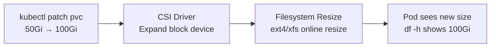

> 💡 **Quick Answer:** Set `allowVolumeExpansion: true` on your StorageClass, then `kubectl edit pvc <name>` and increase `spec.resources.requests.storage`. The volume and filesystem expand automatically (online for most CSI drivers).

## The Problem

Applications grow — databases fill up, log volumes expand, ML datasets accumulate. You need to increase PVC size without downtime, pod restarts, or data migration. Kubernetes supports online volume expansion, but it requires proper StorageClass configuration.

## The Solution

### Enable Volume Expansion

```yaml
apiVersion: storage.k8s.io/v1
kind: StorageClass
metadata:
  name: expandable-ssd
provisioner: ebs.csi.aws.com
parameters:
  type: gp3
allowVolumeExpansion: true
reclaimPolicy: Retain
```

### Expand a PVC

```bash
# Check current size
kubectl get pvc data-volume -o jsonpath='{.spec.resources.requests.storage}'
# 10Gi

# Expand to 50Gi
kubectl patch pvc data-volume -p '{"spec":{"resources":{"requests":{"storage":"50Gi"}}}}'

# Monitor expansion
kubectl get pvc data-volume -o jsonpath='{.status.conditions[*].type}'
# FileSystemResizePending → (empty when complete)

# Verify new size
kubectl exec my-pod -- df -h /data
# /dev/nvme1n1  50G  8.2G  42G  17% /data
```

### StatefulSet PVC Expansion

```bash
# StatefulSet PVCs are named: <volumeClaimTemplate-name>-<pod-name>
# Expand each one individually
for i in 0 1 2; do
  kubectl patch pvc data-db-$i -p '{"spec":{"resources":{"requests":{"storage":"100Gi"}}}}'
done
```

> ⚠️ You cannot change `volumeClaimTemplates` in a StatefulSet. Expand existing PVCs individually.



## Common Issues

**PVC stuck in FileSystemResizePending**

Some CSI drivers require pod restart to trigger filesystem resize. Delete the pod — StatefulSet recreates it, and the filesystem expands on mount.

**"storageclass does not allow volume expansion"**

The StorageClass has `allowVolumeExpansion: false` (or unset). You can't change it retroactively for existing PVCs. Create a new StorageClass with expansion enabled.

## Best Practices

- **Always set `allowVolumeExpansion: true`** on production StorageClasses
- **You can only increase PVC size** — shrinking is not supported
- **Expand during low-traffic periods** — filesystem resize may briefly increase I/O latency
- **Monitor PVC usage** with Prometheus — alert at 80% capacity to expand proactively
- **Test expansion in staging** before production — verify your CSI driver supports online resize

## Key Takeaways

- PVC expansion requires `allowVolumeExpansion: true` on the StorageClass
- `kubectl patch pvc` to increase storage — CSI driver + filesystem resize handles the rest
- StatefulSet PVCs must be expanded individually (can't change volumeClaimTemplates)
- Online expansion works with most CSI drivers (EBS, GCE PD, Azure Disk, Ceph)
- You can only grow PVCs — shrinking is never supported
