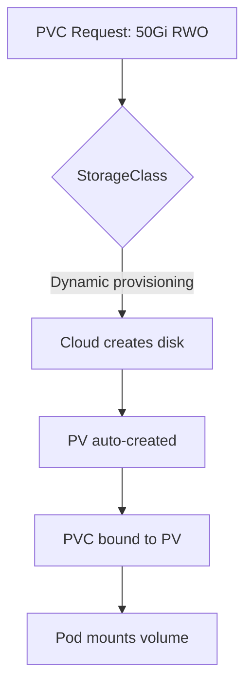

> 💡 **Quick Answer:** Create and manage Persistent Volumes and PersistentVolumeClaims in Kubernetes. Covers StorageClasses, dynamic provisioning, access modes, and volume expansion.

## The Problem

This is one of the most searched Kubernetes topics. Having a comprehensive, well-structured guide helps both beginners and experienced users quickly find what they need.

## The Solution

### PersistentVolumeClaim (Dynamic Provisioning)

```yaml
# Most common — let StorageClass handle it
apiVersion: v1
kind: PersistentVolumeClaim
metadata:
  name: postgres-data
spec:
  accessModes:
    - ReadWriteOnce
  storageClassName: gp3          # Cloud provider StorageClass
  resources:
    requests:
      storage: 50Gi
---
# Use in a pod
apiVersion: v1
kind: Pod
spec:
  containers:
    - name: postgres
      image: postgres:16
      volumeMounts:
        - name: data
          mountPath: /var/lib/postgresql/data
  volumes:
    - name: data
      persistentVolumeClaim:
        claimName: postgres-data
```

### StorageClass

```yaml
apiVersion: storage.k8s.io/v1
kind: StorageClass
metadata:
  name: fast-ssd
  annotations:
    storageclass.kubernetes.io/is-default-class: "true"
provisioner: ebs.csi.aws.com
parameters:
  type: gp3
  iops: "5000"
  throughput: "250"
  encrypted: "true"
reclaimPolicy: Delete      # or Retain
allowVolumeExpansion: true  # Allow PVC resize
volumeBindingMode: WaitForFirstConsumer  # Bind when pod is scheduled
```

### Access Modes

| Mode | Abbreviation | Description |
|------|-------------|-------------|
| ReadWriteOnce | RWO | Single node read-write |
| ReadOnlyMany | ROX | Multiple nodes read-only |
| ReadWriteMany | RWX | Multiple nodes read-write (NFS, CephFS) |
| ReadWriteOncePod | RWOP | Single pod read-write (K8s 1.27+) |

### Expand a PVC

```bash
# Edit the PVC size (StorageClass must allow expansion)
kubectl patch pvc postgres-data -p '{"spec":{"resources":{"requests":{"storage":"100Gi"}}}}'

# Check status
kubectl get pvc postgres-data
# Condition: FileSystemResizePending → resize happens on next pod mount
```

### Static PersistentVolume

```yaml
apiVersion: v1
kind: PersistentVolume
metadata:
  name: nfs-data
spec:
  capacity:
    storage: 100Gi
  accessModes:
    - ReadWriteMany
  nfs:
    server: nfs.example.com
    path: /exports/data
  persistentVolumeReclaimPolicy: Retain
```



## Frequently Asked Questions

### What happens when I delete a PVC?

Depends on `reclaimPolicy`: **Delete** removes the underlying storage. **Retain** keeps the data but the PV becomes Released and can't be reused without manual cleanup.

### PV vs PVC?

**PV** is the actual storage resource. **PVC** is a request for storage. PVCs bind to PVs. With dynamic provisioning, you only create PVCs and the PV is auto-created.

## Best Practices

- **Start simple** — use the basic form first, add complexity as needed
- **Be consistent** — follow naming conventions across your cluster
- **Document your choices** — add annotations explaining why, not just what
- **Monitor and iterate** — review configurations regularly

## Key Takeaways

- This is fundamental Kubernetes knowledge every engineer needs
- Start with the simplest approach that solves your problem
- Use `kubectl explain` and `kubectl describe` when unsure
- Practice in a test cluster before applying to production
