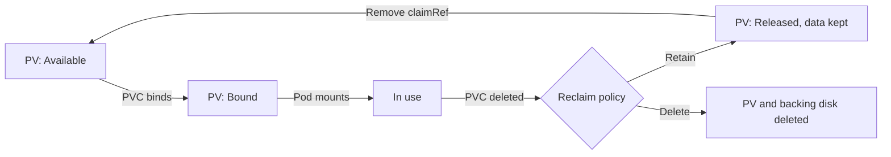

> 💡 **Quick Answer:** Create a PVC: `kubectl apply -f` a PersistentVolumeClaim requesting storage size and access mode. With a StorageClass, volumes are provisioned automatically (dynamic provisioning). Access modes: `ReadWriteOnce` (single node), `ReadOnlyMany` (many nodes read), `ReadWriteMany` (many nodes read/write). Reclaim policies: `Delete` (default for dynamic) removes data on PVC deletion, `Retain` keeps it.

## The Problem

Container storage is ephemeral — data is lost when pods restart:

- Database pods lose all data on crash
- Log collectors lose buffered logs
- File uploads disappear on pod reschedule
- No persistent state across deployments

## The Solution

### Dynamic Provisioning (Recommended)

```yaml
# 1. StorageClass (usually pre-installed by cloud provider)
apiVersion: storage.k8s.io/v1
kind: StorageClass
metadata:
  name: fast-ssd
provisioner: ebs.csi.aws.com          # or pd.csi.storage.gke.io, disk.csi.azure.com (in-tree kubernetes.io/aws-ebs is removed)
parameters:
  type: gp3
reclaimPolicy: Delete
allowVolumeExpansion: true
volumeBindingMode: WaitForFirstConsumer

---
# 2. PVC — requests storage
apiVersion: v1
kind: PersistentVolumeClaim
metadata:
  name: postgres-data
spec:
  accessModes:
  - ReadWriteOnce
  storageClassName: fast-ssd
  resources:
    requests:
      storage: 50Gi

---
# 3. Pod using PVC
apiVersion: v1
kind: Pod
metadata:
  name: postgres
spec:
  containers:
  - name: postgres
    image: postgres:16
    volumeMounts:
    - name: data
      mountPath: /var/lib/postgresql/data
  volumes:
  - name: data
    persistentVolumeClaim:
      claimName: postgres-data
```

### Static Provisioning

```yaml
# Admin creates PV manually
apiVersion: v1
kind: PersistentVolume
metadata:
  name: nfs-pv
spec:
  capacity:
    storage: 100Gi
  accessModes:
  - ReadWriteMany
  persistentVolumeReclaimPolicy: Retain
  nfs:
    server: nfs.example.com
    path: /exports/data

---
# PVC binds to matching PV
apiVersion: v1
kind: PersistentVolumeClaim
metadata:
  name: shared-data
spec:
  accessModes:
  - ReadWriteMany
  resources:
    requests:
      storage: 100Gi
  storageClassName: ""    # Empty = no dynamic provisioning
```

`storageClassName: ""` means "bind only to a PV with no class" and disables dynamic provisioning. **Omitting** the field uses the cluster's default StorageClass — not the same thing.

A static PV can carry NFS mount options and labels, and a PVC can pin itself to it with a selector:

```yaml
apiVersion: v1
kind: PersistentVolume
metadata:
  name: nfs-vol-01
  labels:
    type: nfs
    environment: production
spec:
  capacity:
    storage: 100Gi
  volumeMode: Filesystem
  accessModes: [ReadWriteMany]
  persistentVolumeReclaimPolicy: Retain
  storageClassName: ""
  mountOptions:
    - nfsvers=4.1
    - hard
  nfs:
    server: nfs.example.com
    path: /exports/data01
---
apiVersion: v1
kind: PersistentVolumeClaim
metadata:
  name: prod-data
spec:
  accessModes: [ReadWriteMany]
  storageClassName: ""
  resources:
    requests:
      storage: 100Gi
  selector:
    matchLabels:
      type: nfs
      environment: production
```

Pre-bind precisely with `spec.volumeName: nfs-vol-01` on the PVC (and optionally `spec.claimRef` on the PV). For iSCSI, Fibre Channel or cloud disks, prefer the vendor's CSI driver over in-tree volume types.

### PV Lifecycle and Status

| Status | Meaning |
|--------|---------|
| Available | Free, not bound to a PVC |
| Bound | Bound to a PVC (1:1) |
| Released | PVC deleted; data kept (`Retain`), PV not reusable yet |
| Failed | Automatic reclamation failed |

```bash
# Make a Released PV Available again (data is still on it — wipe first if needed)
kubectl patch pv nfs-vol-01 --type json -p '[{"op":"remove","path":"/spec/claimRef"}]'

# Protect data before deleting a PVC
kubectl patch pv <pv> -p '{"spec":{"persistentVolumeReclaimPolicy":"Retain"}}'
```


```mermaid
graph LR
    A[PV: Available] -->|PVC binds| B[PV: Bound]
    B -->|Pod mounts| C[In use]
    C -->|PVC deleted| D{Reclaim policy}
    D -->|Retain| E[PV: Released, data kept]
    D -->|Delete| F[PV and backing disk deleted]
    E -->|Remove claimRef| A
```

### Volume Modes

```yaml
# Filesystem (default): mounted as a directory via volumeMounts
volumeMode: Filesystem

# Block: raw device, for databases or software-defined storage that manage their own layout
volumeMode: Block
# In the pod, use volumeDevices instead of volumeMounts:
#   volumeDevices:
#     - name: data
#       devicePath: /dev/xvda
```

### Access Modes

| Mode | Abbreviation | Description |
|------|-------------|-------------|
| ReadWriteOnce | RWO | Single node read/write |
| ReadOnlyMany | ROX | Multiple nodes read-only |
| ReadWriteMany | RWX | Multiple nodes read/write |
| ReadWriteOncePod | RWOP | Single pod (GA in K8s 1.29, CSI only) |

RWO restricts attachment to one **node**, not one pod — several pods on the same node can mount an RWO volume. Access modes are what the driver supports; block storage (EBS, Azure Disk, Ceph RBD) is RWO, file storage (NFS, EFS, CephFS, Azure Files) supports RWX.

```bash
# List StorageClasses and the default one
kubectl get storageclass
kubectl describe storageclass fast-ssd
```

### Volume Expansion

```bash
# Expand PVC (StorageClass must have allowVolumeExpansion: true)
kubectl patch pvc postgres-data -p '{"spec":{"resources":{"requests":{"storage":"100Gi"}}}}'

# Check status
kubectl get pvc postgres-data
# NAME            STATUS   VOLUME   CAPACITY   ACCESS MODES
# postgres-data   Bound    pv-xxx   100Gi      RWO

# Some CSI drivers require pod restart for filesystem expansion
kubectl delete pod postgres
```

### StatefulSet with VolumeClaimTemplates

```yaml
apiVersion: apps/v1
kind: StatefulSet
metadata:
  name: postgres
spec:
  serviceName: postgres
  replicas: 3
  selector:
    matchLabels:
      app: postgres
  template:
    metadata:
      labels:
        app: postgres
    spec:
      containers:
      - name: postgres
        image: postgres:16
        volumeMounts:
        - name: data
          mountPath: /var/lib/postgresql/data
  volumeClaimTemplates:          # Auto-creates PVC per replica
  - metadata:
      name: data
    spec:
      accessModes: ["ReadWriteOnce"]
      storageClassName: fast-ssd
      resources:
        requests:
          storage: 50Gi
# Creates: data-postgres-0, data-postgres-1, data-postgres-2
```

## Common Issues

**PVC stuck in Pending**

No matching PV or StorageClass not configured. Check: `kubectl describe pvc <name>` for events. With `WaitForFirstConsumer`, Pending is normal until a pod uses the PVC. See [PVC Pending troubleshooting](/recipes/troubleshooting/pvc-pending-troubleshooting/).

**Data lost after pod restart**

Volume not mounted or using `emptyDir` instead of PVC. Verify: `kubectl describe pod <name> | grep -A5 Volumes`.

**"volume is already exclusively attached"**

RWO volume can't attach to multiple nodes. Pod must schedule on same node, or use RWX access mode.

## Best Practices

- **Always use dynamic provisioning** — let StorageClass handle PV creation
- **Set `WaitForFirstConsumer`** — binds volume to pod's node (topology-aware)
- **Use `Retain` for databases** — don't auto-delete production data
- **StatefulSet + volumeClaimTemplates** — one PVC per replica automatically
- **Monitor PVC usage** with `kubelet_volume_stats_used_bytes` Prometheus metric

## Key Takeaways

- PVCs request storage; PVs provide it; StorageClass automates provisioning
- Dynamic provisioning with StorageClass is the standard approach
- RWO for databases, RWX for shared filesystems, RWOP for strict single-pod
- Volume expansion supported with `allowVolumeExpansion: true` in StorageClass
- StatefulSet `volumeClaimTemplates` create per-replica persistent storage

## Frequently Asked Questions

### What is the difference between a PersistentVolume and a PersistentVolumeClaim?

A PersistentVolume (PV) is a cluster-scoped piece of storage — an NFS export, a cloud disk, a Ceph image — created by an admin or dynamically by a CSI provisioner. A PersistentVolumeClaim (PVC) is a namespaced request for storage of a size and access mode; Kubernetes binds it 1:1 to a matching PV, and pods reference the PVC.

### What does storageClassName: "" do?

It tells Kubernetes the claim must bind to a statically created PV that has no StorageClass, and prevents the default StorageClass from dynamically provisioning a volume. Leaving the field out applies the default StorageClass.

### What happens to data when I delete a PVC?

It depends on the PV's `persistentVolumeReclaimPolicy`. `Delete` (the default for dynamically provisioned volumes) removes the PV and the backing disk. `Retain` keeps both; the PV goes to `Released` and must be cleaned up or reclaimed manually.

### Can multiple pods use the same PVC?

Yes with `ReadWriteMany` storage across nodes, or with `ReadWriteOnce` if all pods run on the same node. `ReadWriteOncePod` guarantees a single pod.

### How do I resize a PersistentVolumeClaim?

Increase `spec.resources.requests.storage` on the PVC; the StorageClass must have `allowVolumeExpansion: true`. Most CSI drivers expand online; shrinking isn't supported.

