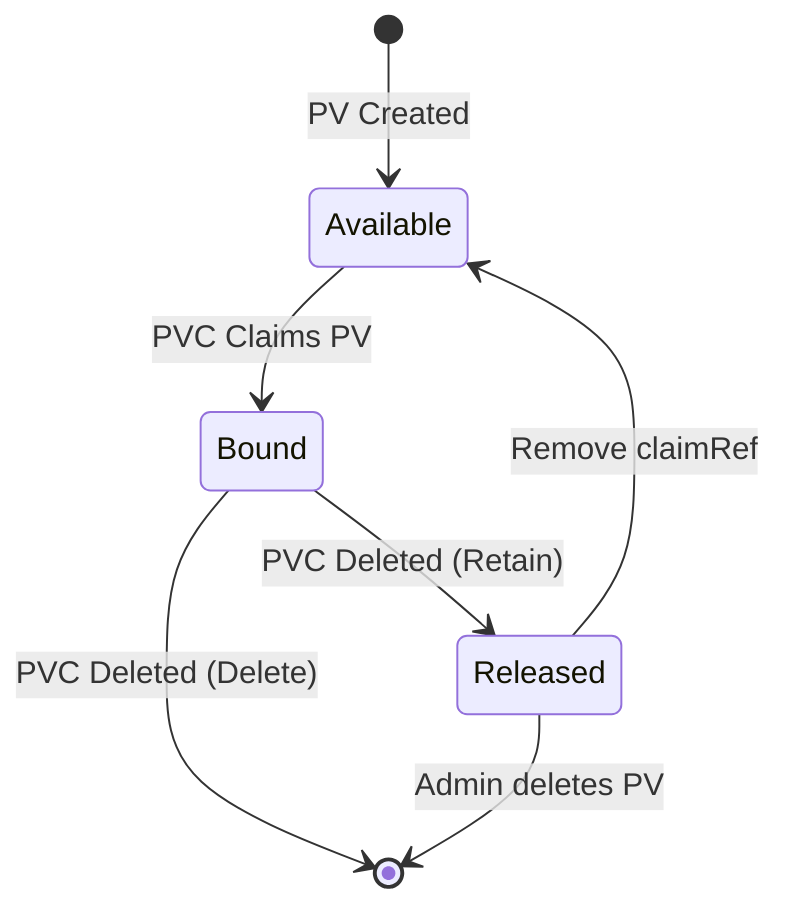

> 💡 **Quick Answer:** `Delete` removes the backing storage when PVC is deleted (default for dynamic provisioning). `Retain` keeps the volume data for manual recovery. Never use `Recycle` (deprecated).

## The Problem

When a PVC is deleted, what happens to the data? Without understanding reclaim policies:
- Production data accidentally deleted with the PVC
- Orphaned cloud volumes accumulating costs
- Inability to recover data from released PVs
- Confusion about why a PV shows "Released" but can't be rebound

## The Solution

### Check Current Policy

```bash
kubectl get pv -o custom-columns=NAME:.metadata.name,POLICY:.spec.persistentVolumeReclaimPolicy,STATUS:.status.phase
```

### Change Policy on Existing PV

```bash
# Change from Delete to Retain (protect data)
kubectl patch pv pv-data-01 -p '{"spec":{"persistentVolumeReclaimPolicy":"Retain"}}'
```

### StorageClass with Retain Policy

```yaml
apiVersion: storage.k8s.io/v1
kind: StorageClass
metadata:
  name: retain-ssd
provisioner: ebs.csi.aws.com
reclaimPolicy: Retain
volumeBindingMode: WaitForFirstConsumer
parameters:
  type: gp3
  encrypted: "true"
```

### Recover a Released PV

```bash
# 1. PV is in "Released" state after PVC deletion
kubectl get pv pv-data-01
# STATUS: Released

# 2. Remove the claimRef to make it Available
kubectl patch pv pv-data-01 --type=json -p='[{"op":"remove","path":"/spec/claimRef"}]'

# 3. Create a new PVC that binds to this PV
```

```yaml
apiVersion: v1
kind: PersistentVolumeClaim
metadata:
  name: recovered-data
spec:
  accessModes: ["ReadWriteOnce"]
  storageClassName: ""  # Empty = manual binding
  volumeName: pv-data-01
  resources:
    requests:
      storage: 50Gi
```

### Static PV with Retain

```yaml
apiVersion: v1
kind: PersistentVolume
metadata:
  name: nfs-data
spec:
  capacity:
    storage: 100Gi
  accessModes: ["ReadWriteMany"]
  persistentVolumeReclaimPolicy: Retain
  nfs:
    server: 192.168.1.100
    path: /exports/data
```



## Common Issues

**PV stuck in "Released" — can't bind new PVC**
The `claimRef` still references the deleted PVC. Remove it:
```bash
kubectl patch pv <pv-name> --type=json -p='[{"op":"remove","path":"/spec/claimRef"}]'
```

**Dynamic PVs defaulting to Delete**
Most CSI drivers and cloud StorageClasses default to `Delete`. Create a `Retain` StorageClass for important data.

**Orphaned cloud volumes after PVC deletion with Retain**
Retained PVs keep the cloud volume. Clean up manually:
```bash
# List Released PVs
kubectl get pv --field-selector=status.phase=Released
# Delete PV (doesn't delete cloud volume)
kubectl delete pv <pv-name>
# Delete cloud volume separately
aws ec2 delete-volume --volume-id vol-abc123
```

## Best Practices

- Use `Retain` for production databases and stateful workloads
- Use `Delete` for ephemeral/reproducible data (caches, build artifacts)
- Patch existing PVs to `Retain` before dangerous operations
- Create a `retain-*` StorageClass variant for important workloads
- Monitor Released PVs to prevent storage cost creep
- Use Velero or CSI snapshots as backup — don't rely on Retain alone
- Document recovery procedures for your team

## Key Takeaways

- `Delete`: PV and backing storage removed when PVC is deleted
- `Retain`: PV moves to "Released" state, data preserved, manual recovery possible
- `Recycle`: Deprecated — don't use (was basic `rm -rf`)
- StorageClass `reclaimPolicy` sets the default for dynamically provisioned PVs
- Released PVs need `claimRef` removed before rebinding
- Always use `Retain` + snapshots for production stateful data
