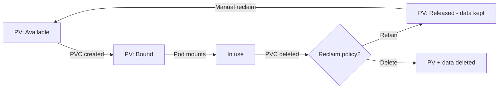

> 💡 **Quick Answer:** storage

## The Problem

This is one of the most searched Kubernetes topics with thousands of monthly searches. A comprehensive, production-ready guide prevents hours of trial and error.

## The Solution

### PV Lifecycle

```
Provisioning → Binding → Using → Reclaiming

1. PV available (static or dynamic via StorageClass)
2. PVC created → PV bound to PVC
3. Pod mounts PVC → reads/writes data
4. PVC deleted → PV enters Released state
5. Reclaim policy determines next step
```

### Static PV

```yaml
apiVersion: v1
kind: PersistentVolume
metadata:
  name: nfs-vol-01
  labels:
    type: nfs
    environment: production
spec:
  capacity:
    storage: 100Gi
  volumeMode: Filesystem    # or Block
  accessModes:
    - ReadWriteMany
  persistentVolumeReclaimPolicy: Retain
  storageClassName: ""       # Empty for static
  mountOptions:
    - nfsvers=4.1
    - hard
  nfs:
    server: nfs.example.com
    path: /exports/data01
```

### PV Binding with Label Selector

```yaml
# PVC with selector — bind to specific PV
apiVersion: v1
kind: PersistentVolumeClaim
metadata:
  name: prod-data
spec:
  accessModes: [ReadWriteMany]
  storageClassName: ""
  resources:
    requests:
      storage: 100Gi
  selector:
    matchLabels:
      type: nfs
      environment: production
```

### Volume Modes

```yaml
# Filesystem (default) — mounted as directory
volumeMode: Filesystem

# Block — raw block device (databases that manage their own filesystem)
volumeMode: Block
# Pod spec for block:
# volumeDevices:
#   - name: data
#     devicePath: /dev/xvda
```

### PV Status Transitions

| Status | Meaning |
|--------|---------|
| Available | PV is free, not bound to PVC |
| Bound | PV bound to a PVC |
| Released | PVC deleted, PV retains data but not yet available |
| Failed | Automatic reclaim failed |

```bash
# Manually reclaim a Released PV
kubectl patch pv nfs-vol-01 -p '{"spec":{"claimRef": null}}'
# Now PV is Available again (data still there!)
```



## Frequently Asked Questions

### StorageClass "" vs not setting it?

`storageClassName: ""` means "don't use dynamic provisioning, bind to a static PV". Omitting it entirely uses the default StorageClass. They are NOT the same.

### Can I change a PV's reclaim policy?

Yes: `kubectl patch pv my-pv -p '{"spec":{"persistentVolumeReclaimPolicy":"Retain"}}'`. Always set to Retain for production data before deleting PVCs.

## Best Practices

- Start with the simplest configuration that solves your problem
- Test in staging before production
- Use `kubectl describe` and events for troubleshooting
- Document team conventions for consistency

## Key Takeaways

- This is fundamental Kubernetes operational knowledge
- Follow established conventions and recommended labels
- Monitor and iterate based on real production behavior
- Automate repetitive tasks to reduce human error
