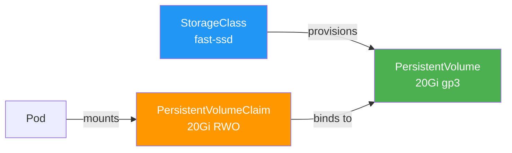

> 💡 **Quick Answer:** PersistentVolume (PV) is the storage, PersistentVolumeClaim (PVC) is the request, StorageClass enables dynamic provisioning. Create a StorageClass, reference it in a PVC, mount the PVC in a pod. Use `ReadWriteOnce` for single-node (block), `ReadWriteMany` for shared (NFS/CephFS), and `allowVolumeExpansion: true` on StorageClass for online resize.

## The Problem

Container storage is ephemeral — when a pod restarts, all data is lost. Applications need:

- Data persistence across pod restarts
- Shared storage between pods
- Storage provisioned on demand
- Volume resizing without downtime
- Different storage tiers (SSD, HDD, NFS)

## The Solution

### StorageClass (Dynamic Provisioning)

```yaml
apiVersion: storage.k8s.io/v1
kind: StorageClass
metadata:
  name: fast-ssd
provisioner: kubernetes.io/aws-ebs    # Or csi driver
parameters:
  type: gp3
  iops: "3000"
  throughput: "125"
reclaimPolicy: Delete
allowVolumeExpansion: true
volumeBindingMode: WaitForFirstConsumer
```

### PersistentVolumeClaim

```yaml
apiVersion: v1
kind: PersistentVolumeClaim
metadata:
  name: app-data
  namespace: production
spec:
  accessModes:
  - ReadWriteOnce
  storageClassName: fast-ssd
  resources:
    requests:
      storage: 20Gi
```

### Mount in Pod

```yaml
apiVersion: apps/v1
kind: Deployment
metadata:
  name: app
spec:
  template:
    spec:
      containers:
      - name: app
        image: myapp:v1
        volumeMounts:
        - name: data
          mountPath: /data
      volumes:
      - name: data
        persistentVolumeClaim:
          claimName: app-data
```

### Static PersistentVolume (Pre-Provisioned)

```yaml
apiVersion: v1
kind: PersistentVolume
metadata:
  name: nfs-share
spec:
  capacity:
    storage: 100Gi
  accessModes:
  - ReadWriteMany
  persistentVolumeReclaimPolicy: Retain
  nfs:
    server: nfs.example.com
    path: /exports/data
---
apiVersion: v1
kind: PersistentVolumeClaim
metadata:
  name: shared-data
spec:
  accessModes:
  - ReadWriteMany
  storageClassName: ""        # Empty = static binding
  resources:
    requests:
      storage: 100Gi
```

### Access Modes

| Mode | Abbreviation | Description |
|------|-------------|-------------|
| `ReadWriteOnce` | RWO | Single node read-write |
| `ReadOnlyMany` | ROX | Multiple nodes read-only |
| `ReadWriteMany` | RWX | Multiple nodes read-write |
| `ReadWriteOncePod` | RWOP | Single pod read-write (v1.27+) |

### Reclaim Policies

| Policy | Behavior |
|--------|----------|
| `Delete` | PV deleted when PVC is deleted (dynamic default) |
| `Retain` | PV preserved, must be manually reclaimed |
| `Recycle` | Deprecated — use Delete or Retain |

### Volume Expansion

```bash
# Edit PVC to request more storage
kubectl patch pvc app-data -p '{"spec":{"resources":{"requests":{"storage":"50Gi"}}}}'

# StorageClass must have allowVolumeExpansion: true
# For filesystem volumes, pod restart may be needed for resize to take effect
```



## Common Issues

**PVC stuck in Pending**

No matching PV or StorageClass provisioner failing. Check `kubectl describe pvc <name>` for events. With `WaitForFirstConsumer`, PVC stays Pending until a pod uses it.

**Volume not expanding**

StorageClass must have `allowVolumeExpansion: true`. Some CSI drivers require pod restart for filesystem resize.

**Data lost after PVC delete**

ReclaimPolicy was `Delete`. Use `Retain` for important data and always back up with Velero.

## Best Practices

- **Use dynamic provisioning** — let StorageClass handle PV creation
- **`WaitForFirstConsumer`** — ensures PV is in the same zone as the pod
- **`Retain` for production data** — prevents accidental deletion
- **Enable volume expansion** — resize without redeployment
- **RWO for databases, RWX for shared content** — match access mode to use case
- **Always back up PVs** — storage is not backup

## Key Takeaways

- PV = storage, PVC = request, StorageClass = dynamic provisioning template
- Dynamic provisioning creates PVs automatically when PVCs are created
- `WaitForFirstConsumer` ensures zone-aware volume placement
- Volume expansion works online for most CSI drivers
- Use `Retain` reclaim policy for data you can't afford to lose
- `ReadWriteOncePod` (v1.27+) provides the strongest single-writer guarantee
