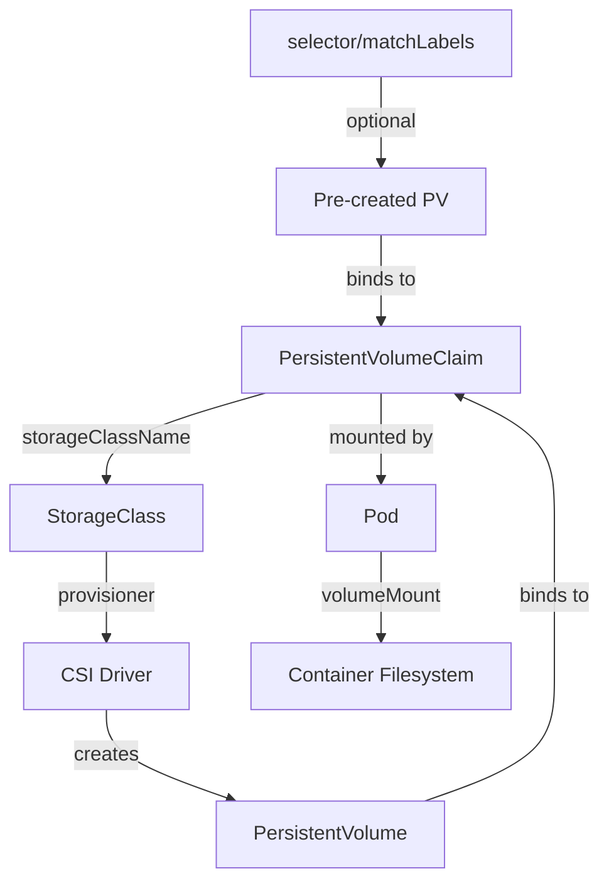

> 💡 **Quick Answer:** `PersistentVolumeClaimSpec` defines storage requirements: `accessModes` (ReadWriteOnce/ReadWriteMany/ReadOnlyMany), `resources.requests.storage` (size), `storageClassName` (which provisioner), and optionally `volumeMode`, `selector`, or `dataSource` for cloning.

## The Problem

Creating PVCs requires understanding the spec fields:
- Which access mode matches your workload?
- How does `storageClassName` interact with dynamic provisioning?
- When to use `volumeMode: Block` vs `Filesystem`?
- How to clone volumes or restore from snapshots?

## The Solution

### Complete PersistentVolumeClaimSpec

```yaml
apiVersion: v1
kind: PersistentVolumeClaim
metadata:
  name: myapp-data
  namespace: default
spec:
  # Required: How the volume can be mounted
  accessModes:
    - ReadWriteOnce        # Single node read-write

  # Required: Storage size request
  resources:
    requests:
      storage: 10Gi       # Minimum size
    limits:
      storage: 20Gi       # Maximum (optional, rarely used)

  # StorageClass for dynamic provisioning
  storageClassName: standard  # "" = no dynamic provisioning (bind to existing PV)

  # Filesystem (default) or Block
  volumeMode: Filesystem

  # Optional: Select specific PV by labels
  selector:
    matchLabels:
      environment: production

  # Optional: Clone from existing PVC or snapshot
  dataSource:
    kind: PersistentVolumeClaim
    name: source-pvc
```

### Access Modes Explained

```yaml
# ReadWriteOnce (RWO) — most common, single node
# Use for: databases, stateful apps, single-replica deployments
spec:
  accessModes:
    - ReadWriteOnce

# ReadWriteMany (RWX) — multiple nodes simultaneous write
# Use for: shared file storage, CMS uploads, ML training data
# Requires: NFS, CephFS, Azure Files, EFS
spec:
  accessModes:
    - ReadWriteMany

# ReadOnlyMany (ROX) — multiple nodes read-only
# Use for: shared config, static assets, model weights
spec:
  accessModes:
    - ReadOnlyMany

# ReadWriteOncePod (RWOP) — single pod (K8s 1.27+)
# Use for: strict single-writer guarantee
spec:
  accessModes:
    - ReadWriteOncePod
```

### StorageClass Selection

```yaml
# Dynamic provisioning (most common)
spec:
  storageClassName: gp3           # AWS EBS gp3
  storageClassName: premium-rwo   # GKE premium SSD
  storageClassName: managed-csi   # Azure managed disk

# Use cluster default StorageClass (omit field entirely)
spec:
  accessModes:
    - ReadWriteOnce
  resources:
    requests:
      storage: 5Gi
  # storageClassName not specified = use default

# Disable dynamic provisioning — bind to pre-created PV
spec:
  storageClassName: ""
  accessModes:
    - ReadWriteOnce
  resources:
    requests:
      storage: 10Gi
```

### Volume Cloning

```yaml
# Clone from existing PVC (same namespace, same StorageClass)
apiVersion: v1
kind: PersistentVolumeClaim
metadata:
  name: myapp-data-clone
spec:
  accessModes:
    - ReadWriteOnce
  storageClassName: standard
  resources:
    requests:
      storage: 10Gi
  dataSource:
    kind: PersistentVolumeClaim
    name: myapp-data  # Source PVC
---
# Restore from VolumeSnapshot
apiVersion: v1
kind: PersistentVolumeClaim
metadata:
  name: myapp-data-restored
spec:
  accessModes:
    - ReadWriteOnce
  storageClassName: standard
  resources:
    requests:
      storage: 10Gi
  dataSource:
    kind: VolumeSnapshot
    name: myapp-data-snapshot-20260420
    apiGroup: snapshot.storage.k8s.io
```

### Architecture



### StatefulSet with PVC Template

```yaml
apiVersion: apps/v1
kind: StatefulSet
metadata:
  name: postgres
spec:
  serviceName: postgres
  replicas: 3
  template:
    spec:
      containers:
        - name: postgres
          image: postgres:16
          volumeMounts:
            - name: data
              mountPath: /var/lib/postgresql/data
  volumeClaimTemplates:
    - metadata:
        name: data
      spec:
        accessModes:
          - ReadWriteOnce
        storageClassName: fast-ssd
        resources:
          requests:
            storage: 50Gi
```

### Volume Expansion

```yaml
# StorageClass must have allowVolumeExpansion: true
# Edit existing PVC to increase size
kubectl patch pvc myapp-data -p '{"spec":{"resources":{"requests":{"storage":"20Gi"}}}}'

# Check expansion status
kubectl get pvc myapp-data
# NAME         STATUS   VOLUME     CAPACITY   ACCESS MODES
# myapp-data   Bound    pv-xxx     20Gi       RWO
```

## Common Issues

| Issue | Cause | Fix |
|-------|-------|-----|
| PVC stuck "Pending" | No PV matches / no StorageClass | Check `kubectl describe pvc` events |
| "no persistent volumes available" | StorageClass not found | Verify `kubectl get sc` |
| Volume won't expand | StorageClass lacks `allowVolumeExpansion` | Create new SC with expansion enabled |
| Access mode mismatch | PV has RWO, pod on different node | Use RWX or reschedule to same node |
| Clone fails | Different StorageClass or namespace | Source and target must match |

## Best Practices

1. **Always specify `storageClassName`** — don't rely on default (it can change)
2. **Use `ReadWriteOncePod` for databases** — prevents accidental multi-attach corruption
3. **Set `resources.requests.storage` realistically** — over-provisioning wastes cloud spend
4. **Use VolumeSnapshots for backups** — CSI-native, faster than file-level backup
5. **Label PVCs in StatefulSets** — easier filtering and lifecycle management

## Key Takeaways

- `PersistentVolumeClaimSpec` has 6 fields: accessModes, resources, storageClassName, volumeMode, selector, dataSource
- `accessModes` determines how many nodes/pods can mount: RWO (1 node), RWX (many), RWOP (1 pod)
- Empty `storageClassName: ""` disables dynamic provisioning — binds to pre-created PVs
- `dataSource` enables cloning (from PVC) and restore (from VolumeSnapshot)
- PVCs are namespace-scoped; PVs are cluster-scoped
