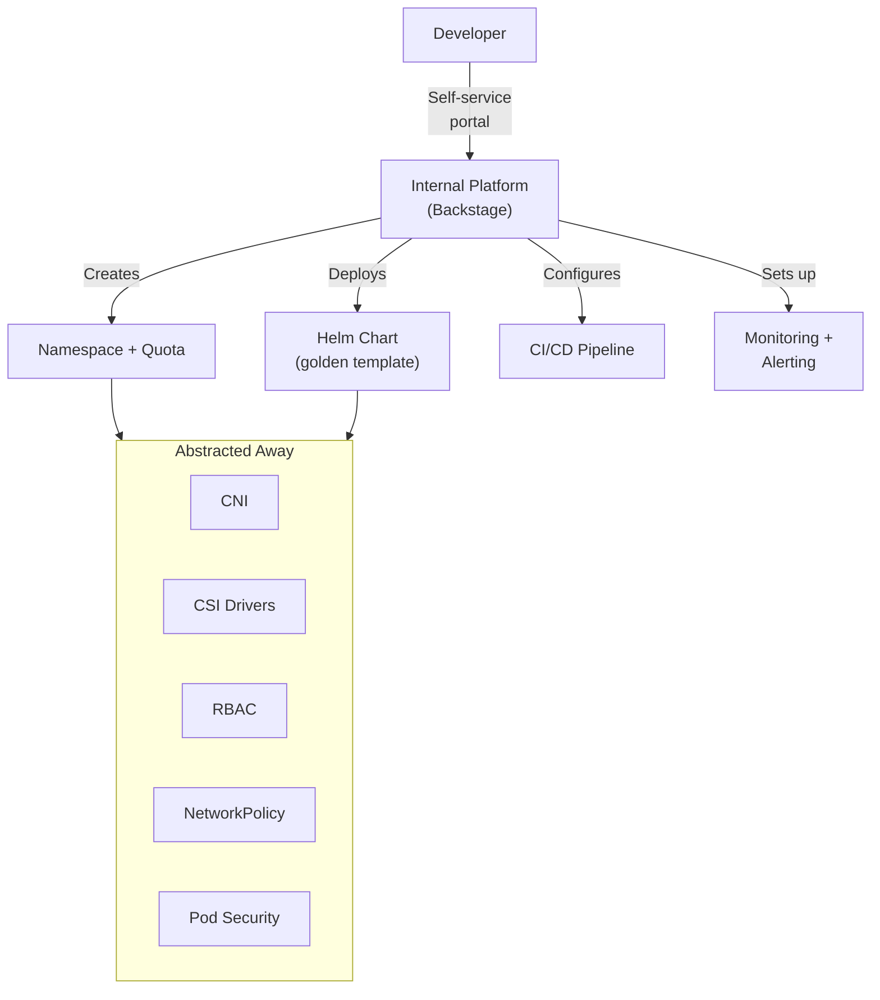

> 💡 **Quick Answer:** A **golden path** is a pre-built, opinionated way to do things right. Instead of every developer figuring out Kubernetes from scratch, you give them a paved road: "Run this command, get a production-ready service." Backstage catalogs, Helm charts, and self-service portals turn Kubernetes from "infrastructure you fight" into "infrastructure that works for you."

## The Problem

Developers shouldn't need to understand CNI plugins, StorageClasses, or Pod Security Admission to ship code. Platform engineering abstracts Kubernetes behind golden paths — tested, secure, observable defaults that developers just use.



## The Golden Path Catalog

### 1. Web Service (REST/gRPC API)

```bash
# Developer runs one command:
platform create service \
  --name checkout-api \
  --team payments \
  --language go \
  --port 8080

# Behind the scenes, this creates:
# ✅ Git repo from template (with Dockerfile, CI pipeline, Helm chart)
# ✅ Kubernetes namespace (with quota, RBAC, network policy)
# ✅ ArgoCD Application (auto-deploy on push)
# ✅ Ingress + TLS certificate
# ✅ HPA (autoscaling)
# ✅ ServiceMonitor + Grafana dashboard
# ✅ PagerDuty alert routing
```

### 2. Backstage Software Template

```yaml
# backstage/templates/web-service/template.yaml
apiVersion: scaffolder.backstage.io/v1beta3
kind: Template
metadata:
  name: kubernetes-web-service
  title: Web Service (Production-Ready)
  description: Deploy a new web service with CI/CD, monitoring, and autoscaling
spec:
  owner: platform-team
  type: service
  parameters:
    - title: Service Info
      properties:
        name:
          title: Service Name
          type: string
          pattern: "^[a-z][a-z0-9-]*$"
        team:
          title: Team
          type: string
          enum: [payments, catalog, shipping, auth]
        language:
          title: Language
          type: string
          enum: [go, python, node, java]
        port:
          title: Port
          type: number
          default: 8080

    - title: Infrastructure
      properties:
        replicas:
          title: Minimum Replicas
          type: number
          default: 3
        cpu:
          title: CPU Limit
          type: string
          default: "1"
        memory:
          title: Memory Limit
          type: string
          default: 512Mi
        needsDatabase:
          title: Needs PostgreSQL?
          type: boolean
          default: false

  steps:
    - id: scaffold
      name: Create repo from template
      action: fetch:template
      input:
        url: ./skeleton
        values:
          name: ${{ parameters.name }}
          team: ${{ parameters.team }}
          port: ${{ parameters.port }}

    - id: publish
      name: Create GitHub repo
      action: publish:github
      input:
        repoUrl: github.com?owner=org&repo=${{ parameters.name }}

    - id: create-namespace
      name: Provision Kubernetes namespace
      action: kubernetes:apply
      input:
        manifest:
          apiVersion: v1
          kind: Namespace
          metadata:
            name: ${{ parameters.team }}-${{ parameters.name }}

    - id: register
      name: Register in Backstage catalog
      action: catalog:register
      input:
        repoContentsUrl: ${{ steps.publish.output.repoContentsUrl }}
        catalogInfoPath: /catalog-info.yaml
```

### 3. Self-Service Helm Chart

```yaml
# Platform team's "golden" Helm chart
# charts/web-service/values.yaml
replicaCount: 3
image:
  repository: ""    # Set per service
  tag: latest

service:
  port: 8080

autoscaling:
  enabled: true
  minReplicas: 3
  maxReplicas: 20
  targetCPU: 70

ingress:
  enabled: true
  className: nginx
  annotations:
    cert-manager.io/cluster-issuer: letsencrypt-prod

monitoring:
  enabled: true
  dashboardUrl: ""  # Auto-generated

resources:
  requests:
    cpu: 100m
    memory: 128Mi
  limits:
    cpu: "1"
    memory: 512Mi

probes:
  liveness:
    path: /healthz
  readiness:
    path: /ready
```

```bash
# Developer deploys with 3 values:
helm install checkout-api platform/web-service \
  --set image.repository=registry.example.com/checkout-api \
  --set image.tag=v1.2.3 \
  --set ingress.hosts[0]=checkout.example.com \
  -n payments
```

## The Abstraction Layers

| What Developers See | What Platform Provides Underneath |
|--------------------|---------------------------------|
| "Deploy my app" | Deployment + RollingUpdate + PDB + TopologySpread |
| "Give me a URL" | Ingress + TLS + cert-manager + DNS |
| "Make it scale" | HPA + metrics-server + resource requests |
| "Show me logs" | Loki + Promtail + Grafana |
| "Alert me if it breaks" | Prometheus + AlertManager + PagerDuty |
| "Store my data" | StorageClass + CSI driver + backup CronJob |
| "Keep it secure" | NetworkPolicy + PSA + RBAC + image scanning |

## Measuring Success

| Metric | Before Platform | After Platform |
|--------|----------------|---------------|
| Time to first deploy | 2-5 days | 30 minutes |
| Lead time for changes | 1-2 weeks | Hours |
| New service onboarding | Full sprint | Self-service |
| Security audit findings | Many | Near-zero (built-in) |
| "Works on my machine" incidents | Weekly | Rare |

## Common Issues

| Issue | Cause | Fix |
|-------|-------|-----|
| Golden path too restrictive | Doesn't handle edge cases | Add escape hatches (custom values, raw YAML overrides) |
| Developers bypass the platform | Too slow or too opinionated | Listen to feedback, iterate on the templates |
| Drift between template versions | Old services on old templates | Automated upgrade PRs (Renovate/Dependabot for Helm) |

## Best Practices

- **Opinionated defaults, optional overrides** — 80% of services use defaults, 20% customize
- **Make the right thing the easy thing** — golden path should be LESS work than the manual way
- **Document with examples, not theory** — "here's how to deploy" beats "here's how K8s works"
- **Measure developer experience** — time-to-deploy, satisfaction surveys, support tickets
- **Iterate based on feedback** — the platform serves developers, not the other way around

## Key Takeaways

- Golden paths turn "learn Kubernetes" into "run one command"
- Platform engineering = make the right thing the easy thing
- Backstage + Helm + ArgoCD = self-service developer platform
- Developers don't need to know about CNI, CSI, PSA — they need to ship code
- The "K8s is a scam" crowd hasn't seen a well-built platform
