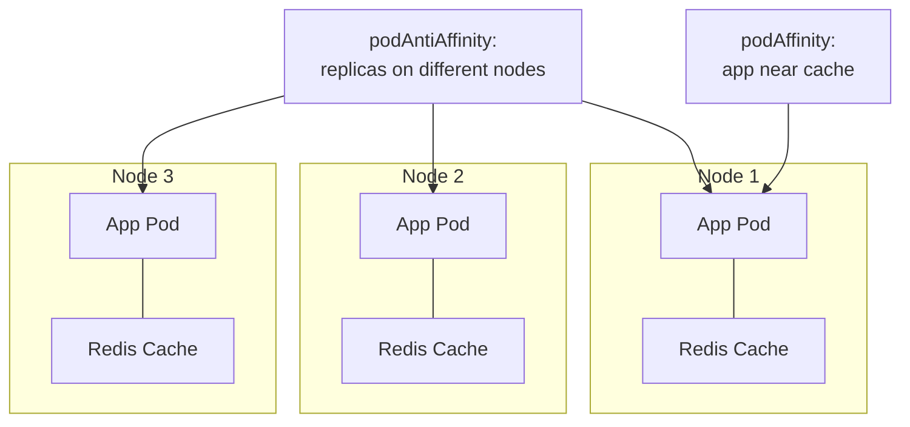

> 💡 **Quick Answer:** Use `podAffinity` to co-locate pods (cache near app server) and `podAntiAffinity` to spread replicas across nodes. Prefer `preferredDuringSchedulingIgnoredDuringExecution` for soft rules that don't block scheduling.

## The Problem

Your cache pods are on different nodes than the app servers that use them — adding 1-2ms network latency per request. Or all 3 replicas of a service landed on the same node — one node failure takes out the entire service.

## The Solution

### Co-Locate Cache with App

```yaml
apiVersion: apps/v1
kind: Deployment
metadata:
  name: web-server
spec:
  template:
    spec:
      affinity:
        podAffinity:
          requiredDuringSchedulingIgnoredDuringExecution:
            - labelSelector:
                matchExpressions:
                  - key: app
                    operator: In
                    values: ["redis-cache"]
              topologyKey: kubernetes.io/hostname
```

Web server pods MUST schedule on nodes that already have redis-cache pods.

### Spread Replicas Across Nodes

```yaml
apiVersion: apps/v1
kind: Deployment
metadata:
  name: api-server
spec:
  replicas: 3
  template:
    spec:
      affinity:
        podAntiAffinity:
          preferredDuringSchedulingIgnoredDuringExecution:
            - weight: 100
              podAffinityTerm:
                labelSelector:
                  matchLabels:
                    app: api-server
                topologyKey: kubernetes.io/hostname
```

Prefer different nodes for each replica. Soft rule — if only 2 nodes exist, 2 pods can share a node.

### Hard Anti-Affinity (Strict Separation)

```yaml
podAntiAffinity:
  requiredDuringSchedulingIgnoredDuringExecution:
    - labelSelector:
        matchLabels:
          app: api-server
      topologyKey: kubernetes.io/hostname
```

⚠️ Hard anti-affinity with 3 replicas requires at least 3 nodes. Pods stay Pending if not enough nodes.



## Common Issues

**Pods stuck Pending with hard anti-affinity**

Not enough nodes to satisfy the rule. Switch to `preferredDuringScheduling` (soft) or add more nodes.

**Affinity not working — pods on wrong nodes**

Check label selectors match exactly. `kubectl get pods --show-labels` to verify pod labels match the affinity `matchLabels`.

## Best Practices

- **Soft anti-affinity for most services** — prevents single-node concentration without blocking scheduling
- **Hard affinity only for true co-location requirements** — cache + app on same node
- **`topologyKey: kubernetes.io/hostname`** for node-level separation
- **`topologyKey: topology.kubernetes.io/zone`** for zone-level separation
- **Prefer topology spread constraints** for even distribution — more flexible than anti-affinity

## Key Takeaways

- podAffinity co-locates pods (same node/zone); podAntiAffinity separates them
- Soft rules (`preferred`) are scheduling preferences; hard rules (`required`) are mandatory
- Hard anti-affinity requires enough topology domains — can cause Pending pods
- Use `topologyKey` to control scope: hostname (node), zone, rack
- Topology spread constraints are often better than anti-affinity for even distribution
