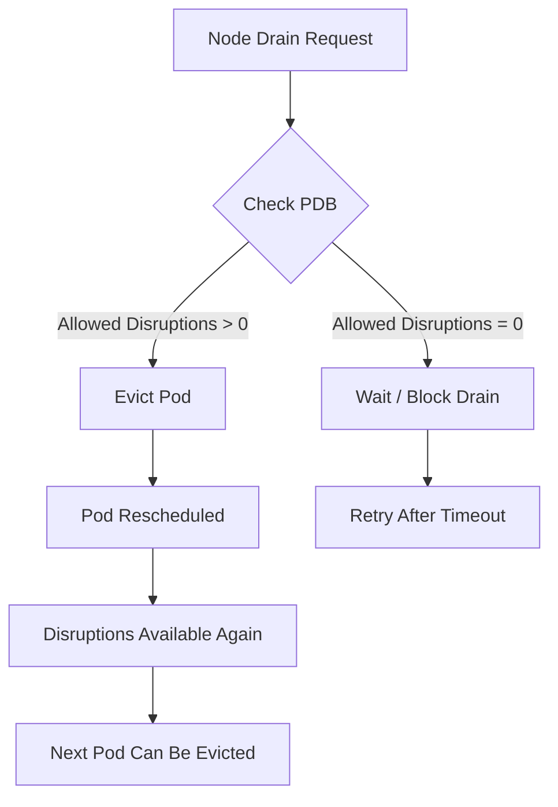

> 💡 **Quick Answer:** A PodDisruptionBudget (PDB) limits how many pods from a set can be voluntarily disrupted simultaneously, ensuring your application stays available during maintenance.

## The Problem

When you drain a node for maintenance or a cluster autoscaler removes a node, Kubernetes evicts pods without considering application availability. Without a PDB, all replicas on a node can be evicted at once, causing downtime.

Common scenarios where PDBs matter:
- Node OS upgrades or kernel patches
- Cluster version upgrades
- Autoscaler scale-down events
- Spot/preemptible instance reclamation

## The Solution

### minAvailable PDB

Guarantee a minimum number of pods remain running:

```yaml
apiVersion: policy/v1
kind: PodDisruptionBudget
metadata:
  name: web-app-pdb
  namespace: production
spec:
  minAvailable: 2
  selector:
    matchLabels:
      app: web-app
```

### maxUnavailable PDB

Allow a maximum number of pods to be unavailable:

```yaml
apiVersion: policy/v1
kind: PodDisruptionBudget
metadata:
  name: api-pdb
  namespace: production
spec:
  maxUnavailable: 1
  selector:
    matchLabels:
      app: api-server
```

### Percentage-Based PDB

```yaml
apiVersion: policy/v1
kind: PodDisruptionBudget
metadata:
  name: worker-pdb
spec:
  maxUnavailable: "25%"
  selector:
    matchLabels:
      app: worker
```

### Check PDB Status

```bash
kubectl get pdb -n production
kubectl describe pdb web-app-pdb -n production
```

Output shows `ALLOWED DISRUPTIONS`:
```
NAME          MIN AVAILABLE   MAX UNAVAILABLE   ALLOWED DISRUPTIONS   AGE
web-app-pdb   2               N/A               1                     5m
api-pdb       N/A             1                 1                     5m
```



## Common Issues

**PDB blocks node drain indefinitely**
If `minAvailable` equals the replica count, no disruptions are allowed. Always leave headroom:
```bash
# Check if PDB is blocking
kubectl get pdb -A -o wide
# Force drain (dangerous - ignores PDB)
kubectl drain node01 --ignore-daemonsets --delete-emptydir-data --force
```

**PDB with wrong selector matches no pods**
Verify the selector matches your deployment labels:
```bash
kubectl get pods -l app=web-app -n production
```

**Single replica with PDB**
A PDB with `minAvailable: 1` on a single-replica deployment blocks all voluntary evictions. Use `maxUnavailable: 1` instead, or scale to 2+ replicas.

## Best Practices

- Use `maxUnavailable` over `minAvailable` for simpler reasoning
- Set `maxUnavailable: 1` for most stateful workloads
- Use percentage-based PDBs for workloads that scale frequently
- Never set `minAvailable` equal to replica count (blocks all drains)
- Combine PDBs with pod anti-affinity to spread replicas across nodes
- Add PDBs to all production workloads with 2+ replicas
- Monitor `ALLOWED DISRUPTIONS` in alerting

## Key Takeaways

- PDBs protect against voluntary disruptions (drains, autoscaling) — not involuntary ones (node crashes)
- `minAvailable` guarantees minimum running pods; `maxUnavailable` limits simultaneous evictions
- Percentage values round up for `minAvailable` and down for `maxUnavailable`
- PDBs apply to the eviction API — `kubectl delete pod` bypasses them
- Always verify PDB selectors match your workload labels
- Leave headroom: don't protect 100% of replicas
