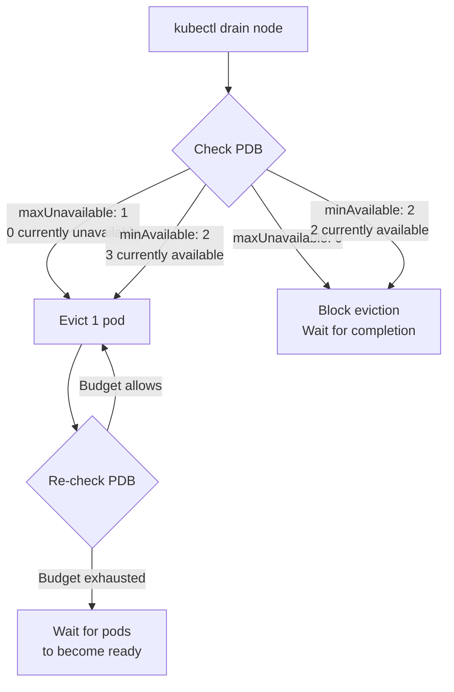

> 💡 **Quick Answer:** Use `maxUnavailable: 1` for stateless services (allows one pod down during drain), `minAvailable: "50%"` for stateful workloads, and `maxUnavailable: 0` for GPU training jobs that cannot tolerate any disruption.

## The Problem

Node maintenance (upgrades, scaling, kernel patches) triggers pod evictions. Without PDBs, `kubectl drain` evicts all pods simultaneously — causing downtime. PDBs tell Kubernetes how many pods must remain available during voluntary disruptions.

## The Solution

### Strategy Matrix

| Workload Type | PDB Strategy | Value | Why |
|---|---|---|---|
| Stateless web service | `maxUnavailable` | `1` or `25%` | Fast rollout, some degradation OK |
| Database / StatefulSet | `minAvailable` | `"50%"` | Quorum must be maintained |
| GPU training job | `maxUnavailable` | `0` | Cannot tolerate any pod loss |
| Single-replica critical | `minAvailable` | `1` | Must always be running |
| Batch processing | No PDB needed | — | Jobs are restartable |

### Stateless Service

```yaml
apiVersion: policy/v1
kind: PodDisruptionBudget
metadata:
  name: web-pdb
spec:
  maxUnavailable: 1
  selector:
    matchLabels:
      app: web-frontend
```

### Stateful Quorum (etcd, Kafka, ZooKeeper)

```yaml
apiVersion: policy/v1
kind: PodDisruptionBudget
metadata:
  name: etcd-pdb
spec:
  minAvailable: 2
  selector:
    matchLabels:
      app: etcd
```

For a 3-node etcd cluster: `minAvailable: 2` ensures quorum (majority) is always maintained.

### GPU Training — No Disruption

```yaml
apiVersion: policy/v1
kind: PodDisruptionBudget
metadata:
  name: training-pdb
spec:
  maxUnavailable: 0
  selector:
    matchLabels:
      app: distributed-training
```

> ⚠️ `maxUnavailable: 0` blocks `kubectl drain` entirely until the training job completes. Use with `unhealthyPodEvictionPolicy: AlwaysAllow` (K8s 1.31+) to still evict crash-looping pods.



## Common Issues

**`kubectl drain` hangs forever**

PDB with `maxUnavailable: 0` or `minAvailable` equal to current replicas blocks all evictions. Use `--timeout` flag or temporarily adjust the PDB.

**PDB blocks cluster autoscaler scale-down**

Same issue — autoscaler respects PDBs. Ensure at least one pod can be disrupted for scale-down to work.

**PDB selector doesn't match any pods**

Verify labels match: `kubectl get pods -l app=web-frontend` should return the pods you expect.

## Best Practices

- **Every production Deployment should have a PDB** — no exceptions
- **Use `maxUnavailable` for stateless** — simpler, allows percentage-based scaling
- **Use `minAvailable` for stateful** — directly expresses quorum requirement
- **Never set `minAvailable` = replicas** — blocks all voluntary disruptions
- **Combine with `topologySpreadConstraints`** — spread pods across nodes so draining one node doesn't violate PDB

## Key Takeaways

- PDBs protect against voluntary disruptions only (node drain, cluster autoscaler) — not involuntary (OOM, hardware failure)
- `maxUnavailable: 1` is the safest default for most services
- `maxUnavailable: 0` blocks all evictions — use for jobs that cannot restart
- `minAvailable` with absolute numbers is safer than percentages for small replica counts
- PDBs don't prevent scaling down replicas — only pod evictions
