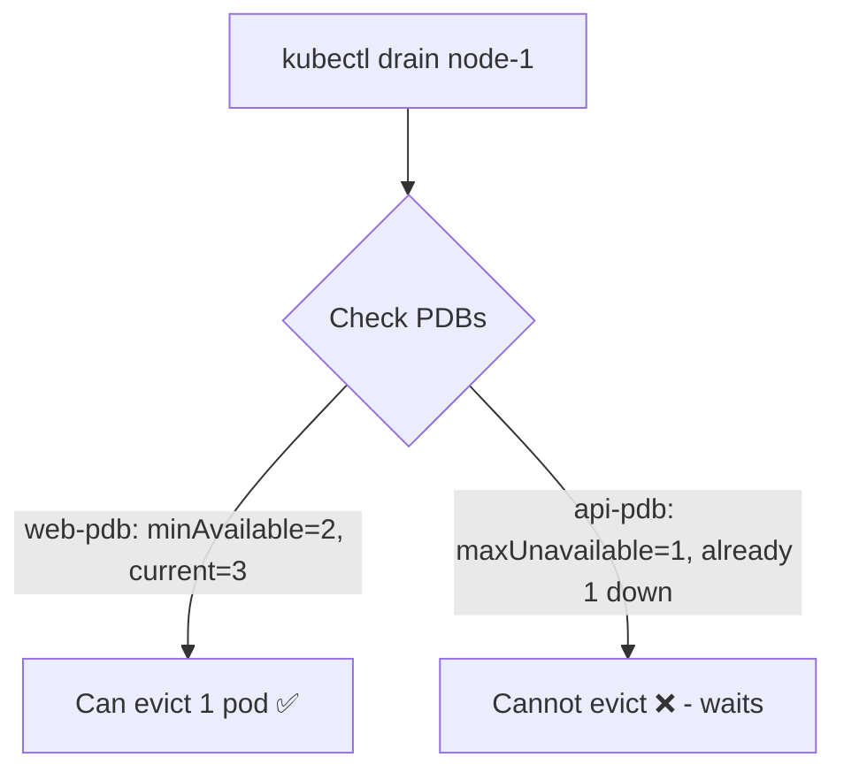

> 💡 **Quick Answer:** Configure PodDisruptionBudgets to protect application availability during node drains, upgrades, and voluntary disruptions in Kubernetes.

## The Problem

This is one of the most searched Kubernetes topics. A comprehensive, well-structured guide helps engineers of all levels quickly find actionable solutions.

## The Solution

Detailed implementation with production-ready examples below.


### Create a PodDisruptionBudget

```yaml
# Option 1: Minimum available
apiVersion: policy/v1
kind: PodDisruptionBudget
metadata:
  name: web-pdb
spec:
  minAvailable: 2          # At least 2 pods must be running
  selector:
    matchLabels:
      app: web
---
# Option 2: Maximum unavailable
apiVersion: policy/v1
kind: PodDisruptionBudget
metadata:
  name: api-pdb
spec:
  maxUnavailable: 1        # At most 1 pod can be down
  selector:
    matchLabels:
      app: api
---
# Option 3: Percentage
apiVersion: policy/v1
kind: PodDisruptionBudget
metadata:
  name: worker-pdb
spec:
  minAvailable: "50%"      # At least 50% must remain
  selector:
    matchLabels:
      app: worker
```

```bash
# Check PDB status
kubectl get pdb
# NAME       MIN AVAILABLE   MAX UNAVAILABLE   ALLOWED DISRUPTIONS   AGE
# web-pdb    2               N/A               1                     1h

# Node drain respects PDBs
kubectl drain node-1 --ignore-daemonsets --delete-emptydir-data
# Waits if draining would violate PDB
```



## Frequently Asked Questions

### When should I create PDBs?

For any production workload with 2+ replicas. PDBs protect against: node drains, cluster upgrades, spot/preemptible node reclaims, and cluster autoscaler scale-downs.

### PDB with single replica?

A PDB with `minAvailable: 1` on a single-replica deployment blocks ALL voluntary disruptions (node drains hang forever). Use `maxUnavailable: 1` instead, or scale to 2+ replicas.

## Common Issues

Check `kubectl describe` and `kubectl get events` first — most issues have clear error messages pointing to the root cause.

## Best Practices

- **Follow least privilege** — only grant the access that's needed
- **Test in staging** before applying to production
- **Monitor and alert** on key metrics
- **Document your runbooks** for the team

## Key Takeaways

- Essential knowledge for Kubernetes operations
- Start simple and evolve your approach
- Automation reduces human error
- Share knowledge with your team
