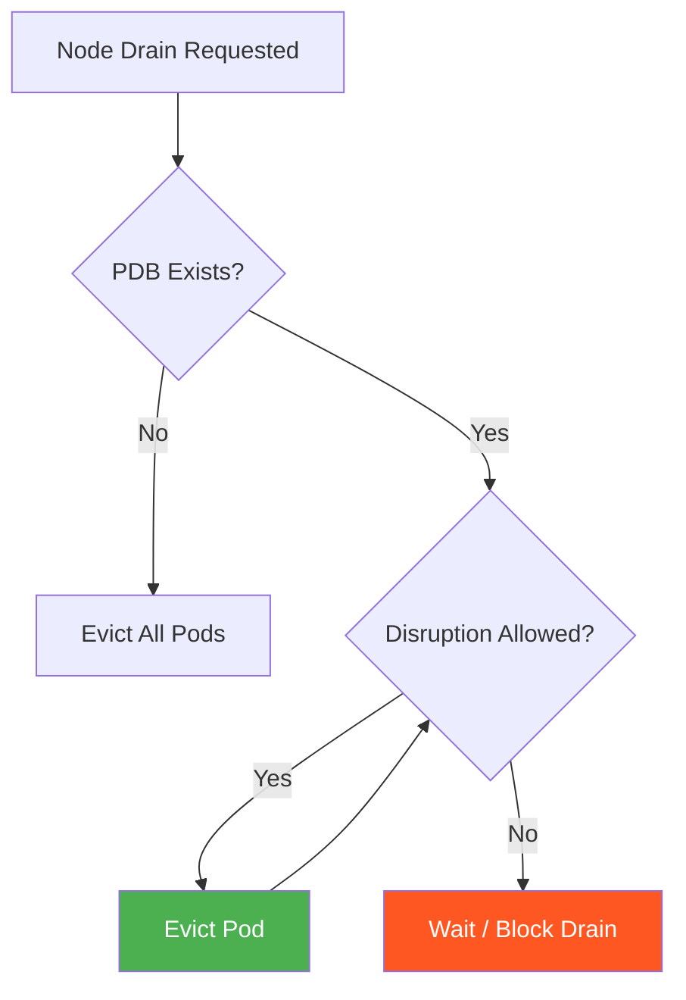

> 💡 **Quick Answer:** A PodDisruptionBudget (PDB) limits how many pods of a workload can be simultaneously unavailable during voluntary disruptions like node drains and cluster upgrades. Use `minAvailable: 1` to ensure at least one pod always runs, or `maxUnavailable: 1` to allow only one pod down at a time.

## The Problem

During node maintenance, upgrades, or scaling, Kubernetes evicts pods. Without PDBs:

- All replicas of a service can be evicted simultaneously
- Node drains during upgrades cause downtime
- Cluster autoscaler can't respect application availability requirements
- Critical workloads get disrupted by routine operations

## The Solution

### Basic PDB with minAvailable

```yaml
apiVersion: policy/v1
kind: PodDisruptionBudget
metadata:
  name: web-app-pdb
  namespace: production
spec:
  minAvailable: 2        # At least 2 pods must always be running
  selector:
    matchLabels:
      app: web-app
```

### PDB with maxUnavailable

```yaml
apiVersion: policy/v1
kind: PodDisruptionBudget
metadata:
  name: api-pdb
  namespace: production
spec:
  maxUnavailable: 1      # At most 1 pod can be unavailable
  selector:
    matchLabels:
      app: api-server
```

### Percentage-Based PDB

```yaml
apiVersion: policy/v1
kind: PodDisruptionBudget
metadata:
  name: worker-pdb
spec:
  maxUnavailable: "25%"   # Allow 25% of pods to be down
  selector:
    matchLabels:
      app: worker
```

### PDB for StatefulSets

```yaml
apiVersion: policy/v1
kind: PodDisruptionBudget
metadata:
  name: database-pdb
spec:
  minAvailable: 2        # Quorum: 2 of 3 must be up
  selector:
    matchLabels:
      app: postgres
      role: replica
```

### Unhealthy Pod Eviction Policy (v1.27+)

```yaml
apiVersion: policy/v1
kind: PodDisruptionBudget
metadata:
  name: app-pdb
spec:
  minAvailable: 1
  selector:
    matchLabels:
      app: my-app
  unhealthyPodEvictionPolicy: AlwaysAllow  # Evict unhealthy even if PDB violated
```

| Policy | Behavior |
|--------|----------|
| `IfHealthy` (default) | Only evict unhealthy pods if PDB is not violated |
| `AlwaysAllow` | Always allow eviction of unhealthy pods regardless of PDB |

### Check PDB Status

```bash
# List all PDBs
kubectl get pdb -A

# Check disruptions allowed
kubectl get pdb web-app-pdb -o wide
# NAME          MIN AVAILABLE   MAX UNAVAILABLE   ALLOWED DISRUPTIONS   AGE
# web-app-pdb   2               N/A               1                     5m

# Describe for details
kubectl describe pdb web-app-pdb
```



## Common Issues

**Node drain stuck — "Cannot evict pod"**

PDB is blocking eviction. Check `ALLOWED DISRUPTIONS` — if 0, no more pods can be evicted. Either wait for unhealthy pods to recover, or delete the PDB temporarily.

**PDB with minAvailable = replicas deadlocks drains**

If `minAvailable` equals the total replica count, NO pod can ever be evicted. Use `maxUnavailable: 1` instead.

**Single-replica deployments with PDB**

A PDB with `minAvailable: 1` on a single-replica deployment blocks ALL drains. Either increase replicas or don't use PDB for single-replica workloads.

## Best Practices

- **Use `maxUnavailable` over `minAvailable`** — simpler to reason about during scaling
- **Never set `minAvailable` equal to replica count** — deadlocks node drains
- **Always create PDBs for production workloads** — even `maxUnavailable: 1` prevents mass eviction
- **Use `AlwaysAllow` unhealthy eviction** — prevents stuck drains from CrashLooping pods
- **PDBs only protect against voluntary disruptions** — node crashes bypass PDB entirely
- **Test PDBs before cluster upgrades** — simulate with `kubectl drain --dry-run`

## Key Takeaways

- PDBs limit simultaneous pod disruptions during node drains and upgrades
- `maxUnavailable: 1` is the safest default for most workloads
- PDBs don't protect against involuntary disruptions (node failures, OOMKill)
- `unhealthyPodEvictionPolicy: AlwaysAllow` prevents CrashLooping pods from blocking drains
- Always pair PDBs with sufficient replicas — PDB on a single replica deadlocks drains
