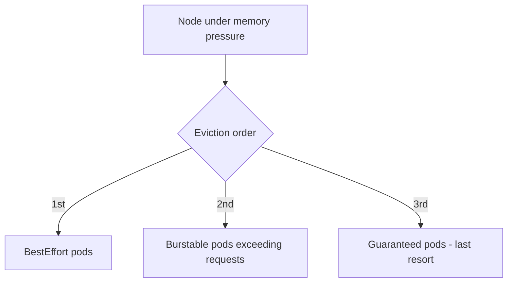

> 💡 **Quick Answer:** Understand why Kubernetes evicts pods and how to prevent it. Covers resource pressure, priority classes, PDBs, and eviction policies.

## The Problem

This is one of the most searched Kubernetes topics. A comprehensive, well-structured guide helps engineers of all levels quickly find actionable solutions.

## The Solution

Detailed implementation with production-ready examples below.


### Why Pods Get Evicted

```bash
# Check eviction events
kubectl get events --field-selector reason=Evicted -A
kubectl describe pod <evicted-pod> | grep -A5 "Status\|Reason\|Message"
```

| Cause | Trigger | Prevention |
|-------|---------|------------|
| **Node pressure** | Memory/disk/PID exhaustion | Set resource requests |
| **Preemption** | Higher priority pod needs space | Use PriorityClass |
| **Taint-based** | Node tainted with NoExecute | Add toleration |
| **Node drain** | Admin/upgrade drain | PodDisruptionBudget |
| **Spot reclaim** | Cloud reclaims spot instance | Use on-demand for critical |

### QoS and Eviction Order

```yaml
# Guaranteed (last to evict) — requests == limits
resources:
  requests:
    cpu: 500m
    memory: 256Mi
  limits:
    cpu: 500m
    memory: 256Mi

# BestEffort (first to evict) — no requests/limits
# DON'T do this for production workloads
```

### Priority Classes

```yaml
apiVersion: scheduling.k8s.io/v1
kind: PriorityClass
metadata:
  name: critical-apps
value: 1000000
globalDefault: false
preemptionPolicy: PreemptLowerPriority
description: "Critical production workloads"
---
# Use in pod spec
spec:
  priorityClassName: critical-apps
```



## Frequently Asked Questions

### How do I prevent eviction?

Set `Guaranteed` QoS (requests == limits), use PodDisruptionBudgets, and use PriorityClasses. For node pressure eviction, ensure nodes have enough capacity.

## Common Issues

Check `kubectl describe` and `kubectl get events` first — most issues have clear error messages pointing to the root cause.

## Best Practices

- **Follow least privilege** — only grant the access that's needed
- **Test in staging** before applying to production
- **Monitor and alert** on key metrics
- **Document your runbooks** for the team

## Key Takeaways

- Essential knowledge for Kubernetes operations
- Start simple and evolve your approach
- Automation reduces human error
- Share knowledge with your team
