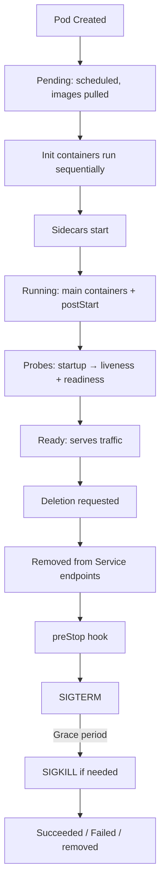

> 💡 **Quick Answer:** A pod moves through five **phases** — `Pending` (accepted, not yet running: scheduling or image pull), `Running` (bound to a node, at least one container running), `Succeeded` (all containers exited 0), `Failed` (all containers terminated, at least one non-zero), and `Unknown` (node unreachable). Each container separately has a **state**: `Waiting`, `Running`, or `Terminated`. Check both with `kubectl get pod <name> -o jsonpath='{.status.phase}'` and `kubectl describe pod <name>`.

## The Problem

`kubectl get pods` shows a `STATUS` column (`ContainerCreating`, `CrashLoopBackOff`, `Completed`, `Terminating`) that is neither the pod phase nor the container state — it's a mix of both. To debug a stuck or restarting pod you need to know which layer you're looking at: the pod phase, the per-container state and its reason, or the lifecycle step (init, hooks, probes, termination) the pod is currently in.

## The Solution

### Pod Phases

| Phase | Description |
|-------|-------------|
| **Pending** | Pod accepted by the API server, but one or more containers aren't running yet — waiting for scheduling, volume attach, or image pull |
| **Running** | Pod bound to a node, all containers created, at least one running (or starting/restarting) |
| **Succeeded** | All containers exited with code 0 and won't be restarted |
| **Failed** | All containers terminated, at least one with a non-zero exit (or killed by the system) |
| **Unknown** | Pod state can't be obtained — usually lost communication with the node's kubelet |

```bash
kubectl get pod my-pod -o jsonpath='{.status.phase}{"\n"}'
```

> `Terminating` and `CrashLoopBackOff` are **not** phases. `Terminating` means `deletionTimestamp` is set; `CrashLoopBackOff` is a container `Waiting` reason while the pod phase stays `Running`.

### Container States

| State | Description | Common reasons |
|-------|-------------|----------------|
| `Waiting` | Not running yet | `ContainerCreating`, `PodInitializing`, `ImagePullBackOff`, `ErrImagePull`, `CrashLoopBackOff`, `CreateContainerConfigError` |
| `Running` | Executing without issues | — (`startedAt` is set) |
| `Terminated` | Finished, successfully or not | `Completed`, `Error`, `OOMKilled` (with `exitCode`) |

```bash
# Current state of every container
kubectl get pod my-pod -o jsonpath='{range .status.containerStatuses[*]}{.name}{"\t"}{.state}{"\n"}{end}'

# Current and previous state (why did it restart?)
kubectl describe pod my-pod
# State:          Running
#   Started:      Mon, 07 Apr 2026 10:00:00 UTC
# Last State:     Terminated
#   Reason:       OOMKilled
#   Exit Code:    137
# Restart Count:  3
```

### Pod Lifecycle Timeline

```
1.  Pod created → API server persists it in etcd          (phase: Pending)
2.  Scheduler assigns a node
3.  kubelet pulls images, mounts volumes
4.  Init containers run sequentially, each must exit 0
5.  Native sidecars (init containers with restartPolicy: Always) start
6.  Main containers start; postStart hook runs (if defined) (phase: Running)
7.  Startup probe (if defined), then liveness + readiness probes
8.  Pod Ready → added to Service endpoints
9.  Deletion requested → deletionTimestamp set ("Terminating")
10. Pod removed from Service endpoints
11. preStop hook runs
12. SIGTERM sent to containers
13. terminationGracePeriodSeconds countdown (default 30s)
14. SIGKILL if still running → pod removed from the API
```



### Lifecycle Hooks and Graceful Shutdown

```yaml
apiVersion: v1
kind: Pod
metadata:
  name: app
spec:
  terminationGracePeriodSeconds: 60    # Default: 30
  containers:
    - name: app
      image: my-app:v1
      lifecycle:
        postStart:
          exec:
            command: ["/bin/sh", "-c", "echo started > /tmp/started"]
        preStop:
          exec:
            command: ["/bin/sh", "-c", "sleep 5 && /app/shutdown.sh"]
          # preStop runs BEFORE SIGTERM; it counts against the grace period
```

For the full termination sequence and hook patterns, see [graceful shutdown and pod termination](/recipes/deployments/kubernetes-graceful-shutdown-guide/) and [Pod lifecycle hooks](/recipes/deployments/pod-lifecycle-hooks/).

### Restart Policies

| Policy | Behavior | Use Case |
|--------|----------|----------|
| `Always` | Restart on any exit (default) | Deployments, StatefulSets, DaemonSets |
| `OnFailure` | Restart only on non-zero exit | Jobs |
| `Never` | Never restart | Jobs/one-off pods you want to inspect |

With `Always`, a pod whose container keeps exiting never reaches `Succeeded`/`Failed` — it stays `Running` with the container cycling through `CrashLoopBackOff` (exponential back-off up to 5 minutes).

### Troubleshooting Stuck Pods by Phase/State

| Symptom | Likely cause | Check |
|---------|--------------|-------|
| `Pending`, no node assigned | Insufficient CPU/memory, nodeSelector/affinity mismatch, untolerated taints, unbound PVC | `kubectl describe pod` → Events (`FailedScheduling`) |
| `Pending` / `ContainerCreating` | Image pull, volume attach/mount, CNI or Secret/ConfigMap missing | Events: `FailedMount`, `ErrImagePull` |
| `Init:0/2`, `PodInitializing` | Init container failing or hanging | `kubectl logs my-pod -c <init-container>` |
| `Running` but `CrashLoopBackOff` | App exits on start, failing liveness probe | `kubectl logs my-pod --previous` |
| `Terminated` / `OOMKilled`, exit 137 | Memory limit exceeded | Raise limit or fix leak |
| `Unknown` | Node down or kubelet unreachable | `kubectl get nodes`, `kubectl describe node` |
| Stuck `Terminating` | Finalizers or unreachable node | `kubectl get pod -o jsonpath='{.metadata.finalizers}'` |

## Frequently Asked Questions

### What are the 5 Kubernetes pod phases?

`Pending`, `Running`, `Succeeded`, `Failed`, and `Unknown`. The phase is a high-level summary in `.status.phase`; details live in `.status.conditions` (`PodScheduled`, `Initialized`, `ContainersReady`, `Ready`) and `.status.containerStatuses`.

### What is the difference between pod phase and container state?

Pod phase is the overall pod status. Container state is per-container. A pod can be `Running` while one of its containers is `Waiting` with reason `CrashLoopBackOff`.

### Why is my pod stuck in Pending?

Common reasons: insufficient CPU/memory on nodes, no nodes match nodeSelector/affinity, PVC not bound, taints without tolerations. Run `kubectl describe pod` and check the Events section.

### postStart vs init container?

**Init containers** run BEFORE main containers start (separate container, guaranteed ordering, must succeed). **postStart** runs inside the main container, concurrently with the entrypoint — no ordering guarantee. Use init containers for setup tasks.

### What's exit code 137?

128 + 9 = SIGKILL. The container was forcefully killed — either `OOMKilled` (exceeded its memory limit) or it didn't stop within `terminationGracePeriodSeconds`.

## Best Practices

- **Read phase and container state together** — `kubectl describe pod` shows both, plus `Last State` for the previous crash
- **Use init containers, not postStart, for ordering** — postStart has no guarantee relative to the entrypoint
- **Add a startup probe for slow starters** — prevents liveness probes from killing containers still booting
- **Handle SIGTERM in your app** and size `terminationGracePeriodSeconds` to cover preStop + shutdown
- **Use `restartPolicy: Never` for debugging one-off pods** so the failed container stays inspectable

## Key Takeaways

- Five pod phases: `Pending` → `Running` → `Succeeded` / `Failed`, plus `Unknown` when the node is unreachable
- Three container states: `Waiting`, `Running`, `Terminated` — the *reason* field tells you why
- `CrashLoopBackOff`, `ContainerCreating` and `Terminating` are reasons/status strings, not phases
- Lifecycle order: schedule → init containers → sidecars → main + postStart → probes → Ready → preStop → SIGTERM → SIGKILL
- Exit code 137 = SIGKILL (OOMKilled or grace period exceeded)
