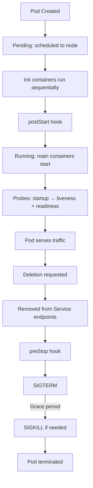

> 💡 **Quick Answer:** configuration

## The Problem

This is one of the most searched Kubernetes topics with thousands of monthly searches. A comprehensive, production-ready guide prevents hours of trial and error.

## The Solution

### Pod Phases

| Phase | Meaning |
|-------|---------|
| **Pending** | Accepted but not running (downloading image, waiting for node) |
| **Running** | At least one container running |
| **Succeeded** | All containers exited with code 0 |
| **Failed** | At least one container exited with non-zero |
| **Unknown** | Cannot determine state (node communication lost) |

### Container States

```bash
kubectl describe pod my-pod
# State:          Running
#   Started:      Mon, 07 Apr 2026 10:00:00 UTC
# Last State:     Terminated
#   Reason:       OOMKilled
#   Exit Code:    137
```

| State | Description |
|-------|-------------|
| `Waiting` | Not yet running (pulling image, waiting for deps) |
| `Running` | Container executing |
| `Terminated` | Finished execution (success or failure) |

### Pod Lifecycle Timeline

```
1. Pod created → API server stores in etcd
2. Scheduler assigns to node
3. kubelet pulls images
4. Init containers run (sequentially)
5. postStart hook (if defined)
6. Main containers start
7. Startup probe (if defined)
8. Liveness + Readiness probes begin
9. Pod runs...
10. Deletion requested
11. Pod removed from Service endpoints
12. preStop hook runs
13. SIGTERM sent to containers
14. terminationGracePeriodSeconds countdown
15. SIGKILL if still running
16. Pod removed from API
```

### Lifecycle Hooks

```yaml
spec:
  containers:
    - name: app
      lifecycle:
        postStart:
          exec:
            command: ["/bin/sh", "-c", "echo started > /tmp/started"]
          # Or httpGet:
          #   path: /started
          #   port: 8080
        preStop:
          exec:
            command: ["sh", "-c", "sleep 5 && /app/shutdown.sh"]
```



## Frequently Asked Questions

### postStart vs init container?

**Init containers** run BEFORE main containers start (separate container, guaranteed ordering). **postStart** runs inside the main container, concurrently with the entrypoint — no ordering guarantee. Use init containers for setup tasks.

### What's exit code 137?

128 + 9 = SIGKILL. The container was forcefully killed — either OOMKilled (exceeded memory limit) or didn't stop within terminationGracePeriodSeconds.

## Best Practices

- Start with the simplest configuration that solves your problem
- Test in staging before production
- Use `kubectl describe` and events for troubleshooting
- Document team conventions for consistency

## Key Takeaways

- This is fundamental Kubernetes operational knowledge
- Follow established conventions and recommended labels
- Monitor and iterate based on real production behavior
- Automate repetitive tasks to reduce human error
