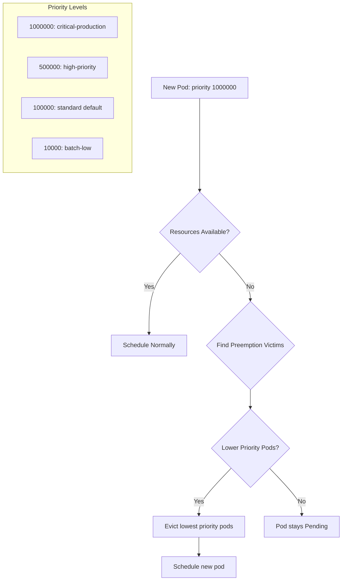

> 💡 **Quick Answer:** PriorityClasses assign numeric priorities to pods. Higher-priority pods preempt (evict) lower-priority pods when the cluster is full, ensuring critical workloads always get scheduled.

## The Problem

When cluster resources are exhausted:
- Critical workloads (production APIs) stay Pending behind batch jobs
- GPU workloads can't schedule because dev experiments hold the GPUs
- No way to express "this pod is more important than that pod"
- Manual intervention needed to free resources during incidents

## The Solution

### Define PriorityClasses

```yaml
apiVersion: scheduling.k8s.io/v1
kind: PriorityClass
metadata:
  name: critical-production
value: 1000000
globalDefault: false
preemptionPolicy: PreemptLowerPriority
description: "Critical production services that must always run"
---
apiVersion: scheduling.k8s.io/v1
kind: PriorityClass
metadata:
  name: standard
value: 100000
globalDefault: true
description: "Default priority for regular workloads"
---
apiVersion: scheduling.k8s.io/v1
kind: PriorityClass
metadata:
  name: batch-low
value: 10000
preemptionPolicy: Never
description: "Batch jobs that should not preempt other workloads"
```

### Assign Priority to Pods

```yaml
apiVersion: apps/v1
kind: Deployment
metadata:
  name: payment-api
spec:
  replicas: 3
  selector:
    matchLabels:
      app: payment-api
  template:
    spec:
      priorityClassName: critical-production
      containers:
        - name: api
          image: payment-api:2.0
          resources:
            requests:
              cpu: "1"
              memory: 1Gi
```

### Non-Preempting Priority

```yaml
apiVersion: scheduling.k8s.io/v1
kind: PriorityClass
metadata:
  name: high-priority-no-preempt
value: 500000
preemptionPolicy: Never
description: "High priority in queue but won't evict others"
```



## Common Issues

**System pods getting preempted**
System-critical pods use built-in priority classes:
```bash
kubectl get priorityclasses
# system-cluster-critical: 2000000000
# system-node-critical:    2000001000
```
Never set custom priorities above 1000000000.

**Preemption cascades**
Pod A preempts B, B's disruption triggers C's eviction. Use PDBs to limit:
```yaml
# PDB protects minimum replicas even during preemption
apiVersion: policy/v1
kind: PodDisruptionBudget
metadata:
  name: standard-pdb
spec:
  minAvailable: 1
  selector:
    matchLabels:
      priority-tier: standard
```

**Batch jobs immediately preempted**
Use `preemptionPolicy: Never` for batch — they queue without displacing others, but still get priority in scheduling order.

## Best Practices

- Define 3-5 priority levels (don't over-complicate)
- Set one `globalDefault: true` class for workloads that don't specify priority
- Use `preemptionPolicy: Never` for workloads that should wait, not evict
- Keep priorities below 1000000000 (system classes use higher values)
- Combine with ResourceQuota to prevent priority abuse per namespace
- Document priority classes and their intended use cases
- Monitor preemption events: `kubectl get events --field-selector reason=Preempted`

## Key Takeaways

- PriorityClass value determines scheduling order and preemption eligibility
- Higher-priority pods can evict lower-priority pods to get resources
- `preemptionPolicy: Never` = high scheduling priority without evicting others
- `globalDefault: true` applies to pods without explicit priorityClassName
- System classes (2 billion range) are reserved — stay below 1 billion
- PDBs are respected during preemption — preemptor may stay Pending
- Only one PriorityClass can be `globalDefault: true`
